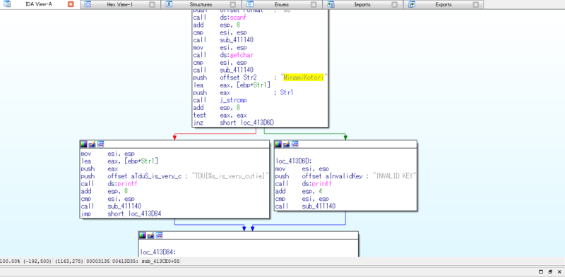

※ 移行前の元ブログ記事 : [TDU CTF 2014 Satellite in ConoHaに参加した話 - #include <sys_socket.h>](https://socketo.hatenablog.jp/entry/2015/03/31/002642_1) 

2015-03-29、TDU CTFに参加してきました。


TDU CTF 2014 Satellite in ConoHa (2015/03/29 12:00〜) : http://connpass.com/event/11986/

CTF for Beginnersでの簡易CTF以外ではCTF初参加なのでビクビクしながら行きました。

本当の初心者だった自分は結局620pt取れました。

懇親会でどのようにして問題を解いたかなどを参加者の方々と話していくなかで、自分が手も足も出なかった問題に対してのアプローチの仕方などを知ることがとても楽しいものでした。

自分が解けた問題は少ないですがWriteupとか感想を。

## Web

**Easy SQLi**

とりあえず

``` javascript
' OR 1 = 1 --
```

をしてみたけどダメで色々と試してたらダブルコーテーションなら何か反応があり、

``` javascript
" OR 1 = 1 --
```

を突っ込んだらフラグが出た。複数フラグがあったようでしたがそれ以上進むことが出来ずに断念。

## binary

**string_compare**

実行ファイルstring_compare.exeをとりあえずstringsしたらMinamiKotoriとかTDU{%s_is_very_cutie}といったフラグのフォーマットっぽいのが出てきたけど、IDAに食わせた。



多分TDU{%s_is_very_cutie}の%s部分にMinamiKotoriを入れれば良さそうな感じだったのでTDU{MinamiKotori_is_very_cutie}をsubmit

競技終了後に中身をちゃんと見てみたら、入力をとって「MinamiKotori」だったらFlagを出して、それ以外だったら「INVALID KEY」が返されるとのこと。

<span style="color: #cccccc;">とりあえず私はラブライブ！では穂乃果ちゃんが好きなのでKosakaHonokaと入力するだけしておく。</span>

<span style="color: #cccccc;">KosakaHonokaではINVALID KEY</span>


**Trip Picture**

20150223_Kyoto.jpg（ことりちゃん率の高いラバスト画像）が与えられたのでとりあえずstringsコマンドしたらFlagっぽいのが出たのでsubmitした

**読めない文字1**

文末に"=="がつく文字列が与えられていたので、とりあえずBase64でデコード。そしたらまた文末に"=="がついた文字列が出てきたのでもう一回デコードしたらFlagが出た。

## network

**柚子胡椒 Vol.1**

Bluetoothの通信をキャプチャしたっぽいpcapが与えられたのでWiresharkで開いて内容を見てたらFlagがあったのでそれをsubmitした

## crypt

**我が同胞に告ぐ**

文字列"avia hhlam li as li ii llaem xiwe hhiso lllasom"が与えられ、最初はシーザー暗号かと思いPythonで一文字ずつズラして表示したりしたけどそれっぽいものにはならくて諦めかけていたが、問題の作成者のnomukenさんが「この問題は宗教的な戦争が～…」との発言をしていたので、Vim/Emacsの宗教戦争かとのことでVimを起動してその文字列をスペースがあたる部分をEscで入力すると

"vimissoawesome" → vim is so awesome

Vimはとても素晴らしい

## misc

**Mini Quiz #1**

封筒に入れることが出来るThinkPadはどれ？的な問題。

安直に“ThinkPad　封筒”でggり、"封筒に入る超薄型X300"という記事を見つけたのでそれを入れた。

ThinkPad e450が欲しいと言い続けてるけど買っていない。

**Mini Quiz #2**

OS Xのバージョンのクイズ。

バージョンggって10.x（忘れた）を"."を抜いてFlagフォーマットに入力した

以下、時間ないに解けなかった悔しかった問題

**DEVELOPER! DEVELOPER! DEVEROPER!**

zipファイルが与えられ、とりあえずunzipしようとするとpasswordを要求される。

zipファイルの中身はflag.txtとSteve_ballmer_2007_outdoors2.jpgの2つのファイルらしく、画像ファイルの方をggるとwikipediaから画像データを持ってくることが出来る。

そこから既知平文攻撃をすればいいとのことなので、pkcrackを使う。

``` shell
./pkcrack -C question.zip -c Steve_ballmer_2007_outdoors2.jpg -p Steve_ballmer_2007_outdoors2.jpg; -d ques_ans.zip
```

既知平文攻撃とpkcrackは知っていたのだが、何かしらやり方が違ったらしく競技が終わってからもう一度やったら解けた。

## 感想

初心者向けとのことで、真の初心者である自分はとても楽しめました。

自分の知識の無さを改めて実感出来る良い機会となりました。（勉強会行く度に言っている）

とりあえず常時開催のCTFの問題を解いてマッチョマンになりたいです。

運営の皆様、とても楽しい時間をありがとうございました。;