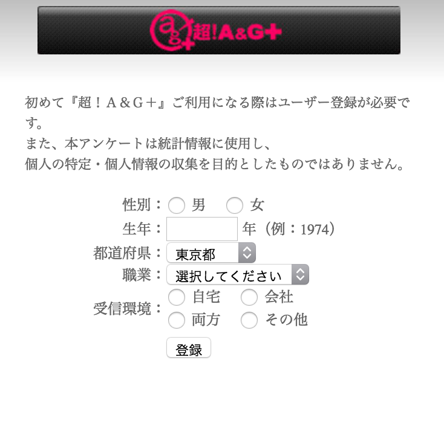

※ 移行前の元ブログ記事 [PythonでSeleniumを使ってagqrの登録を自動化する - #include <sys_socket.h>](https://socketo.hatenablog.jp/entry/2016/04/10/201909_1)

JOQR 超!A&G+でよく声優さんのラジオを聴いたり見たりしています．  
[超！A&G | 文化放送](http://www.agqr.jp/)

僕は『洲崎西』と『西明日香のデリケートゾーン!』が好きで基本毎週視聴しているんですが，前々からこの超!A&G+で気になってたことがあって，プレイヤーの画面に行くとこのような登録画面が出て視聴するのが初めてじゃないのに登録を迫られることです．  

ここでは"初めて『超！Ａ＆Ｇ＋』ご利用になる際はユーザー登録が必要です。"と書いてあるが，初めてじゃなくても登録してから一定期間経つとこのページが現れて登録を迫られるっぽい．  
目的のラジオ開始時間ギリギリにagqrのページを開いてこの登録画面が出ると，ラジオをはじめから聞けないとかいう事故が何回か起こったりしてた．  
そこでSeleniumを使って自動化して起動出来れば数秒は早く出来るんじゃないかということで適当に書いた．



Seleniumは前にOSCかどこかで聞いて何か遊びで使えないかなぁと思っていたので遊びで使えて満足．  
radio buttonとかのチェックとか登録のボタンのsubmitがnameもidも振られていなかったりしてよくわからなかったけど，xpathで指定したらそのまま扱えたのでよかった．  
xpathを利用する際に，FireFoxのアドオンのFireBugとFirePathが便利だった．