※ 移行前の元ブログ記事 : [Digital Forensic Challenge #2 - User Policy Violation Case Write up - #include <sys_socket.h>](https://socketo.hatenablog.jp/entry/2018/02/19/090657)

本投稿の内容に間違いや問題などありましたら，Twitter経由などでやんわり優しめに教えて頂ければ幸いです．(Twitter:[@sys_socket](https://twitter.com/sys_socket))

恐らく何かしら間違ってたり，足りなかったりします．多分．
誰か教えてください．

はい．

https://www.ashemery.com/dfir.html のChallenge #2

Case1はこちら
[Digital Forensic Challenge #1 - Web Server Case Write up - socketo.hatenablog.jp](http://socketo.hatenablog.jp/entry/2018/02/05/032146)

## 問題文

``` text
This is another digital forensics image that was prepared to cover a full Windows Forensics course.
System Image: here
Hashes: here
Password = here
You can use the image to learn the following:
File Carving, Custom Carving, and Keyword Searching
File System Forensics - NTFS
Deep Windows Registry Forensics: System and User Hives
SYSTEM
SOFTWARE
SAM
NTUSER.DAT
USRCLASS.DAT
Other Windows Files: LNK, Jump Lists, Libraries, etc
Application Compatibility Cache (ShimCache)
Analyzing Windows Search (Search Charm)
Analyzing Thumb Caches
Analyzing Prefetch Files
Analyzing Recycle Bin(s)
USB Forensics
Events Analysis
Email Forensics: Web and Outlook
Browser Forensics: Internet Explorer and Google Chrome
Skype Forensics
This image covers most if not all of the recent system artifacts that you might encounter. Let me know if you need any help or if you are an instructor and want the answers to each part of the case. I will only send the answers to verified instructors.

Due to lots of requests, I have decided to compile a manual or a book for the second image with Q&As to help you go through the challenge and solve every part of it. URLs and further explanations will be provided very soon. Stay tuned my friends and happy hunting ;)
```

このイメージで以下のことが学べるらしい

1.  ファイルカービング，カスタムカービング，キーワード検索
2.  ファイルシステムフォレンジック - NTFS
3.  Deep Windows レジストリフォレンジック:システムとユーザのハイブ

    * SYSTEM
    * SOFTWARE
    * SAM
    * NTUSER.DAT
    * USRCLASS.DAT

4.  その他のWindowsファイル:LNK，ジャンプリスト，ライブラリなど
5.  ShimCache
6.  Windows検索の分析
7.  Thumbキャッシュの分析
8.  Prefetchファイルの分析
9.  ゴミ箱の分析
10.  USBフォレンジック
11.  イベント分析
12.  電子メールフォレンジック:WebとOutlook
13.  Webブラウザフォレンジック:Internet Exploler, Google Chrome
14.  Skypeフォレンジック

\***

## 調査環境・ツール

有償ツールは使わない流れでいきます．

* FTK(R) Imager 3.2.0 : http://marketing.accessdata.com/ftkimager3.2.0
* SIFT CLI : https://github.com/sans-dfir/sift-cli

    * RegRIpper : https://github.com/keydet89/RegRipper2.8
    * Volatility : https://github.com/volatilityfoundation/volatility
    * foremost : http://foremost.sourceforge.net/

* WinPrefetchView : http://www.nirsoft.net/utils/win_prefetch_view.html
* USNAnalytics : https://www.kazamiya.net/usn_analytics
* HindSight : https://github.com/obsidianforensics/hindsight
* DB Browser for SQLite : http://sqlitebrowser.org/
* XstReader : https://github.com/Dijji/XstReader
* PSTWalker : https://pstwalker.com/
* NetworkUsageView : https://www.nirsoft.net/utils/network_usage_view.html

## 調査

### 基本情報を調べる

Case1と同じでregripperを使用して，各基本情報を調べる

#### OS情報

|            OS            |
|--------------------------|
|  Windows 8.1 Enterprise  |

#### timezone

前回と同じくUTC-7なことを確認

``` text
[vagrant@siftworkstation:/vagrant_data/ashemery/Challenge02/reg]$ rip.pl -r SYSTEM -p timezone
Launching timezone v.20160318
timezone v.20160318
(System) Get TimeZoneInformation key contents

TimeZoneInformation key
ControlSet001\Control\TimeZoneInformation
LastWrite Time Tue Jun 21 09:14:37 2016 (UTC)
DaylightName   -> @tzres.dll,-211
StandardName   -> @tzres.dll,-212
Bias           -> 480 (8 hours)
ActiveTimeBias -> 420 (7 hours)
TimeZoneKeyName-> Pacific Standard Time
```

#### ComputerName/Hostname

``` text
[vagrant@siftworkstation:/vagrant_data/ashemery/Challenge02/reg]$ rip.pl -r SYSTEM -p compname
Launching compname v.20090727
compname v.20090727
(System) Gets ComputerName and Hostname values from System hive

ComputerName    = 4ORENSICS
TCP/IP Hostname = 4orensics
```

#### User確認

``` text
[vagrant@siftworkstation:/vagrant_data/ashemery/Challenge02/reg]$ rip.pl -r SAM -p samparse
Launching samparse v.20160203
samparse v.20160203
(SAM) Parse SAM file for user & group mbrshp info

User Information
-------------------------
Username        : Administrator [500]
Full Name       :
User Comment    : Built-in account for administering the computer/domain
Account Type    : Default Admin User
Account Created : Tue Jun 21 08:19:47 2016 Z
Name            :
Last Login Date : Tue Mar 18 10:20:36 2014 Z
Pwd Reset Date  : Tue Mar 18 10:20:39 2014 Z
Pwd Fail Date   : Never
Login Count     : 3
--> Normal user account
--> Password does not expire
--> Account Disabled

Username        : Guest [501]
Full Name       :
User Comment    : Built-in account for guest access to the computer/domain
Account Type    : Default Guest Acct
Account Created : Tue Jun 21 08:19:47 2016 Z
Name            :
Last Login Date : Never
Pwd Reset Date  : Never
Pwd Fail Date   : Never
Login Count     : 0
--> Normal user account
--> Password does not expire
--> Password not required
--> Account Disabled

Username        : Hunter [1001]
Full Name       :
User Comment    :
Account Type    : Default Admin User
Account Created : Tue Jun 21 08:37:43 2016 Z
Name            :
Password Hint   : What do you do?
Last Login Date : Tue Jun 21 01:42:40 2016 Z
Pwd Reset Date  : Tue Jun 21 08:37:43 2016 Z
Pwd Fail Date   : Tue Jun 21 12:53:04 2016 Z
Login Count     : 3
--> Normal user account
--> Password does not expire
--> Password not required

Username        : HomeGroupUser$ [1003]
Full Name       : HomeGroupUser$
User Comment    : Built-in account for homegroup access to the computer
Account Type    : Custom Limited Acct
Account Created : Tue Jun 21 08:40:06 2016 Z
Name            :
Last Login Date : Never
Pwd Reset Date  : Tue Jun 21 08:40:06 2016 Z
Pwd Fail Date   : Never
Login Count     : 0
--> Normal user account
--> Password does not expire
```

### やる

"User Policy Violation"とのことなので，適当に見る．

### プログラム実行履歴

#### Prefetch

アプリケーション起動速度を速める為にWindows XP以降に実装された仕組み．

詳しい話は以下のブログにて色々と書いてあるので参考に．

簡易解析入門 プログラム実行の痕跡の調査 (1)Prefetch: セクタンラボ 実験日誌
http://sectanlab.sblo.jp/article/115076023.html

上のブログと同じように，[WinPrefetchView](http://www.nirsoft.net/utils/win_prefetch_view.html)を使う．

FTK Imagerで`C:\Windows\Prefetch`フォルダをExportして，メニューから`Options`-`Advanced Options`を選択しExportしてきたPrefetchフォルダを読み込ませる．

※WinPrefetchViewはデフォルトの表示時間がローカルタイムになってしまうので，`Options`-`Show Time in GMT`のチェックを入れるようにする．

<span itemscope="" itemtype="http://schema.org/Photograph">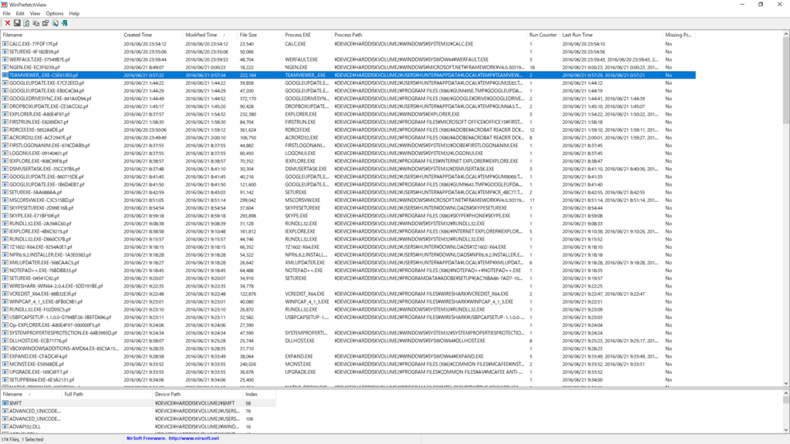</span>

`User Policy Violation`というケースタイトルなので，内部不正を行う時に使用しそうなっぽいソフトウェアとか普通のユーザが入れないソフトウェアっぽいのをとりあえず列挙する．

* CCleaner
* Dropbox
* FTK Imager
* Outlook
* Python
* Skype
* TorBrowser installer
* Wireshark
* Zenmap

#### UserAssist

Exploler経由で起動したアプリケーションが`　HKCU\Software\Microsoft\Windows\CurrentVersion\Explorer\UserAssist`に保存されている．regedit.exeで見るとROT13しているが，RegistryExplorlerで見るといい感じにROT13を復号してくれている．

いい感じにregripperでuserassistプラグインを使用し，実行履歴を出す．

色々と実行してる．

``` text
[socketo@siftworkstation:/vagrant_data/ashemery/Challenge02]$ rip.pl -r reg/NTUSER.DAT -p userassist
～省略～
{CEBFF5CD-ACE2-4F4F-9178-9926F41749EA}
Tue Jun 21 12:29:55 2016 Z
C:\Users\Hunter\Downloads\FTK-Imager\FTK Imager.exe (2)
Tue Jun 21 12:28:08 2016 Z
{6D809377-6AF0-444B-8957-A3773F02200E}\CCleaner\CCleaner64.exe (1)
Tue Jun 21 12:26:30 2016 Z
{6D809377-6AF0-444B-8957-A3773F02200E}\Microsoft Office\Office15\WINWORD.EXE (2)
Tue Jun 21 12:26:17 2016 Z
C:\Python27\pythonw.exe (1)
Tue Jun 21 12:08:13 2016 Z
{7C5A40EF-A0FB-4BFC-874A-C0F2E0B9FA8E}\Nmap\zenmap.exe (1)
Tue Jun 21 12:02:35 2016 Z
{7C5A40EF-A0FB-4BFC-874A-C0F2E0B9FA8E}\Jetico\BCWipe\BCWipe.exe (2)
Tue Jun 21 12:01:44 2016 Z
{6D809377-6AF0-444B-8957-A3773F02200E}\CCleaner\ccleaner.exe (1)
Tue Jun 21 12:00:43 2016 Z
{7C5A40EF-A0FB-4BFC-874A-C0F2E0B9FA8E}\TeamViewer\TeamViewer.exe (1)
Tue Jun 21 11:55:37 2016 Z
C:\Users\Hunter\Downloads\putty.exe (1)
Tue Jun 21 11:54:48 2016 Z
C:\Users\Hunter\Downloads\SysinternalsSuite\Procmon.exe (1)
Tue Jun 21 11:54:45 2016 Z
{F38BF404-1D43-42F2-9305-67DE0B28FC23}\hh.exe (1)
Tue Jun 21 11:54:36 2016 Z
C:\Users\Hunter\Downloads\SysinternalsSuite\procexp.exe (1)
Tue Jun 21 11:52:06 2016 Z
{1AC14E77-02E7-4E5D-B744-2EB1AE5198B7}\notepad.exe (3)
Tue Jun 21 11:51:23 2016 Z
windows.immersivecontrolpanel_cw5n1h2txyewy!microsoft.windows.immersivecontrolpanel (1)
Tue Jun 21 11:44:32 2016 Z
C:\Users\Hunter\Downloads\bcwipeSetup.exe (1)
Tue Jun 21 11:44:16 2016 Z
C:\Users\Hunter\Downloads\ccsetup519pro.exe (2)
Tue Jun 21 11:38:46 2016 Z
{6D809377-6AF0-444B-8957-A3773F02200E}\Java\jre1.8.0_91\bin\javaw.exe (1)
Tue Jun 21 11:19:14 2016 Z
C:\Users\Hunter\Downloads\python-3.5.1.exe (1)
Tue Jun 21 11:17:58 2016 Z
{1AC14E77-02E7-4E5D-B744-2EB1AE5198B7}\msiexec.exe (1)
Tue Jun 21 11:06:44 2016 Z
C:\Users\Hunter\Downloads\Hash_Suite_Free\Hash_Suite_64.exe (1)
Tue Jun 21 09:28:21 2016 Z
D:\VBoxWindowsAdditions.exe (1)
Tue Jun 21 09:27:00 2016 Z
{7C5A40EF-A0FB-4BFC-874A-C0F2E0B9FA8E}\Google\Chrome\Application\chrome.exe (2)
Tue Jun 21 08:41:33 2016 Z
C:\Users\Hunter\Downloads\ChromeSetup.exe (1)
Tue Jun 21 08:38:47 2016 Z
Microsoft.InternetExplorer.Default (1)
Tue Jun 21 02:00:01 2016 Z
{7C5A40EF-A0FB-4BFC-874A-C0F2E0B9FA8E}\Adobe\Acrobat Reader DC\Reader\AcroRd32.exe (5)
Tue Jun 21 01:51:06 2016 Z
Dropbox.Desktop.Client (1)
Tue Jun 21 01:43:24 2016 Z
Chrome (3)
Mon Jun 20 23:53:36 2016 Z
{1AC14E77-02E7-4E5D-B744-2EB1AE5198B7}\cmd.exe (1)
```

### USNジャーナルの解析

Case1と同じく，[USNAnalytics](https://www.kazamiya.net/usn_analytics)を使用．

<span itemscope="" itemtype="http://schema.org/Photograph">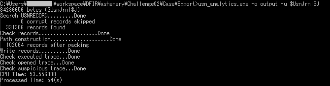</span>

各アーティファクトで出てきた結果とかの裏付けとかで適宜確認する．

### LNKファイル解析

LNKファイルはWindowsのショートカットファイルの拡張子で，ユーザがファイル，ドキュメントを開いた際にLNKファイルが生成されるので触ったファイルが分かる．

`C:\Users\{username}\AppData\Roaming\Microsoft\Windows\Recent`に.lnkファイルが生成される．

<span itemscope="" itemtype="http://schema.org/Photograph">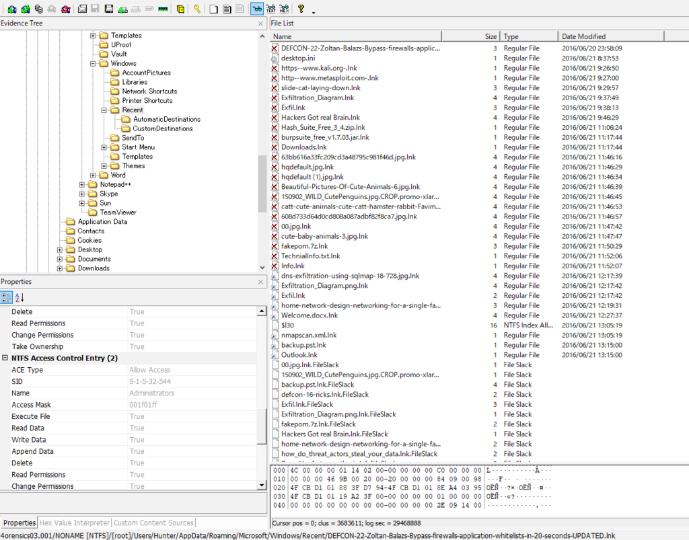</span>

中を見てみると，左側にバツマークがついており削除されていることが分かる
．
ユーザが意図的に消したか，CCleanerのような最適化ツールによって削除したかなど考えられる．

### Skype

Skypeについて見ていく．

Skypeのアーティファクトについては以下を参考．

Skype Forensics: Analyzing Call and Chat Data From Computers and Mobile(pdf) : https://www.magnetforensics.com/wp-content/uploads/2014/04/Skype-Forensics-Analyzing-Call-and-Chat-Data-From-Computers-and-Mobile-Magnet-Forensics.pdf

`Users/Hunter/AppData/Roaming/Skype/hunterhpt/`ディレクトリをFTK ImagerでExportする．

`Users/Hunter/AppData/Roaming/Skype/hunterhpt/main.db`に実際のSkypeの色々が格納されている．
<span itemscope="" itemtype="http://schema.org/Photograph">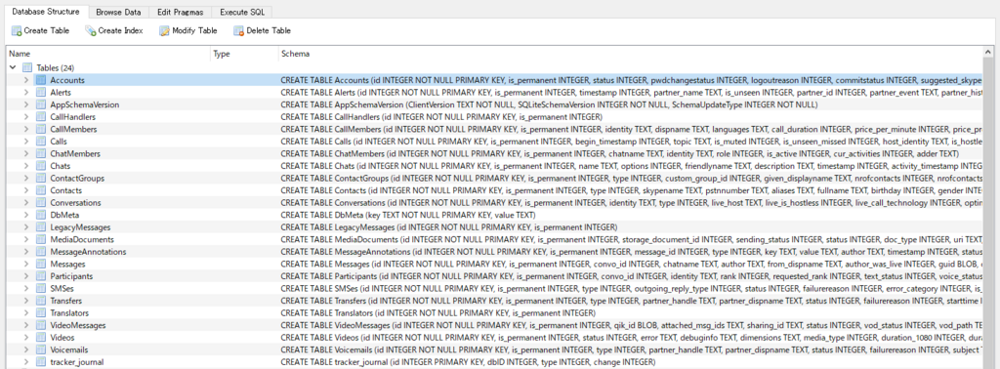</span>

まずアカウント情報を見ていく．

アカウント情報は`Accounts`テーブルに格納されている．

このSkypeを利用していたMicrosoftアカウントのメールアドレスが`ehptmsgs@gmail.com`ということがわかる．

<span itemscope="" itemtype="http://schema.org/Photograph">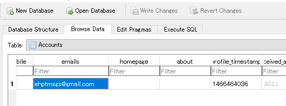</span>

次にチャットメッセージを見る．

チャットメッセージは`Messages`テーブルに格納されている．
<span itemscope="" itemtype="http://schema.org/Photograph">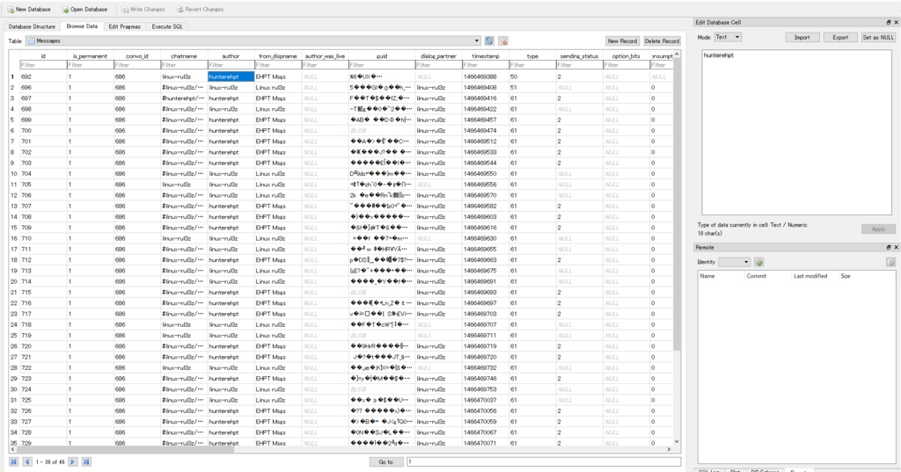</span>

一応，見れるが文字コードとかがおかしいのか中身を読めない．

Skypeのログを見る便利なツールがあるので，これに頼る．

Skype Log Viewer : http://www.nirsoft.net/utils/skype_log_view.html

Exportした`Users/Hunter/AppData/Roaming/Skype/hunterhpt/`を読み込ませるといい感じに表示してくれる．

<span itemscope="" itemtype="http://schema.org/Photograph">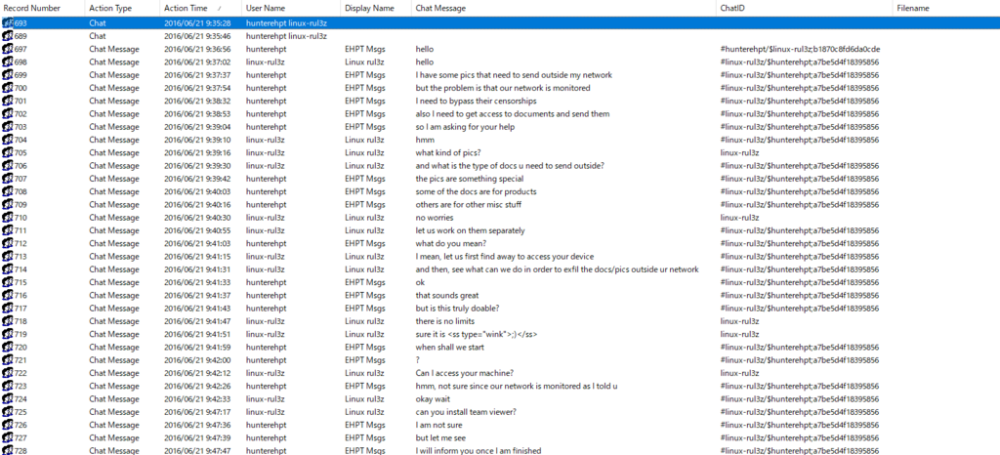</span>

見やすいように時系列順に会話を並べて形成する．

(多分ローカルのTimezoneに合わせられているので-9にしてUTCに直す)

会話ログ原文

``` text
datetime Display Name    Chat Message
2016/06/21 00:36:56 EHPT Msgs   hello
2016/06/21 00:37:02 Linux rul3z hello
2016/06/21 00:37:37 EHPT Msgs   I have some pics that need to send outside my network
2016/06/21 00:37:54 EHPT Msgs   but the problem is that our network is monitored
2016/06/21 00:38:32 EHPT Msgs   I need to bypass their censorships
2016/06/21 00:38:53 EHPT Msgs   also I need to get access to documents and send them
2016/06/21 00:39:04 EHPT Msgs   so I am asking for your help
2016/06/21 00:39:10 Linux rul3z hmm
2016/06/21 00:39:16 Linux rul3z what kind of pics?
2016/06/21 00:39:30 Linux rul3z and what is the type of docs u need to send outside?
2016/06/21 00:39:42 EHPT Msgs   the pics are something special
2016/06/21 00:40:03 EHPT Msgs   some of the docs are for products
2016/06/21 00:40:16 EHPT Msgs   others are for other misc stuff
2016/06/21 00:40:30 Linux rul3z no worries
2016/06/21 00:40:55 Linux rul3z let us work on them separately
2016/06/21 00:41:03 EHPT Msgs   what do you mean?
2016/06/21 00:41:15 Linux rul3z I mean, let us first find away to access your device
2016/06/21 00:41:31 Linux rul3z and then, see what can we do in order to exfil the docs/pics outside ur network
2016/06/21 00:41:33 EHPT Msgs   ok
2016/06/21 00:41:37 EHPT Msgs   that sounds great
2016/06/21 00:41:43 EHPT Msgs   but is this truly doable?
2016/06/21 00:41:47 Linux rul3z there is no limits
2016/06/21 00:41:51 Linux rul3z sure it is <ss type="wink">;)</ss>
2016/06/21 00:41:59 EHPT Msgs   when shall we start
2016/06/21 00:42:00 EHPT Msgs   ?
2016/06/21 00:42:12 Linux rul3z Can I access your machine?
2016/06/21 00:42:26 EHPT Msgs   hmm, not sure since our network is monitored as I told u
2016/06/21 00:42:33 Linux rul3z okay wait
2016/06/21 00:47:17 Linux rul3z can you install team viewer?
2016/06/21 00:47:36 EHPT Msgs   I am not sure
2016/06/21 00:47:39 EHPT Msgs   but let me see
2016/06/21 00:47:47 EHPT Msgs   I will inform you once I am finished
2016/06/21 00:47:51 EHPT Msgs   how can I reach u?
2016/06/21 00:48:12 Linux rul3z send an email to my Hotmail account
2016/06/21 00:48:17 EHPT Msgs   which one?
2016/06/21 00:48:25 Linux rul3z same as Skype <ss type="wink">;)</ss>
2016/06/21 00:48:32 EHPT Msgs   ok <ss type="laugh">:D</ss>
2016/06/21 00:48:34 EHPT Msgs   understood
2016/06/21 00:48:46 EHPT Msgs   see you soon
2016/06/21 00:48:52 Linux rul3z yeah
2016/06/21 00:48:54 EHPT Msgs   bye bye
2016/06/21 00:48:56 Linux rul3z bye
2016/06/21 11:48:37 EHPT Msgs   <URIObject type="File.1" uri="https://api.asm.skype.com/v1/objects/0-weu-d2-a958c1f0bec3eaa30bcef8d795c8ff63" url_thumbnail="https://api.asm.skype.com/v1/objects/0-weu-d2-a958c1f0bec3eaa30bcef8d795c8ff63/views/thumbnail">To view this shared file, go to: <Title>fakeporn.7z</Title> <Description>fakeporn.7z</Description> <a href="https://login.skype.com/login/sso?go=webclient.xmm&amp;docid=0-weu-d2-a958c1f0bec3eaa30bcef8d795c8ff63">https://login.skype.com/login/sso?go=webclient.xmm&amp;docid=0-weu-d2-a958c1f0bec3eaa30bcef8d795c8ff63</a><FileSize v="750184" /><OriginalName v="fakeporn.7z" /></URIObject>
2016/06/21 11:48:46 EHPT Msgs   Nice pics<ss type="wink">;)</ss>
```

会話ログ意訳(日時UTC)

``` text
datetime Display Name    Chat Message
2016/06/21 00:36:56 EHPT Msgs   ハロー
2016/06/21 00:37:02 Linux rul3z ハロー
2016/06/21 00:37:37 EHPT Msgs   私はネットワークの外に送信する必要がある幾つかの写真を持ってる
2016/06/21 00:37:54 EHPT Msgs   でも問題としてネットワークが監視されている
2016/06/21 00:38:32 EHPT Msgs   私はその検閲を回避する必要がある
2016/06/21 00:38:53 EHPT Msgs   さらに私はドキュメントにアクセスしてそれらを送信する必要がある
2016/06/21 00:39:04 EHPT Msgs   だから私はあなたに助けを求めている
2016/06/21 00:39:10 Linux rul3z ウーン…
2016/06/21 00:39:16 Linux rul3z どんな写真？
2016/06/21 00:39:30 Linux rul3z ネットワークの外に送信する必要があるドキュメントのタイプは何？
2016/06/21 00:39:42 EHPT Msgs   写真はスペシャルなもの
2016/06/21 00:40:03 EHPT Msgs   いくつかのドキュメントはプロダクト用
2016/06/21 00:40:16 EHPT Msgs   その他は他の資料
2016/06/21 00:40:30 Linux rul3z 心配ない
2016/06/21 00:40:55 Linux rul3z それらは個々に作業をしよう
2016/06/21 00:41:03 EHPT Msgs   どういう意味？
2016/06/21 00:41:15 Linux rul3z とういうのは，まず私達にあなたのデバイスにアクセスさせてください
2016/06/21 00:41:31 Linux rul3z そして，あなたのネットワークの外にドキュメント/写真がexfil(対象を外的環境から奪取す?)るのを見てください
2016/06/21 00:41:33 EHPT Msgs   ok
2016/06/21 00:41:37 EHPT Msgs   それは良いです
2016/06/21 00:41:43 EHPT Msgs   これは本当に実践できるだろうか？
2016/06/21 00:41:47 Linux rul3z ここに制限は無い
2016/06/21 00:41:51 Linux rul3z もちろん;)
2016/06/21 00:41:59 EHPT Msgs   いつはじめますか
2016/06/21 00:42:00 EHPT Msgs   ?
2016/06/21 00:42:12 Linux rul3z 私はあなたのマシンにアクセスできますか？
2016/06/21 00:42:26 EHPT Msgs   うーん，言ったようにネットワークは監視されているので
2016/06/21 00:42:33 Linux rul3z オーケー，待って
2016/06/21 00:47:17 Linux rul3z TeamViewerはインストールできる？
2016/06/21 00:47:36 EHPT Msgs   よくわかりませんが
2016/06/21 00:47:39 EHPT Msgs   そうですね
2016/06/21 00:47:47 EHPT Msgs   終わったら知らせます
2016/06/21 0047:51  EHPT Msgs   どのようにしてあなたにとどけることができますか？
2016/06/21 00:48:12 Linux rul3z 私のHotmailアカウントにメールを送ってください
2016/06/21 00:48:17 EHPT Msgs   どれ？
2016/06/21 00:48:25 Linux rul3z Skypeと同じ;)
2016/06/21 00:48:32 EHPT Msgs   ok :D
2016/06/21 00:48:34 EHPT Msgs   理解した
2016/06/21 00:48:46 EHPT Msgs   また近いうちに
2016/06/21 00:48:52 Linux rul3z yeah
2016/06/21 00:48:54 EHPT Msgs   bye bye
2016/06/21 00:48:56 Linux rul3z bye
2016/06/21 11:48:37 EHPT Msgs   <URIObject type="File.1" uri="https://api.asm.skype.com/v1/objects/0-weu-d2-a958c1f0bec3eaa30bcef8d795c8ff63" url_thumbnail="https://api.asm.skype.com/v1/objects/0-weu-d2-a958c1f0bec3eaa30bcef8d795c8ff63/views/thumbnail">To view this shared file, go to: <Title>fakeporn.7z</Title> <Description>fakeporn.7z</Description> <a href="https://login.skype.com/login/sso?go=webclient.xmm&amp;docid=0-weu-d2-a958c1f0bec3eaa30bcef8d795c8ff63">https://login.skype.com/login/sso?go=webclient.xmm&amp;docid=0-weu-d2-a958c1f0bec3eaa30bcef8d795c8ff63</a><FileSize v="750184" /><OriginalName v="fakeporn.7z" /></URIObject>
2016/06/21 11:48:46 EHPT Msgs   Nice pics<ss type="wink">;)</ss>
```

会話の流れからして，`EHPT Msgs`がこの端末の所持者で社内ネットワークから機密事項である写真とドキュメントを外に送ろうとしているが，ネットワークが監視されているのでどうしようと`Linux rul3z`に相談をしている感じです．

ネットワークが監視されているということで，TeamViewerをインストールさせてそれ経由でリモート操作をしようとしている感じですね．

TeamViewerは操作される端末側のIDとパスワードを入力することで操作側から端末にリモートでアクセスすることができます．

おそらく，この`Linux rul3z`のHotmailにそのIDとかパスワードが送信されるのでしょう．たぶん．

`Linux rul3z`はHotmailのIDはSkypeと一緒だと言っているのでメールアドレスは`linux-rul3z@hotmail.com`でしょう．

#### Skypeから分かったことと推測

* `EHPT Msgs`が`Linux rul3z`に内部ネットワークから外部にドキュメントと写真を送信したいと相談
* `EHPT Msgs`のネットワークは監視されている
* `Linux rul3z`が`EHPT Msgs`の端末にアクセスをしてどうにか取得をしようとしている
* `EHPT Msgs`の端末にTeamViewerをインストールして`Linux rul3z`がリモートアクセスをしようとしている
* TeamViewerのセットアップが終了したら，`Linux rul3z`のメールアドレス`linux-rul3z@hotmail.com`にTeamViewerの認証情報とかを送信しようとしている

### メール

SkypeでHotmailに送ってくれと言われていたので，メールの証跡を調べる．

PrefetchファイルやUserAssistからOutlookが実行されていたことが分かるので，Outlookのメールを調べる．

Outlookのデータファイルは`.pst`か`.ost`の形式で保存されている．

Outlook データ ファイル (.pst および .ost) の概要 - Outlook
https://support.office.com/ja-jp/article/outlook-%E3%83%87%E3%83%BC%E3%82%BF-%E3%83%95%E3%82%A1%E3%82%A4%E3%83%AB-pst-%E3%81%8A%E3%82%88%E3%81%B3-ost-%E3%81%AE%E6%A6%82%E8%A6%81-222eaf92-a995-45d9-bde2-f331f60e2790

.pst，.ostファイルは以下のパスに保存されているので見る．

`C:/Users/user/AppData/Local/Microsoft/Outlook/`

<span itemscope="" itemtype="http://schema.org/Photograph">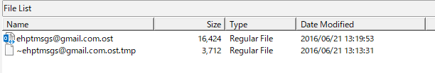</span>

`ehptmsgs@gmail.com.ost`というファイルを確認しファイルをExportする．

次にExportした.ostファイルを閲覧する．

あいにく手元に使えるOutlookのライセンスが無いので，何かしらの.ostファイルViewerが必要になる．

はじめに[FreeOSTViewer](https://gallery.technet.microsoft.com/office/OST-Viewer-to-Easily-Open-96df653e)を試したが，読み込むことが出来ずに断念．

次にXstReaderを使用．

https://github.com/Dijji/XstReader

Exportした.ostファイルを読み込む

<span itemscope="" itemtype="http://schema.org/Photograph">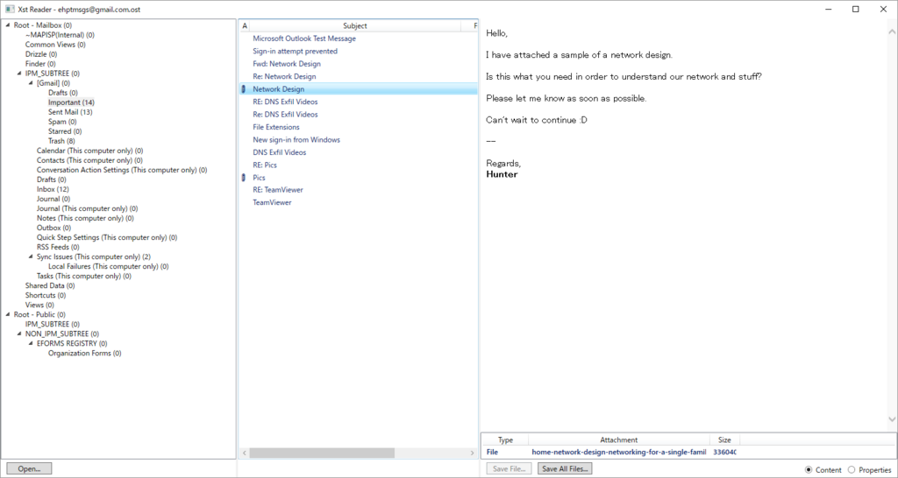</span>

色々とメールが残っていることを確認．だが，日付あっても時間が表示されていないのでまたまた違うツールを検討．

続いてはPST Walkerの評価版を使用．
https://pstwalker.com/

Exportしてきた.ostファイルを開くと見れる．今回は受信した日時，送信した日時も表示されているので大丈夫そう．

評価版なので少し制限があるらしく，一定時間にメールの中身を閲覧する制限があるのでその部分はXstReaderで補っていく．

<span itemscope="" itemtype="http://schema.org/Photograph">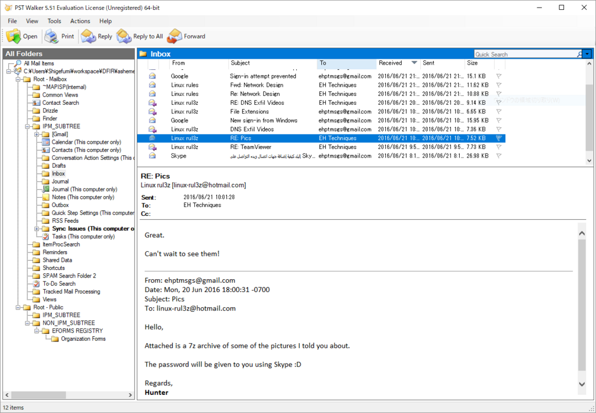</span>

恐らく時間がローカルのタイムゾーンに合わせられてしまうので，UTCに直すために-9した時間を表示．

#### メールのタイムライン

メールの中身を見てく．
InboxとSent Mailである程度時系列にまとめる．

|         日時(UTC)          |           送信者                   |                  受信者          　                  |  件名                        |                            メール内容(要約)   　                                |  添付ファイル                                                                                     |
|--------------------------|---------------------------------|--------------------------------------------------|----------------------------|-------------------------------------------------------------------------|---------------------------------------------------------------------------------------------|
|  2016/06/21 00:53:13     |  `ehptmsgs@gmail.com`             |  `linux-rul3z@hotmail.com`                         |  TeamViewer                | TeamViewインストールしたけどいつから話せますか？                                            |  無し                                                                                         |
|  2016/06/21 00:53:13     |   `linux-rul3z@hotmail.com`       | `ehptmsgs@gmail.com`                               |  RE:TeamViewer             | 今仕事中なので終わったらできます．Skypeでpingします                                          |   無し                                                                                        |
|  2016/06/21 00:57:50     |  `ehptmsgs@gmail.com`             |  `linux-rul3z@hotmail.com`                         |   RE:TeamViewer            | 了解です                                                                    |  無し                                                                                         |
|  2016/06/21 01:00:31     |  `ehptmsgs@gmail.com`             |  `linux-rul3z@hotmail.com`                         |  Pics                      |  このメールに添付した.7zファイルに写真が入ってる．Skype経由でパスワードを渡します                           |  "Pictures.7z"                                                                              |
|  2016/06/21 01:01:28     |  `linux-rul3z@hotmail.com`        |  `ehptmsgs@gmail.com`                              |  RE:Pics                   |  了解です                                                                   |  無し                                                                                         |
|  2016/06/21 11:04:05     |  `linux-rul3z@hotmail.com`        |  `ehptmsgs@gmail.com`                              |  DNS Exifl Videos          |  DNS Data Exfiltrationに関する動画(YouTubeのリンク)の共有                            |  無し                                                                                         |
|  2016/06/21 01:54:21     |  `no-reply@accounts.google.com`  |  `ehptmsgs@gmail.com`                              |  New sign-in from Windows  |  Googleアカウント新規アクセス                                                      |  無し                                                                                         |
|  2016/06/21 01:57:16     |  `linux-rul3z@hotmail.com`        |  `ehptmsgs@gmail.com`                              |  File Extensions           |  ファイルを隠すために拡張子を変えることのアドバイス．PDFファイルの拡張子を確認してください                         |  無し                                                                                         |
|  2016/06/21 01:57:53     |  `ehptmsgs@gmail.com`             |  `linux-rul3z@hotmail.com`                         |  RE:File Extensions        | やってみます．少し待ってください                                                        |  無し                                                                                         |
|  2016/06/21 01:01:17     |  `ehptmsgs@gmail.com`             |  `linux-rul3z@hotmail.com`                         |  RE:File Extensions        |  これを確認してください添付ファイル                                                      |  "Config.png"                                                                               |
|  2016/06/21 11:32:14     |  `ehptmsgs@gmail.com`             |  `linux4rulez@gmail.com`                           |  Hangouts?                 |  あなたからのメール確認しました．Hangoutは繋がりますか？                                        |  無し                                                                                         |
|  2016/06/21 11:50:24     |  `ehptmsgs@gmail.com`             |  `linux-rul3z@hotmail.com`, `linux4rulez@gmail.com`  |  Nice Pics                 | 素敵な写真を添付します．気に入ったら教えてください                                               |  "fakeporn.7z"                                                                              |
|  2016/06/21 11:51:04     |  `ehptmsgs@gmail.com`             |  `linux-rul3z@hotmail.com`                         |  RE:DNS Exifl Videos       | 動画を保存して見てみますが                                                           |  無し                                                                                         |
|  2016/06/21 11:56:39     |  `linux-rul3z@hotmail.com`        |  `ehptmsgs@gmail.com`                              |  RE:DNS Exifl Videos       | それをしないでください．ネットワーク検知されてしまいます                                            |  無し                                                                                         |
|  2016/06/21 11:57:47     |  `ehptmsgs@gmail.com`             |  `linux-rul3z@hotmail.com`                         |  RE:DNS Exifl Videos       |  わかりました削除します．それらのフォルダと情報を全て削除します                                        |  無し                                                                                         |
|  2016/06/21 12:19:33     |  `ehptmsgs@gmail.com`             |  `linux-rul3z@hotmail.com`, `linux4rulez@gmail.com`  |  Network Design            |  ネットワーク設計のサンプルの添付                                                       |  "home-network-design-networking-for-a-single-family-home-case-house-arkko-1433-x-792.jpg"  |
|  2016/06/21 12:20:39     |  `linux4rulez@gmail.com`          |  `ehptmsgs@gmail.com`                              |  RE:Network Design         |  ネットワーク用のオリジナルプリントを入手してください                                             |  無し                                                                                         |
|  2016/06/21 12:31:20     |  `linux4rulez@gmail.com`          |  `ehptmsgs@gmail.com`                              |  Fwd:Network Design        |  "RE:Network Design"の転送メール                                              |  無し                                                                                         |
|  2016/06/21 13:16:00     |  `ehptmsgs@gmail.com`             |  `linux-rul3z@hotmail.com`                         |  Greetings                 |  Outlookの設定の確認のテストとプロジェクトの終了                                            |  無し                                                                                         |

メール経由で送信されたファイルは以下の4つのファイル

* Pictures.7z
* Config.jpg
* fakeporn.7z
* home-network-design-networking-for-a-single-family-home-case-house-arkko-1433-x-792.jpg

2016/06/21 01:57:16に受信したメールで言及されているように，添付ファイルの拡張子を偽装したものが"Config.jpg"だと考えられる．

実際にファイルヘッダを見てみるとどう見てもPDFっぽい感じで.jpgでない．
<span itemscope="" itemtype="http://schema.org/Photograph">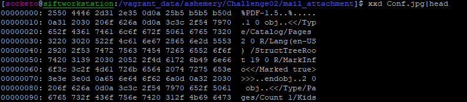</span>

拡張子を.jpgから.pdfに変更して閲覧する．

<span itemscope="" itemtype="http://schema.org/Photograph">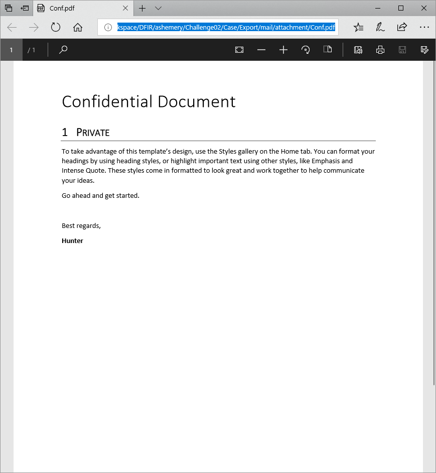</span>

とりあえず"Confidential Docment"と書かれているので恐らく持ち出してはいけない感じのファイルっぽい．

残りのPictures.7zとfakeporn.7zに関してはパスワードがかけられていて今のところ中身は確認することが出来ない．

Pictures.7zに関してはSkype経由でパスワードを送っていることが2016/06/21 01:00:31に受信したメールから分かる．

fakeporn.7zのパスワードに関しては述べられていないが，このファイルが添付されているメールの一つ前にHangoutが出来るかというメールを送っている(2016/06/21 11:32:14)のでHangout経由で送ったのか，それともSkype経由で送ったものかを推測することが出来る．

Skypeのログからパスワードを探したい．

だが，現存するスカイプのログでは2016/06/21/ 00:48:56～2016/06/21 11:48:56が無く，レコード番号も2016/06/21/ 09:48:56の738と2016/06/21 11:48:56の741の間が存在していないことから，パスワード送信部分のメッセージ(739, 740)が削除された可能性がある．

<span itemscope="" itemtype="http://schema.org/Photograph">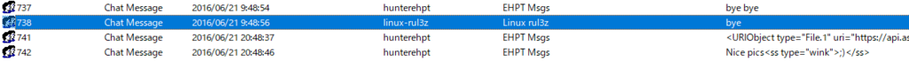</span>

#### メールから分かったことと推測

* この端末を使用しているユーザのメールアドレスは`ehptmsgs@gmail.com`
* 内部ネットワークから持ち出す際に助言を求めているアカウント`Linux rul3z`のメールアドレスは`linux-rul3z@hotmail.com`と`linux4rulez@gmail.com`
* 複数個メールでファイル送信が行われている

    * Pictures.7z : Skypeでパスワードを送信(メール内容より)
    * Config.jpg : ファイル拡張子を".jpg"に偽装したPDFファイル
    * fakeporn.7z : パスワード不明
    * home-network-design-networking-for-a-single-family-home-case-house-arkko-1433-x-792.jpg : ネットワーク構成図(センシティブなものではなさそう(メール内容より))

* DNS Data Exfiltrationの手法をするとネットワークに検知される
* Google HangoutsをSkypeとメール以外の連絡手段として使用している可能性あり

### WEB履歴

今までのSkype，メールでTeamViewerのインストールやHungoutやYouTubeの動画など確実にWEBブラウザを使用シーンが無数にあったのでWEB履歴を確認する．

Prefetchから，実行されていたブラウザはChrome, Firefox, InternetExplorerの3つだということが分かった．

#### Chrome

Chromeの履歴に対しては以下のツールを使ってみる．

obsidianforensics/hindsight

https://github.com/obsidianforensics/hindsight

Python2.7が必要．

ユーザガイドが丁寧なのでこれに従ってやっていく．

https://github.com/obsidianforensics/hindsight/blob/master/documentation/Hindsight%20User%20Guide%20v1.3.0.pdf

スクリプトを実行してブラウザで'localhost:8080'へアクセスすると使うことが出来る．

<span itemscope="" itemtype="http://schema.org/Photograph">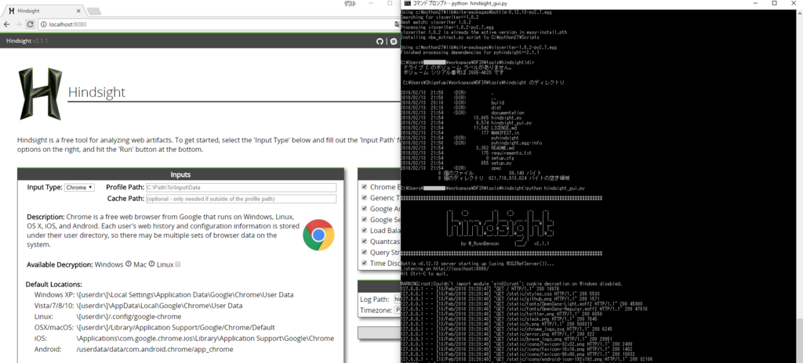</span>

対象の端末OSがWindows8.1なので`   \userdir\]\AppData\Local\Google\Chrome\User Data\Default`をFTK ImagerでExportしてProfile Pathに入力すると以下のように結果が出るので，Save XLSXまたはSave [SQLite DBをクリックして.xlsx形式または.sqlite形式で保存する．

<span itemscope="" itemtype="http://schema.org/Photograph">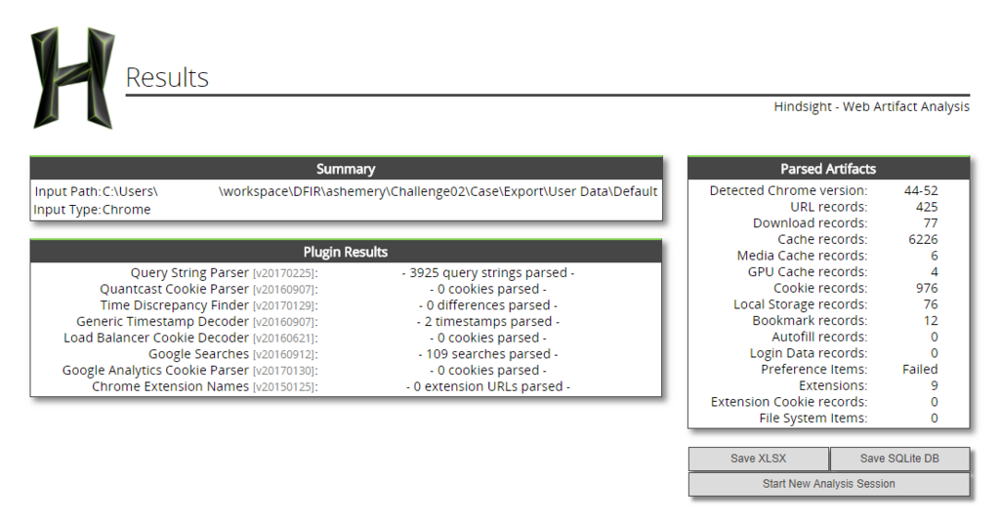</span>

今回はSQLiteDB形式で保存し，DB Browser for SQLiteで中身を見る

<span itemscope="" itemtype="http://schema.org/Photograph">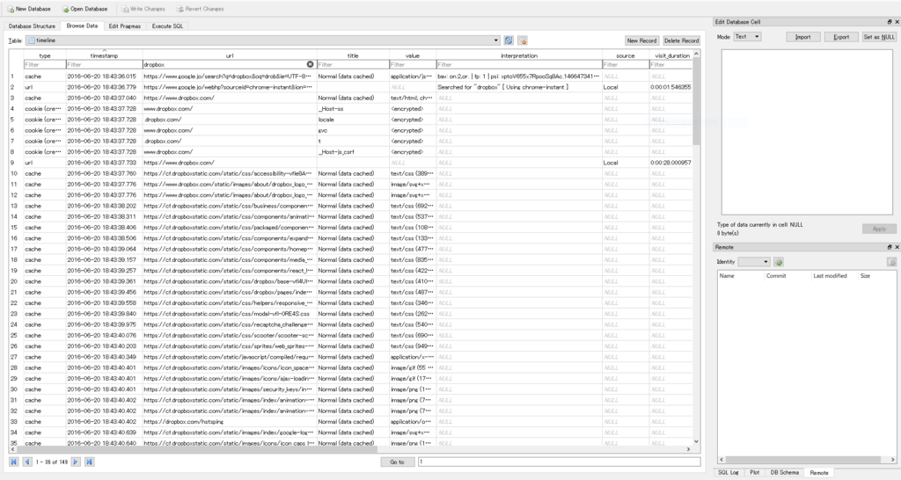</span>

#### Hangouts

メールでHangoutsで連絡できるか？と聞いているので，Chromeの履歴からHangoutsの証跡を探さなけれなならない．

Google Hangoutsのフォレンジック関係は，Android端末に対しての言及はあるがPCのChromeからはあまり見当たらないし，まぁ無理な気がする．

Redditでも言及はあるが，しんどそう．

Google hangouts forensics : computerforensics https://www.reddit.com/r/computerforensics/comments/2631jb/google_hangouts_forensics/

AndroidのHangoutsについてはまぁありそう．

Google Hangouts analysis - Learning Android Forensics https://www.packtpub.com/mapt/book/networking_and_servers/9781782174578/7/ch07lvl1sec60/google-hangouts-analysis

なので，WEB履歴から"hangouts.google.com"でフィルタをして恐らくHangoutsを使用していた時間帯というのを絞りたい．

<span itemscope="" itemtype="http://schema.org/Photograph">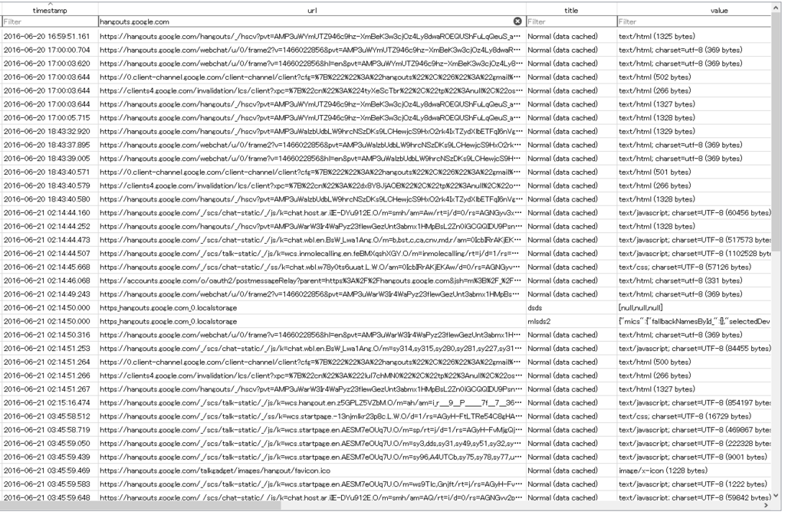</span>

おおまかに以下の時間帯に"hangouts.google.com"にアクセスしていた

* 2016/06/20 23:59:51～2016/06/21 00:00:05
* 2016/06/21 01:43:32～2016/06/21 01:43:40
* 2016/06/21 09:14:44～2016/06/21 09:15:16
* 2016/06/21 10:45:58～2016/06/21 10:46:49
* 2016/06/21 11:30:35～2016/06/21 11:32:47 ※
* 2016/06/21 12:22:46～2016/06/21 12:22:48 ※
* 2016-06-21 12:52:35 ※
* 2016/06/21 13:19:25 ※

メール件名"Hangouts?"を送信した時間以降のものに"※"を表示している．

Hangoutsで相手と連絡をとったのはここのどこかになると推測できる．

正直それ以外は現状よく分からないのでHangoutsはとりあえずここまで．

##### Chrome経由でダウンロードされたファイル

timelineテーブルにアクセスのタイプ，日時，URL，タイトル…などのカラムに格納されている．

このタイプの部分に"download"として格納されているものは，Chromeを介してファイルをダウンロードしたものが残っている．

ダウンロードされたファイルは以下のようなものがあった(抜粋)

* 2016-06-20 16:57:34.500 : putty.exe
* 2016-06-20 16:58:03.044 : DEFCON-22-Zoltan-Balazs-Bypass-firewalls-application-whitelists-in-20-seconds-UPDATED.pdf
* 2016-06-20 17:52:02.028 : TeamViewer_Setup-vfa.exe
* 2016-06-20 18:43:57.878 : googledrivesync.exe
* 2016-06-20 18:44:08.835 : DropboxInstaller.exe
* 2016-06-21 01:54:19.418 : SkypeSetup.exe
* 2016-06-21 02:15:24.167 : Wireshark-win64-2.0.4.exe
* 2016-06-21 02:16:35.660 : 7z1602-x64.exe
* 2016-06-21 03:45:34.221 : ccsetup519pro.exe
* 2016-06-21 03:48:23.003 : torbrowser-install-6.0.1_en-US.exe
* 2016-06-21 03:56:27.140 : bcwipeSetup.exe
* 2016-06-21 03:57:17.593 : Eraser6.2.0.2971-NoRuntimes.exe
* 2016-06-21 03:58:38.541 : nmap-7.12-setup.exe
* 2016-06-21 04:00:20.183 : Hash_Suite_Free_3_4.zip
* 2016-06-21 04:00:58.367 : burpsuite_free_v1.7.03.jar
* 2016-06-21 04:01:24.055 : SysinternalsSuite.zip
* 2016-06-21 04:03:41.022 : python-2.7.11.msi
* 2016-06-21 04:03:42.545 : python-3.5.1.exe
* 2016-06-21 04:05:00.071 : odbg110.zip

※時間はUTC-7なので+7にしてUTCに変換する必要がある

#### InternetExploler

IEのWEB履歴を見る．

IE version10以降の閲覧履歴は以下のファイルに保存されているのでこれをFTK ImagerでExportする．

`C:¥Users¥{Username}¥AppData¥Local¥Microsoft¥Windows¥WebCache. ¥WebCacheV01.dat`

解析にはブラウザの閲覧履歴を解析するツールBrowsing History Viewを使う．

BrowsingHistoryView - View browsing history of your Web browsers

https://www.nirsoft.net/utils/browsing_history_view.html

ExportしたWebCacheV01.datをメニューから`Options`-`Advanced Options`を選択し，`Load history from..`で`Load history from the specified history files`から`Internet Explorer(Version 10.0/11.0) history files(WebCacheV01.dat)`にパスを設定する．

<span itemscope="" itemtype="http://schema.org/Photograph">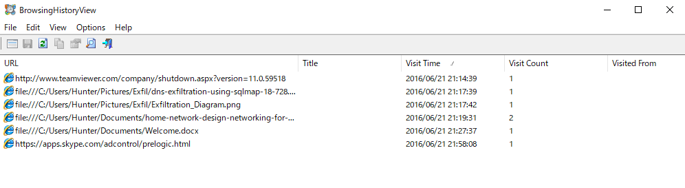</span>

アクセスを見ると，`2016/06/21 21:14:39`に`http://www.teamviewer.com/company/shutdown.aspx?version=11.0.59518`があるが，これはTeamViewerを終了した際に表示されるWEBページのようで，おそらくこの時間帯にTeamViewerを終了したのではないかと推測出来る．

WebCacheV01.datがIEでアクセスしたものだけでなく，WindowsのExplolerでアクセスしたファイルについても記録がされている．

今回のログで残っているものは以下の4つ．

ここもローカルのタイムゾーンに合わせられてしまうので，UTCに直すために-9をする必要があるので直した時間を表示．

``` text
file:///C:/Users/Hunter/Pictures/Exfil/dns-exfiltration-using-sqlmap-18-728.jpg      2016/06/21 12:17:39
file:///C:/Users/Hunter/Pictures/Exfil/Exfiltration_Diagram.png     2016/06/21 12:17:42
file:///C:/Users/Hunter/Documents/home-network-design-networking-for-a-single-family-home-case-house-arkko-1433-x-792.jpg       2016/06/21 12:19:31
file:///C:/Users/Hunter/Documents/Welcome.docx      2016/06/21 12:27:37
```

`Pictures/Exfil`下の画像ファイル2つはメールで言及していたDNS Data Exfiltrationについての画像なのでとりあえず機密な画像では無さそう．

`home-network-design-networking-for-a-single-family-home-case-house-arkko-1433-x-792.jpg`は`C:\Users\Hunter\Documents\`に現存していないが，`2016/06/21 12:19:33`に送信したメールの添付ファイルが同じ名前で恐らくこのファイルでないかと推測が出来る．

裏付けとして，USNJurnlで調べる．

冒頭でUSNAnalyticsで出力した`usn_analytics_records-20160621T081446.csv`でファイルの名前でフィルタをする．

<span itemscope="" itemtype="http://schema.org/Photograph">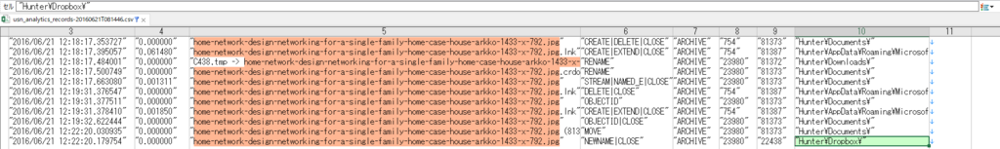</span>

2016/06/21 12:22:20に`Hunter\Documents\`から`Hunter\Dropbox\`へ移動していることが分かる．

とりあえずメールに添付されていたファイルと，Dropboxへ移動したファイルが一致していることを確認する．

<span itemscope="" itemtype="http://schema.org/Photograph">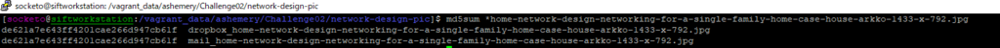</span>

MD5ハッシュ値が一致していることを確認．メールで送信されたネットワーク図がDropboxにアップロードされていた画像と同じことを確認した．

`Welcome.docx`は`C:\Users\Hunter\Documents\`に現存している普通のドキュメントファイルで開くことが出来た．

<span itemscope="" itemtype="http://schema.org/Photograph">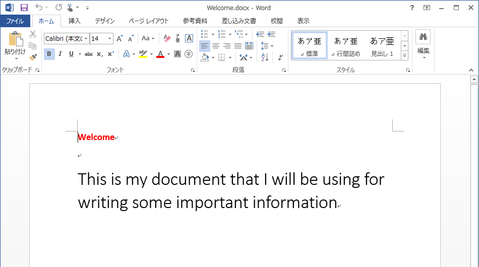</span>

重要な情報を書くために使用する文書だと記述があるので，まぁ重要そうなドキュメントっぽい．

#### TorBrowser

Chromeのダウンロードや，Prefetch，UserAssistを見ているとTor Browserを実行していることが分かる．

分かりやすく`C:\Users\Hunter\Desktop\Tor Browser`というディレクトリがあるので見ていく．

Tor BrowserはFirefoxをベースにされていて，今回は`C:\Users\Hunter\Desktop\Tor Browser`下にあるFirefox.exeを使っているらしい．
なので，Prefetch的には`FIREFOX.EXE-FB5E902D.pf`として残っている．

Prefetchのデータ部分を見ると，参照しているのがデスクトップのTor Browser下のファイルということでこれがTor Browserだということが分かる．

<span itemscope="" itemtype="http://schema.org/Photograph">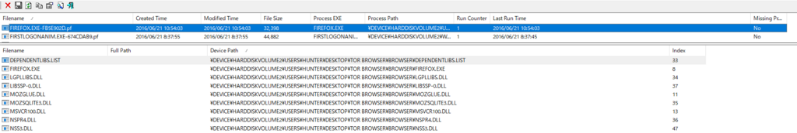</span>

Tor BrowserのフォレンジックについてはSANSが資料を出していたので少し見た．

Tor Forensics on Windows OS(PDF)

https://digital-forensics.sans.org/summit-archives/dfirprague14/Tor_Forensics_On_Windows_OS_Mattia_Epifani.pdf

`pagefile.sys`にTor Browserを実行，または介してアクセスした際に残る特徴的なキーワードが以下の7つらしい．

* HTTP-memory-only-PB
* Torproject
* Tor
* Torrc
* Geoip
* Torbutton
* Tor-launcher

中でもメモリ上には`HTTP-memory-only-PB`の文字列の後にはTor Browserを介してアクセスしたURLが記載されるらしい．
pagefile.sysの中を上のキーワードで検索をしたがそれっぽいのは無し．断念．

気休め程度にTor経由で送受信されたデータ量を確認する．

SRUMを確認する．

SRUMはWindows8から導入された，System Resource Usage Monitorの略称のシステム．

Windows上で動いていたサービスやアプリケーション，ネットワーク接続の活動のデータを保持している．

詳しい説明は以下のSRUM forensics．

SRUM forensics

https://www.sans.org/summit-archives/file/summit-archive-1492184583.pdf

`C:\Windows\System32\sru\SRUDB.dat`をFTKImagerでExportする．

ネットワーク接続を確認するのにはNetworkUsageViewを使用する．

NetworkUsageView https://www.nirsoft.net/utils/network_usage_view.html

これにExportしたSRUDB.datを読み込ませる．

アプリケーションやシステムごとにネットワーク接続の送信/受信のデータ量を見ることができる．

tor.exeがは672,648bytes送信，5,613,506bytes受信となっている．

<span itemscope="" itemtype="http://schema.org/Photograph">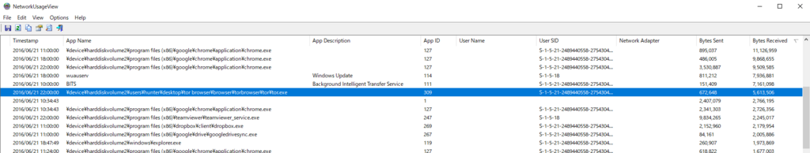</span>

そんなに大きな通信は行われなかったということは分かる．

### TeamViewer

Skype，メール，WEB履歴，PrefetchからTeamViewerが使用されていたことが分かっているので，TeamViewerについて見ていく．

TeamViewerのフォレンジックについてのドキュメントがあったりするので見る．

TeamViewer Forensics - Champlain College(PDF)

https://www.champlain.edu/Documents/LCDI/archive/Team-Viewer-Forensics.pdf

サポート詐欺や不正なログインの際に使用される事例が増えているということで以下のような記事もあったので参考．

TeamViewerに気をつけましょう | セキュリティ対策のラック

https://www.lac.co.jp/lacwatch/people/20160606_000357.html

TeamViewerのログ関係のファイルは`C:\Program Files (x86)\TeamViewer`と`C:\Users\{Username}\AppData\Roaming\TeamViewer`にある．

今回見るべきログは次の2つくらいっぽい

* C:\Program Files (x86)\TeamViewer\Connections_incoming.txt
* C:\Program Files (x86)\TeamViewer\TeamViewer11_Logfile.log

`Connections_incoming.txt`はリモートログインされたセッションを記録しています．

ログはUTCで記録されている．以下のログでは`2016/06/21 12:05:30`～`2016/06/21 12:14:29`に一度接続されていることが確認出来る．

``` text
547298337    PSUT1   21-06-2016 12:05:30 21-06-2016 12:14:29 Hunter  RemoteControl   {DFB7FCA2-0F07-4468-BE01-67D73CD83B3A}
```

`TeamViewer11_Logfile.log`はシステム的なログが残っているが，いい感じのものは残っていなかった．

上の`Team-Viewer-Forensics.pdf`を読むと分かるが，リモートされる端末(被害端末)ではファイル転送のログは残らず，リモートする端末の方のログで一時的に残ることから，今回の被害端末上でファイルが転送されたという証跡は確認することが出来ない．

#### TeamViewerから分かったこと

* 2016/06/21 12:05:30～2016/06/21 12:14:29の間，リモートで操作されていた

#### TeamViewerでの遠隔操作時の動き

上記で分かったTeamViewerの接続時間で何をやっていたのかを調べる必要があるのでとりあえずやる．

##### Prefetchから

<span itemscope="" itemtype="http://schema.org/Photograph">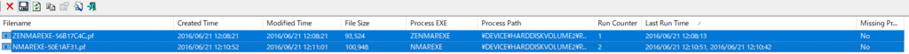</span>
Prefetchを見ると，その時間に`zenmap`，`nmap`が実行されていることが分かる．

zenmapはポートスキャンツールであるnmapのGUI版．

どこかしらにポートスキャンをしたと考えられる．

USNJrnlからこの時間内に作成された`C:\Users\Hunter\.zenmap\recent_scans.txt`を見てみると，以下のファイルパスが書かれている．

`C:\Users\Hunter\Desktop\nmapscan.xml`

NMAPに関係ありそうなファイルなので見てみる．

<span itemscope="" itemtype="http://schema.org/Photograph">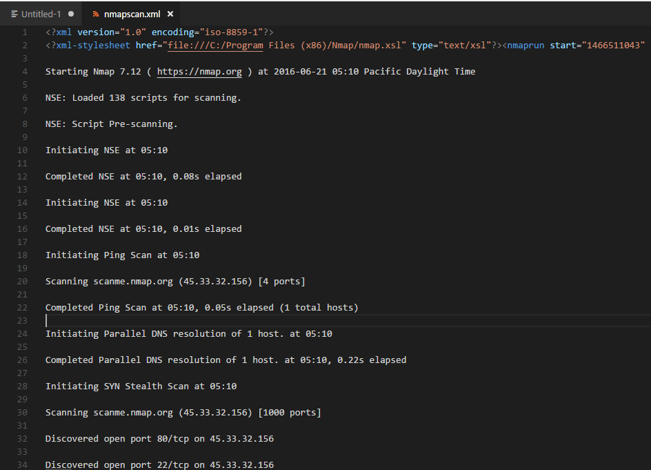</span>

nmapのスキャンログの様子．

`scanme.nmap.org(45.33.32.156)`へポートスキャンをしているログを確認することができた．

### Cloudストレージ

今回のこの端末にはDropboxとGoogleDriveが入っていた．

両方共，インストールした後にそのディレクトリにファイルを置いてファイルの設定を変更すると他者と共有することが出来る．

普通に機密情報とかだとクラウドストレージにアップするだけでも怒られが発生しそうなので，その辺を見る．

Cloud Storage Forensics(PDF)

https://digital-forensics.sans.org/summit-archives/Prague_Summit/Cloud_Storage_Forensics_Mattia_Eppifani.pdf

有償ツールを使ったりメモリを使ったりしていたので，今回はUSNJrnl上で`C:\Users\Hunter\Dropbox`ディレクトリと`C:\Users\Hunter\Google Drive`を見てファイルの流れを確認する．

各アップロードされたファイル
- Dropbox
- Get Started with Dropbox.pdf : Dropboxの始め方の説明
- Accounts.txt : 使用しているアカウント一覧(Gmail, Skype, TeamViewer, GoogleDrive, Dropbox)
- Info/TechnialInfo.txt : 2016/06/21 11:04:05に受信したメールのDNS Data ExfiltrationのYouTube動画リンク集
- home-network-design-networking-for-a-single-family-home-case-house-arkko-1433-x-792.jpg
- Outlook/backup.pst : メールのバックアップファイル
- Pictures.7z : メールで送信したアーカイブファイル

* Google Drive

    * Pyhton and the Army Knife (Recoverd).gslides : Googleスライド(URLが中に入っているが限定公開の模様)
    * Getting Started : Google Driveの公式の開始pdf
    * tools.txt : 2016/06/21 11:04:05に受信したメールのDNS Data ExfiltrationのYouTube動画リンク集
    * Accounts.txt : このアカウントに居ストールするアプリケーションたち(Chrome, Skype, Outlook,など)
    * proposal.pdf : 4orensics – Training and Consultation Servicesについて(宣伝)
    * FTK-Imager.zip

### Pictures.7zとfakeporn.7zの中身を探す

#### Pictures.7z

USNJrnlで`Pictures.7z`をフィルタすると，初回登場が.lnkファイルとなる．

ちなみにこのLNKファイルは削除されているため，どこを参照したものなのかが不明．

<span itemscope="" itemtype="http://schema.org/Photograph">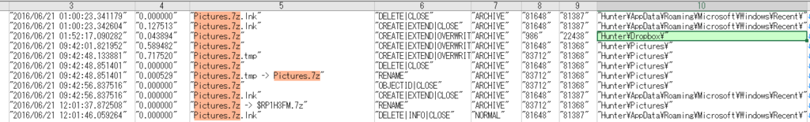</span>

CREATEされたパスがDropboxになっていることから，このファイルはDropbox経由で取得したものの可能性もあると考えることが出来る．

#### fakeporn.7z

USNJrnlで"fakeporn"で検索をする．

`2016/06/21 11:45:03に`C:\Users\Hunter\Pictures`下にfakepornというディレクトリが作られ，そのディレクトリへ.画像ファイルが保存されていることが分かる．

<span itemscope="" itemtype="http://schema.org/Photograph">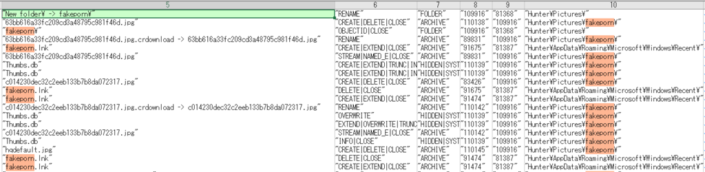</span>

ChromeのWEB履歴内で保存パスを`C:\Users\hunter\Pictures\fakeporn`で検索をするとファイルが複数ヒットする．

<span itemscope="" itemtype="http://schema.org/Photograph">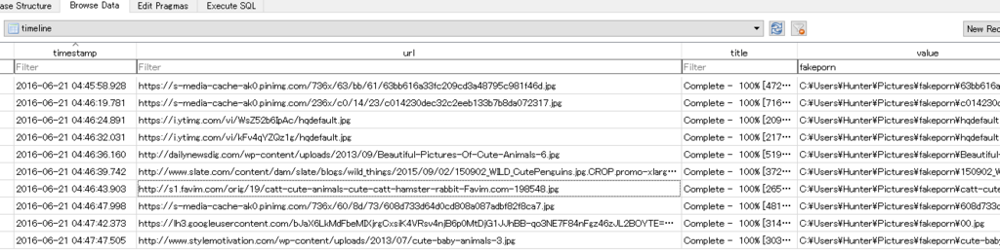</span>

そのURLを見ていくと，可愛らしい動物の写真が出て来る．

恐らく，fakeporn.7zの中身はそれらの画像だということを推測．

そして後にfakeporn.7zは2016/06/21 12:01:07に`mofygdvh.mcp`へリネームしたことをUSNJrnlで確認した．

### FileCarving

最初の要件的にファイルカービングを行う必要があるっぽいのでやる．

カービングはファイルのヘッダ/フッタを探しだして2つの間のブロックを切り取ってファイル復元をするものらしい．

断片とかをつなぎ合わせていい感じにファイルを復元するもので，コンセプトとか説明は以下を読んだ方が良いっぽい．

File Carving - ForensicsWiki

http://forensicswiki.org/wiki/File_Carving

Data Carving Concepts(pdf)

https://www.sans.org/reading-room/whitepapers/forensics/data-carving-concepts-32969

今回はSIFT Workstationに入っているforemostを使用する．他にもcarvingツールは色々あるっぽいので今度見てみる．

Foremost

http://foremost.sourceforge.net/

``` text
[socketo@siftworkstation:/vagrant_data/ashemery/Challenge02]$ foremost -t jpg,png,gif,doc,xls,pdf -i 4orensics03.001 -o ./output
Processing: 4orensics03.001
*********************************************************************|
```

結果．指定していない拡張子も取られているので何かおかしい．

<span itemscope="" itemtype="http://schema.org/Photograph">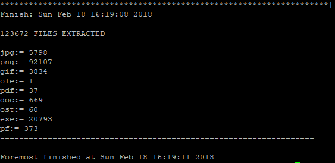</span>

実際にカービングして出力されたファイルを見る．

fakeporn.7zに入っていたであろうと推測された動物の画像が復元されていることを確認することが出来た．

<span itemscope="" itemtype="http://schema.org/Photograph">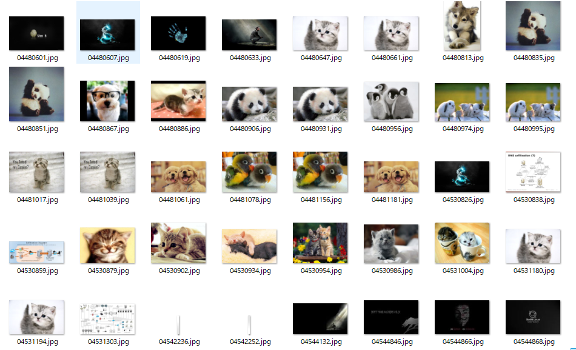</span>

ノイズがかなりあるので，その点をどうにかしないといけなさそう．

## TimeLine

とりあえずまとめ．

何かを見落としている気がするので適宜訂正をしていきますのでゆるしてください．

|       日時(UTC)               |                   事象                                                                                                                                                     |                 ソース        　 |                 備考         　  |
|-----------------------------|--------------------------------------------------------------------------------------------------------------------------------------------------------------------------|------------------------------|-------------------------------|
|  2016/06/21 00:36:56        |  EHPT MsgsがLinux rul3zへSkypeで内部情報の漏洩の補助の依頼                                                                                                                               |  Skype log                   |                               |
|  2016/06/21 00:52:02        |  TeamViewerのインストーラをダウンロード                                                                                                                                                |  WEB履歴(Chrome), USNJurnl     |                               |
|  2016/06/21 01:00:31        |  `ehptmsgs@gmail.com`    から`linux-rul3z@hotmail.com`へ添付ファイル"Pictures.7z"を送信                                                                                                  |  Outlookメール                  |                               |
|  2016/06/21 01:00:??        |  EHPT MsgsからLinux rul3zへ"Pictures.7z"のパスワードをSkype経由で送信                                                                                                                   |  メールの内容                      |  推測:Skypeのメッセージが削除された可能性あり    |
|  2016/06/21 01:01:17        |  `ehptmsgs@gmail.com`から`linux-rul3z@hotmail.com`へ拡張子を偽装したPDF機密ファイル"Config.png"を送信                                                                                            |  Outlookメール                  |                               |
|  2016/06/21 10:51:21        |  TorBrowserのインストール                                                                                                                                                       |  Prefetch                    |  実際のTor実行はFirefox.exe         |
|  2016/06/21 10:54:03        |  TorBrowserの実行                                                                                                                                                           |  Prefetch                    |  何かしらの匿名通信                    |
|  2016/06/21 11:06:44        |  Hash Suite Freeの実行                                                                                                                                                      |  UserAssist, Prefetch        |  ハッシュからのパスワードの解析              |
|  2016/06/21 11:19:41        |  Pythonの実行                                                                                                                                                               |  UserAssist, Prefetch        |  何かしらのスクリプトが実行された？            |
|  2016/06/21 11:50:24        |  `ehptmsgs@gmail.com`から`linux-rul3z@hotmail.com`, `linux4rulez@gmail.com`へ"fakeporn.7z"を送信                                                                                     |  Outlookメール                  |  動物の写真集                       |
|  2016/06/21 12:02:35        |  BCWipeの実行                                                                                                                                                               |  UserAssist, Prefetch        |  証跡の削除                        |
|  2016/06/21 12:05:30        |  TeamViewerでの遠隔操作開始                                                                                                                                                      |  TeamViewerログ                |                               |
|  2016/06/21 12:08:14        |  Zenmapの実行．ポートスキャンの開始                                                                                                                                                    |  Prefetch                    |  45.33.32.156へポートスキャン         |
|  2016/06/21 12:13:15        |  ポートスキャンの実行結果nmapscan.xmlを保存                                                                                                                                             |  USNJrnl                     |                               |
|  2016/06/21 12:14:29        |  TeamViewerでの遠隔操終了                                                                                                                                                       |  TeamViewerログ                |                               |
|  2016/06/21 12:19:33        |  `ehptmsgs@gmail.com`から`linux-rul3z@hotmail.com`, `linux4rulez@gmail.com`へネットワ画像の"home-network-design-networking-for-a-single-family-home-case-house-arkko-1433-x-792.jpg"の送信  |  Outlookメール                  |                               |
|  2016/06/21 12:28:08        |  CCleanerの実行                                                                                                                                                             |  UserAssist, Prefetch        |  証跡の削除                        |
|  2016/06/21 13:05:19        |  nmapscan.xmlを参照                                                                                                                                                         |  USNJrnl, LNK                |                               |
|  2016/06/21 13:16:00        |  プロジェクトの終了                                                                                                                                                               |  メール内容                       |                               |