※ 移行前の元ブログ記事 : [Defcon DFIR CTF 2018 # Image1 - HRServer WriteUp - #include <sys_socket.h>](https://socketo.hatenablog.jp/entry/2018/08/26/030815)

## はじめに

インターネットを眺めていたら，Magnet Forensicsが開催してaいたDFIRのCTF「Defcon DFIR CTF 2018」が公開されていたのでやった話（全部は解けていない）

> The [\#Defcon](https://twitter.com/hashtag/Defcon?src=hash&ref_src=twsrc%5Etfw) [\#DFIR](https://twitter.com/hashtag/DFIR?src=hash&ref_src=twsrc%5Etfw) [\#CTF](https://twitter.com/hashtag/CTF?src=hash&ref_src=twsrc%5Etfw) is now open to the public. https://t.co/IdOE23dMzh [\#infosec](https://twitter.com/hashtag/infosec?src=hash&ref_src=twsrc%5Etfw)— David Cowen (@HECFBlog) [2018年8月13日](https://twitter.com/HECFBlog/status/1029099210556284939?ref_src=twsrc%5Etfw)

Hacking Exposed Computer Forensics Blog _Daily Blog #451_ Defcon DFIR CTF 2018 Open to the Public : http://www.hecfblog.com/2018/08/daily-blog-451-defcon-dfir-ctf-2018.html

Defcon DFIR CTF 2018 : https://defcon2018.ctfd.io/challenges

## 対象イメージファイル

実際に調査するイメージファイルは以下のブログのDropboxのリンクからImage1，Image2，Image3と3つダウンロードできる．

http://www.hecfblog.com/2018/08/daily-blog-451-defcon-dfir-ctf-2018.html

Image1.7zのパスワードは書いてあるので，それを使う．

Image2.7z，Image3.7zのパスワードはCTFの問題を解いていくと分かる．

やっていったら長くなったので，Image2とImage3については今後書く予定です．


## Image 1 : HRServer

`Image1.7z`を展開すると，`HRServer_Disk0.e01`と`HRServer_Disk0.txt`が出てくる．
`HRServer_Disk0.txt`を見ると，X-waysでこのディスクイメージを取得したっぽいことが分かる．

`HRServer_Disk.e01`をFTK Imagerで開く．

<span itemscope="" itemtype="http://schema.org/Photograph">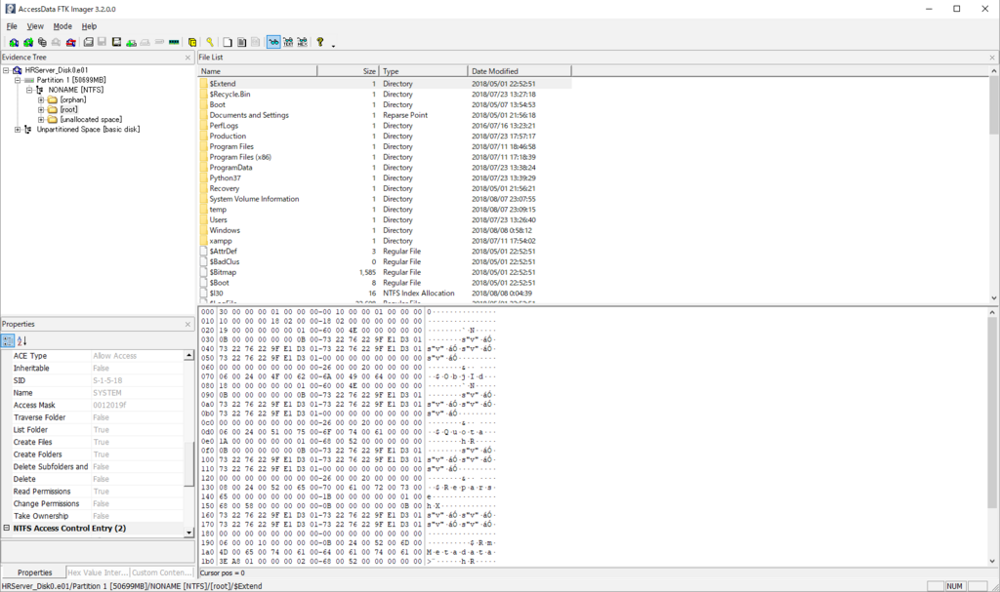</span>

Windows Serverっぽい．

どうせならSIFT Workstationでやるかという気持ちになったので，E01ファイルをSIFT Workstationでマウントする．

SANS Digital Forensics and Incident Response Blog _ Digital Forensic SIFTing - Mounting Evidence Image Files _ SANS Institute : https://digital-forensics.sans.org/blog/2011/11/28/digital-forensic-sifting-mounting-ewf-or-e01-evidence-image-files

`# ewfmount HRServer_Disk0.e01 /mnt/e01/`

`# mmls /mnt/e01/ewf1`

``` text
DOS Partition Table
Offset Sector: 0
Units are in 512-byte sectors

Slot      Start        End          Length       Description
000:  Meta      0000000000   0000000000   0000000001   Primary Table (#0)
001:  -------   0000000000   0001026047   0001026048   Unallocated
002:  000:000   0001026048   0104857599   0103831552   NTFS / exFAT (0x07)
```

``` python
# python
Python 2.7.12 (default, Dec  4 2017, 14:50:18)
[GCC 5.4.0 20160609] on linux2
Type "help", "copyright", "credits" or "license" for more information.
>>> 1026048 * 512
525336576
```

`# mount -o ro,loop,show_sys_files,streams_interface=windows,offset=525336576 -t ntfs /mnt/e01/ewf1 /mnt/windows_mount`

確認する

<span itemscope="" itemtype="http://schema.org/Photograph">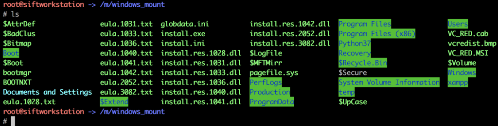</span>

OK

## HR Server Basic

### 前情報

`HRServer_Disk0.txt`の中身する

``` text
08/08/2018, 14:32:43
X-Ways Forensics BYOD 19.6 SR-6 x64
Create Disk Image

Computer: DESKTOP-0QT8017
4 processor cores
Windows 10 (64 bit)
Time zone: -7:00 Pacific Daylight Time
User: Administrator
Examiner(s): Professor Frink

Source: Hard disk 1
Sectors 0-104857599

Model: f-switch BF063FCFC580DB48
Serial No.: DIsk-0
Firmware Rev.: 0001
Bus: SCSI/SATA

Total capacity: 53,687,091,200 bytes = 50.0 GB
Bytes per sector: 512
Sector count: 104,857,600

SMART: n/a (Incorrect function.)
Read consistency: no anomalies detected

Partitioning style: MBR
Disk signature: 5C2C870D
Unpartitionable space: 0 Sectors

Partition 1
Sectors 1,026,048 - 104,857,599
Partition table: Sector 0
NTFS

Unused inter-partition space:
Sectors 0 - 1,026,047 (501 MB)
= 501 MB

Destination: C:\Users\Administrator\Desktop\HRServer_Disk0.e01

Hash of source data: BB3E772F1896D23865AC3FE9763691D3 (MD5)

08/08/2018, 20:30:47
Imaging completed: 12.6 GB
Duration: 5:58:03 h. 0.1 GB/min.
Compression: fast, adaptive
Compression ratio: 75%
```

### HRServer基本調査

Regripperでレジストリ周りを調べると以下のことが分かる

* Windows OSのバージョン : Windows Server 2016 Datacenter
* Timezoneの確認 : UTC-7
* ユーザ

    * Administrator[500]
    * Guest[501]
    * DefaultAccount[503]
    * mpowers[1000]

* グループ

``` text
    Group Name    : Administrators [2]
LastWrite     : Wed Jul 11 17:22:06 2018 Z
Group Comment : Administrators have complete and unrestricted access to the computer/domain
Users :
S-1-5-21-2967420476-1305424719-3994513216-1000     => mpowers
S-1-5-21-2967420476-1305424719-3994513216-500       => Administrator
```

### HR Server - Acquisition Software(2)

問題文

``` text
Which software was used to image the HR Server?
```

HRServerのイメージを取得したソフトウェアを答えるだけ．

HRServer_Disk0.txtに取得時のログか書かれており，X-Ways Forensics BYODで取得されたことがわかるので，それ．

FLAG:`X-Ways`

### HR Server - Acquisition Software Version(2)

問題文

``` text
Which version of the software was used to image the HR Server? [Format: n.n]
```

X-Waysのバージョンを答える．

FLAG:`19.6`

### HR Server - Entry Name(2)

問題文

``` text
What is the file name that represents MFT Entry 168043?
```

MFTエントリ168043を表すファイル名は何か．

MFTを解析するのにはanalyzeMFT.pyを使う．

analyzeMFT.py : https://github.com/dkovar/analyzeMFT

``` text
# analyzeMFT.py -f \$MFT.copy0 -o MFT.csv
```

出力した`MFT.csv`からエントリ168043を探す

`# cat MFT.csv | grep '"168043"'`

<span itemscope="" itemtype="http://schema.org/Photograph">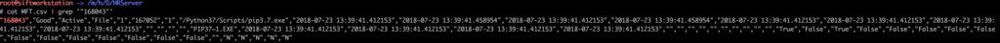</span>

FLAG:`pip3.7.exe`

### HR Server - Entry Number(2)

問題文

``` text
What is the MFT Entry number of the following file? \xampp\mysql\bin\mysql.exe
[format is an integer]
```

逆にファイルからMFATのエントリー番号を探す．

ファイルは`\xampp\mysql\bin\mysql.exe`

`# cat MFT.csv | grep '/xampp/mysql/bin/mysql.exe'`

<span itemscope="" itemtype="http://schema.org/Photograph">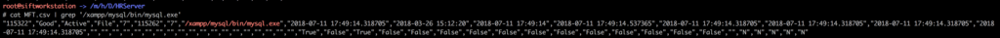</span>

FLAG:`115322`

### HR Server - Attribute ID(2)

問題文

``` text
What is the MFT Attribute ID of the named $J data attribute for the MFT Entry with a file name of $UsnJrnl?
[format is an integer]
```

$ Jデータ属性のMFT属性IDをintで答える的は話

Autopsyでイメージを開く
<span itemscope="" itemtype="http://schema.org/Photograph">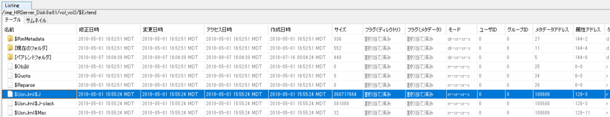</span>

[属性アドレス]が`128-3`なので`3`

FLAG:`3`

### HR Server - SMB(2)

問題文

``` text
At 2018-08-08 18:10:38.554 (UTC) what was the IP address of the the client that attempted to access SMB via an anonymous logon?
```

2018-08-08 18:10:38.554 (UTC)にSMBでanonymous logonを施行したクライアントのIPアドレスを調べる．

調査用している端末がUTC+9である為，Windowsのイベントビュアーで見ると9時間ズレることになる．

XMLで表示すると，実際の生のUTCで見れるんでそれで確認する

<span itemscope="" itemtype="http://schema.org/Photograph">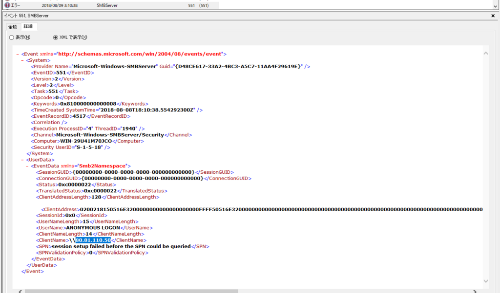</span>

IPアドレスが`80.81.110.50`のクライアントからanonymous logonを施行しているのがある．

FLAG:`80.81.110.50`

### HR Server - Saved(2)

問題文

``` text
What was the name of the batch file saved by mpowers?

[answer is fullpath starting with c:*****]
```

`mpowers`が保存したバッチファイルの名前は何．

`mpowers`のuserassistをregripperを使って見る．

その中に.batファイルがあればそれっぽいのでそれ．

`# rip.pl -r Users/mpowers/NTUSER.DAT -p userassist | grep bat`

<span itemscope="" itemtype="http://schema.org/Photograph">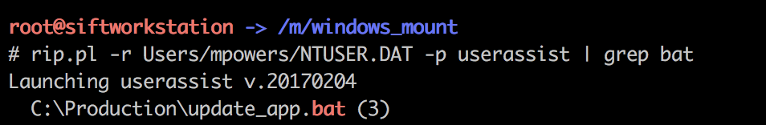</span>

FLAG:`c:\Production\update_app.bat`

### HR Server - Application Q 1(2)

問題文

``` text
What is the name of the hr management application that hosts a web server?
```

ホストしているHR Managementのアプリケーションは何？

`/Users/Administrator/Downloads`に以下の実行ファイルがあった

* `orangehrm-4.1.exe`
* `orangehrm_mysql.sql`
* `xampp-win32-5.6.36-0-VC11-installer.exe`

`OrangeHRM`というオープンソースの人材管理システムがインストールされていたように感じる．

OrangeHRM - Human Resource Management 日本語情報トップページ - OSDN : https://ja.osdn.net/projects/sfnet_orangehrm/

/直下に`xampp`のディレクトリはあるが，`xampp/apache/logs`にこれといったログは無いので，このOrangeHRMの方のディレクトリを見るべきっぽい．

OrangeHRMのホームディレクトリは`/Program Files/OrangeHRM/4.1`になっており，それ以下はxamppと同じようなディレクトリ構造になっているっぽい．

そんな感じでOrangeHRMですね．はい．

FLAG:`OrangeHRM`

### HR Server - Application Q 2(2)

問題文

``` text
What was the public url for the HR system's portal?

[format: http://*****]
```

`/Program Files/OrangeHRM/4.1/apache/logs`の`access.log`をザッと見てると，`http://127.0.0.1/orangehrm-4.1/symfony/web/*`へアクセスしている後に`http://74.118.139.108/symfony/web/*`へのアクセスに変わってる．

ローカルで立てた後にPublicにしたっぽくて`http://74.118.139.108/symfony/web/index.php`がポータルのトップっぽい．

FLAG:`http://74.118.139.108/symfony/web/index.php/`

### HR Server- Changes Q1(2)

問題文

``` text
What is name of the file that had a change recorded with an update sequence number of 368701440?
```

USNAnalyticsを使ってUSNジャーナルの解析をする．
USNAnalytics:https://www.kazamiya.net/usn_analytics

`C:\Users\socketo\workspace\DFIR\DefconDFIR2018\HRServer\usn_analysis.exe -o outputdir -u $UsnJrnl$J`

出力されたcsvファイル(tsv)からUSN:`368701440`を探す．

`# cat usn_analytics_records-20180806T233530.tsv | grep 368701440`

<span itemscope="" itemtype="http://schema.org/Photograph">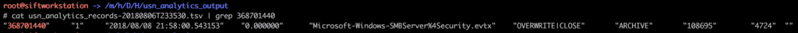</span>

FLAG:`Microsoft-Windows-SMBServer%4Security.evtx`

### HR Server - Changes Q2(2)

問題文

``` text
What is the name of the deleted file with a reference number of 12947848928752043?
```

よくわからん

## HR Server - Advanced

### HR Server - Logon(4)

問題文

``` text
At 2018-07-30 22:31:33 UTC which user was logged in under, what was the logon type (integer), and the logon process name?
[format: {TargetUserName} - {LogonType} - {LogonProcessName} - {IpAddress}]
```

この時間にログオンしたやつを見つけて上のフォーマットで答える

このフォーマット的にSecurityイベントログのようなので`/Windows/System32/winevt/Logs/Security.evtx`を見たいので見たが，Eventlogの消去が行われていたようで，その時間のイベントログを見ることが出来ない．(UTC+9上の環境で見ている為，時間はズレている)

<span itemscope="" itemtype="http://schema.org/Photograph">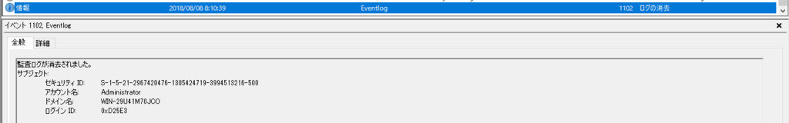</span>

`Security.evtx`以外では，RDP関係のイベントが残るイベントログ`Microsoft-Windows-TerminalServices-RemoteConnectionManager%4Admin.evtx`を見ると，該当の時間にRDPで接続されているように思える．

<span itemscope="" itemtype="http://schema.org/Photograph">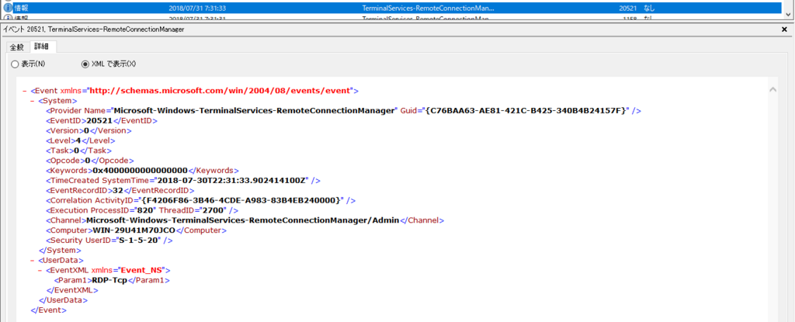</span>

一応この時間に接続がされていたようなので，どうにかしてSecurity.evtxを持ってきたい．

今回は幸いに，`/System Volume Information`下を見るとVolume Shadow Copyのファイルあるので，それを利用する．

Volume Shadow CopyをSIFT Workstationにマウントする

<iframe width="560" height="315" src="https://www.youtube.com/embed/OtIk2ldtWno" frameborder="0" allow="autoplay; encrypted-media" allowfullscreen=""></iframe>

参考動画

`# ewfmount /mnt/hgfs/DefconDFIR2018/HRServer/HRServer_Disk0.e01 /mnt/ewf/`

`# mmls /mnt/ewf/ewf1`

``` text
DOS Partition Table
Offset Sector: 0
Units are in 512-byte sectors

Slot      Start        End          Length       Description
000:  Meta      0000000000   0000000000   0000000001   Primary Table (#0)
001:  -------   0000000000   0001026047   0001026048   Unallocated
002:  000:000   0001026048   0104857599   0103831552   NTFS / exFAT (0x07)
```

``` python
# python
Python 2.7.12 (default, Dec  4 2017, 14:50:18)
[GCC 5.4.0 20160609] on linux2
Type "help", "copyright", "credits" or "license" for more information.
>>> 1026048 * 512
525336576
>>> exit()
```

`# vshadowmount -o 525336576 /mnt/ewf/ewf1 /mnt/vss/`

`# mountwin /mnt/vss/vss1 /mnt/shadow_mount/`

確認する

<span itemscope="" itemtype="http://schema.org/Photograph">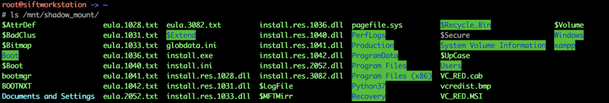</span>

このVSSでのイベントログを確認すると，Security.evtxはイメージファイルに現存しているSecurity.evtxよりもサイズが大きいので削除されていないっぽい．

実際にSecurity.evtxを抽出し，中身を見ると削除される前の状態のものであることが確認できる．
目的の時間のイベントログを探すと以下のイベントログが見つかる．

<span itemscope="" itemtype="http://schema.org/Photograph">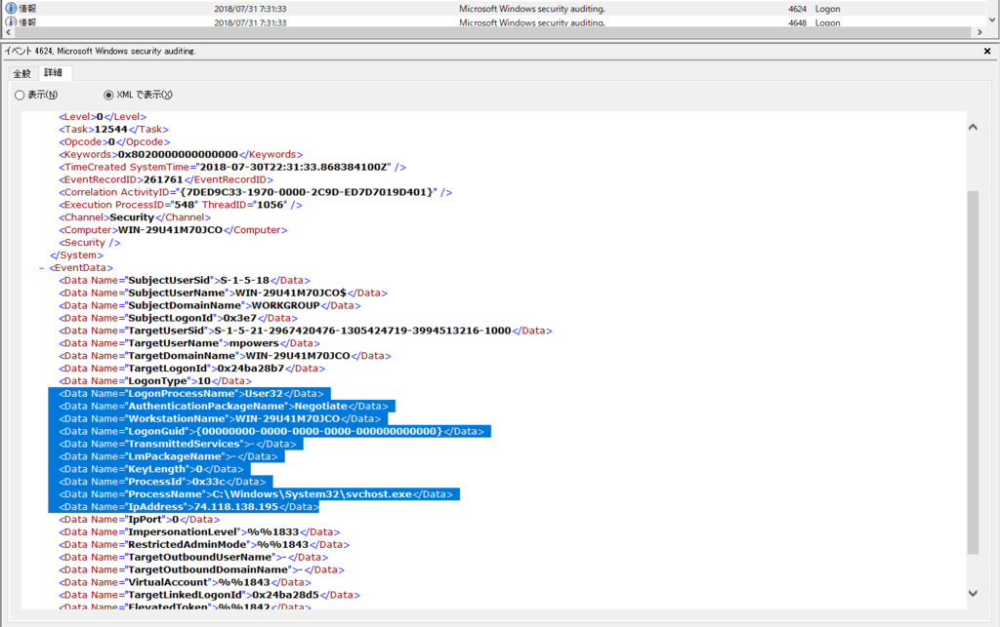</span>

この結果をフォーマットに合わせる

FLAG:`mpowers - 10 - User32 - 74.118.138.195`

### HR Server - Task Started(4)

問題文

``` text
At 2018-07-27 02:42:43 (UTC), what is the name of the task that was started?
```

この時間に始まったタスクを調べるとのこと．
イベントログ`Microsoft-Windows-TaskScheduler%4Operation.evtx`を見る

<span itemscope="" itemtype="http://schema.org/Photograph">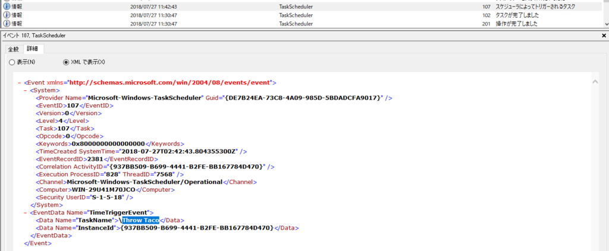</span>

`Throw Taco`というタスクがこの時間にスケジューラによって開始しているのでそれ．

FLAG:`Throw Taco`

### HR Server - HR System 1(4)

問題文

``` text
Which IP address was accessing the OrangeHRM portal via Chrome 68.0.3440.84?
```

`access.log`を`Chrome/68.0.3440.84`でgrepする

<span itemscope="" itemtype="http://schema.org/Photograph">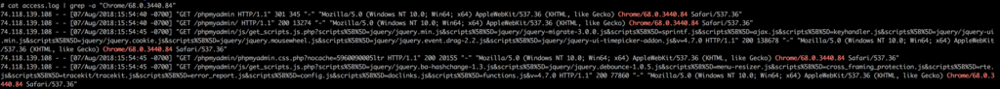</span>

FLAG:`74.118.139.108`

### HR Server - Web App(4)

問題文

``` text
What version of Apache was being used?

[format: n.n]
```

Apacheのバージョンを調べる

`Program Files/OrangeHRM/4.1/apache`でApache関係のファイルがあるので見ると，Apache2.4っぽいので`2.4`

FLAG:`2.4`

### HR Server - Changes Q3(4)

問題文

``` text
What is the integer representation for the reason code given a USN V2 record where the record's reason flags have the following:

USN_REASON_CLOSE | USN_REASON_DATA_EXTEND | USN_REASON_FILE_CREATE
```

USN RECORD V2において`CLOSE`，`DATA_EXTEND`，`FILE_CREATE`のReasonコードを答える問題．

以下のMicrosoftのドキュメントを見ると分かる．

USN_RECORD_V2 _ Microsoft Docs : https://docs.microsoft.com/en-us/windows/desktop/api/winioctl/ns-winioctl-usn_record_v2

|  Reason                  |  Code        |
|--------------------------|--------------|
|  USN_REASON_CLOSE        |  0x80000000  |
|  USN_REASON_DATA_EXTEND  |  0x00000002  |
|  USN_REASON_FILE_CREATE  |  0x00000100  |

この3つが含まれているコードは`0x80000102`になる

これをdecimalにすると`2147483906`になる

FLAG:`2147483906`

## HR Server - Expert

### HR Server - Web Traffic Q1(8)

問題文

``` text
What was the top communicating IP address with the web server?
```

Webサーバと一番通信していたIPアドレスを探す．
普通に`access.log`で出現したIPアドレスを出現多い順にする

`$ cat access.log | awk '{print $1}' | sort | uniq -c | sort -rn | head`

``` text
 780 74.118.138.195
361 99.191.150.129
361 73.60.202.108
361 68.34.44.44
211 74.118.139.108
193 24.63.119.107
175 74.56.59.151
139 104.9.181.249
126 47.75.16.178
125 47.90.92.121
```

FLAG:`74.118.138.195`

### HR Server - Web Traffic Q2(8)

問題文

``` text
How many requests were made to the web server where the requested url contained a wget command within in?
```

リクエストされたURLにwgetが含まれた回数を数える．
普通にgrepして数える

`$ cat access.log| grep wget | wc -l`

``` text
101
```

FLAG:`101`