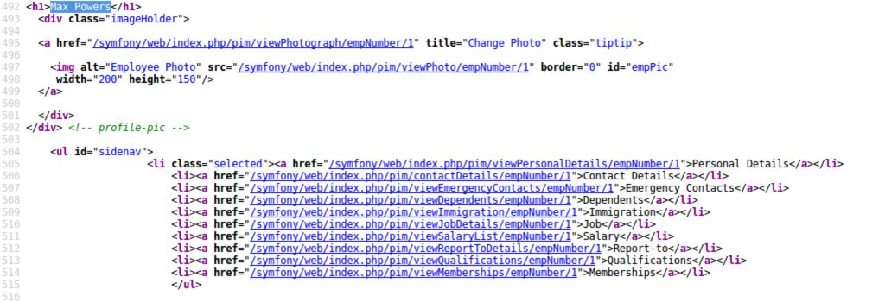

※ 移行前の元ブログ記事 : [Defcon DFIR CTF 2018 # Image2 - FileServer WriteUp - #include <sys_socket.h>](https://socketo.hatenablog.jp/entry/2018/09/16/151141)

## はじめに

以下の記事の続き．

[Defcon DFIR CTF 2018 # Image1 - HRServer WriteUp](https://socketo.hatenablog.jp/entry/2018/08/26/030815)

ディスクイメージの容量が大きくて削除したいので供養(すべて解けていないので誰か教えてください状態)


## File Server Basic

HR Serverの問題を解いているといつの間にか`Next`という項目が増えて，`Image2.7z`のパスワードが開示されるので，Imag2(File Server)をやっていくことができる

### File Server - Basic 1(2)

問題文

``` text
What is the volume serial number of the only partition on the File Server Disk Image
```

Volumeのシリアルナンバーを答える．

FTK Imagerで開いているイメージファイルのFile System Informationを見る．

<span itemscope="" itemtype="http://schema.org/Photograph"></span>

FLAG:`C096-2465`

### File Server - Basic 2(2)

問題文

``` text
What is the name of the examiner who made the Forensic Image?
```

X-Waysとかでイメージを取得するとき，調査員の名前をオプションとして記入することができる．
その際，取得時のログにその名前とかが書かれるんで，`FileServer_Disk0.txt`を見るとexaminer's name的なところに書いてある．

FLAG:`Professor Frink`

### File Server - Basic 3(2)

問題文

``` text
Who cleared the security event log?
```

(忘れたけど確かAdmministratorだった気が)

FLAG:`Administrator`

### FIle Server - Basic 4(2)

問題文

``` text
What is the hostname of the computer?
```

Regripperで調べる

`# rip.pl -r SYSTEM -p compname`

``` text
Launching compname v.20090727
compname v.20090727
(System) Gets ComputerName and Hostname values from System hive

ComputerName    = WIN-M5327EF98B9
TCP/IP Hostname = WIN-M5327EF98B9
```

FLAG:`WIN-M5327EF98B9`

### File Server - Basic 5(2)

問題文

``` text
When was the computer last shutdown? UTC Time In the format of Month/Day/Year Hour:Minute:Second in 24 hour timr 1/1/2018 14:01:01
```

Regripperで調べる

`# rip.pl -r SYSTEM -p shutdown`

``` text
Launching shutdown v.20080324
shutdown v.20080324
(System) Gets ShutdownTime value from System hive

ControlSet001\Control\Windows key, ShutdownTime value
ControlSet001\Control\Windows
LastWrite Time Thu Jul 26 10:16:16 2018 (UTC)
ShutdownTime = Thu Jul 26 10:16:16 2018 (UTC)
```

FLAG:`7/26/2018 10:16:16`

### File Server - Basic 6(2)

問題文

``` text
What is the Current Build number of Windows on the File Server computer?
```

このWindowsのBuildナンバーを見る．

`SYSTEM`ハイブを抽出して，Registry Explolerで見る．
<span itemscope="" itemtype="http://schema.org/Photograph"></span>

FLAG:`7601`

### File Server - Basic 7(2)

問題文

``` text
what was mpowers user id?
```

`mpowers`のユーザIDは何という話．

Regripperを使ってSAMから情報を取得する

`# rip.pl -r Windows/System32/config/SAM -p samparse`

``` text
Username        : mpowers [1000]
Full Name       : mpowers
User Comment    :
Account Type    : Default Admin User
Account Created : Wed Jul 11 20:35:55 2018 Z
Name            :
Password Hint   : 1
Last Login Date : Wed Aug  8 21:36:48 2018 Z
Pwd Reset Date  : Wed Jul 11 20:36:40 2018 Z
Pwd Fail Date   : Mon Jul 30 16:55:55 2018 Z
Login Count     : 10
--> Normal user account
--> Password does not expire
```

FLAG:`1000`

### File Server - Basic 8(2)

問題文

``` text
Which program did Max Powers last run through the GUI?
```

RegripperでUserAssist実行履歴を見る

`# rip.pl -r Users/mpowers/NTUSER.DAT -p userassist`

``` text
Launching userassist v.20170204
UserAssist
Software\Microsoft\Windows\CurrentVersion\Explorer\UserAssist
LastWrite Time Mon Jul 16 17:05:01 2018 (UTC)

{CEBFF5CD-ACE2-4F4F-9178-9926F41749EA}
Wed Aug  8 21:37:04 2018 Z
C:\Users\mpowers\Desktop\sub-win-x64_104.148.109.124_5682_3262.exe (2)
Wed Aug  8 00:16:07 2018 Z
{1AC14E77-02E7-4E5D-B744-2EB1AE5198B7}\services.msc (1)
Tue Aug  7 23:59:01 2018 Z
{1AC14E77-02E7-4E5D-B744-2EB1AE5198B7}\msiexec.exe (2)
Tue Aug  7 23:57:57 2018 Z
{1AC14E77-02E7-4E5D-B744-2EB1AE5198B7}\ServerManager.msc (1)
Tue Aug  7 20:33:21 2018 Z
Microsoft.Windows.RemoteDesktop (1)
Tue Aug  7 20:16:34 2018 Z
Chrome (4)
Tue Aug  7 20:13:14 2018 Z
{1AC14E77-02E7-4E5D-B744-2EB1AE5198B7}\cmd.exe (16)
Tue Aug  7 20:05:30 2018 Z
{F38BF404-1D43-42F2-9305-67DE0B28FC23}\explorer.exe (6)
Mon Jul 30 22:44:12 2018 Z
{6D809377-6AF0-444B-8957-A3773F02200E}\Notepad++\notepad++.exe (4)
Mon Jul 30 22:43:35 2018 Z
{1AC14E77-02E7-4E5D-B744-2EB1AE5198B7}\WindowsPowerShell\v1.0\powershell.exe (3)
Tue Jul 24 15:47:39 2018 Z
{1AC14E77-02E7-4E5D-B744-2EB1AE5198B7}\WF.msc (2)
Mon Jul 16 17:03:14 2018 Z
{1AC14E77-02E7-4E5D-B744-2EB1AE5198B7}\notepad.exe (13)
Microsoft.InternetExplorer.Default (12)
```

FLAG:`sub-win-x64_104.148.109.124_5682_3262.exe`

### File Server - Basic 9(2)

問題文

``` text
When did Max Powers last open projections.zip? UTC TIme Day/Month/year Hour:Minute:Sec in 24 hour time 1/1/2018 15:20:11
```

わからん〜〜〜

### File Server - Basic 10(2)

問題文

``` text
How many clusters are on the partition?
```

FTK ImagerでFIle System Infromationを見る

<span itemscope="" itemtype="http://schema.org/Photograph"></span>

FLAG:`13081343`

## File Server - Advanced

### File Server - Advanced 1(4)

問題文

``` text
Where does the \VSS directory go?
```

\VSSディレクトリはどこへ行くか．

確かにSIFT WorkstationでFile Serverをマウントしてvssディレクトリを見ると，リンクが`unsupported reparse point`となってる．

<span itemscope="" itemtype="http://schema.org/Photograph"></span>

FTK Imagerでマウントして，見るとファイルTypeがReparse Pointになっていて，hexで見るとリンク先が見える．

<span itemscope="" itemtype="http://schema.org/Photograph"></span>

FLAG:`\GLOBALROOT\Device\Harddisk\VolumeShadowCopy1\`

### File Server - Advanced 2(4)

&nbsp;問題文

``` text
When was the Volume Shadow Copy 1 created? Enter answer in UTC TIme in the following format 1/1/2018 13:11:11 Month/Day/Year 24 Hour Time
```

USNAnalyticsを使ってUSNジャーナルの解析をした出力ファイルに対して，`\System Volume Information\`下にある`{f491dfb8-90bc-11e8-a336-c4ce02cc7d80}{3808876b-c176-4e48-b7ae-04046e6cc752}`を探す

<span itemscope="" itemtype="http://schema.org/Photograph"></span>

FLAG:`8/7/2018 20:32:40`

### File Server - Advanced 3(4)

問題文

``` text
Where did Max Powers login from?
```

`Max Powers`はどこからログインしたのかという話．
今まで`mpowers`だったのに突然名前になったのはな何という感じ．(これで引っかかってわりと時間をかけてしまった)

SIFT WorkstationでマウントしたHR Server, FileServerに対して`Max Powers`で全文検索する．

<span itemscope="" itemtype="http://schema.org/Photograph"></span>

`[HR Server]/Users/Administrator/AppData/Local/Microsoft/Windows/INetCache/IE/TQ2DH63X/viewMyDetails[1].htm`というファイルで`<h1>Max Powers</h1>`の部分がヒットしている．

このファイルはパスを見ると，IEのキャッシュファイルっぽい．

HR Serverの`Administrator`アカウントでIEでアクセスがされているようには見える．

実際のhtmファイルを見ると以下のような感じになっていて，ログインをするとユーザのアカウント名が表示されるっぽい？

<span itemscope="" itemtype="http://schema.org/Photograph"></span>

このキャッシュが生成されたアクセスをIEのWEB履歴ファイル`WebCache`下を抽出し，IECaheViewで食わせて見る．

IECacheView - Internet Explorer Cache Viewer : http://www.nirsoft.net/utils/ie_cache_viewer.html

履歴を見ると，URLが`http://74.118.139.108/symfony/web/index.php/pim/ViewMyDetails`になっていることが確認できる．

<span itemscope="" itemtype="http://schema.org/Photograph"></span>

ログインして自分のアカウントを見たときにはこんな感じのURLになると推測できる．

そしてWEBサービスなんで，DBとかにログインの履歴とか残ってたりしないかと思い，xamppで管理されているであろうOrangeHRM関係のファイルを見る．

``[HRServer]/Program Files/OrangeHRM/4.1/mysql/bin/`に`my.ini`ファイルがあるので色々と見るが，本当は`[HRServer]/Users/Administrator/Downloads`に`orangehrm_mysql.sql`という明らかに[MySQLからダンプされたようなファイルがあってそれを見れば良い．

MySQLのダンプファイルなので，MySQLのDBをリストアする．

```
mysql > CREATE DATABASE OrangeHRM;`
# mysql -u username -ppassword -D OrangeHRM < orangehrm_mysql.sql
mysql> select * ohrm_users;
```

<span itemscope="" itemtype="http://schema.org/Photograph"></span>

`ohrm_users`に登録されているユーザは4つ

`hs_hr_employee`ではユーザが3人登録されていて，`Max Powers`がいることが確認できる．

<span itemscope="" itemtype="http://schema.org/Photograph"></span>

ログインした感じのものが`ohrm_login`に残っている．

<span itemscope="" itemtype="http://schema.org/Photograph"></span>

Maxがログインしているところが多々あり，それのアクセスを調べる為に．apacheのaccess.logを調べる．
`viewMyDetail`がログインしている状態っぽいので，それでgrepする

`$ cat access.log| grep "symfony/web/index.php/pim/viewMyDetail*"`

<span itemscope="" itemtype="http://schema.org/Photograph"></span>

これを見るとIPアドレスが共通しており，`74.118.138.195`からログインしていることが分かる．

FLAG:`74.118.138.195`

### File Server - Advanced 4(4)

問題文

``` text
What program was used to delete forensic artifacts?
```

フォレンジックアーティファクトを削除するのに使われたプログラムは何という話．

`\Users\mpowers\Desktop`にそれっぽい実行ファイルがある．

Regripperで出力したUseAssistにも怪しい実行ファイルがある．

``` text
Value names with no time stamps:
{1AC14E77-02E7-4E5D-B744-2EB1AE5198B7}\cleanmgr.exe
C:\Users\mpowers\Desktop\PrivaZer.exe
Microsoft.Windows.WindowsInstaller
{1AC14E77-02E7-4E5D-B744-2EB1AE5198B7}\SystemPropertiesComputerName.exe
{1AC14E77-02E7-4E5D-B744-2EB1AE5198B7}\taskmgr.exe
```

PrivaZer.exeを調べると，PCのクリーンをするプログラムだというのが出てくる．
Free PC cleaner - Download : https://privazer.com/download.php#.W4A9B5MzYsk

それっぽい．

FLAG:`PrivaZer.exe`

### File Server - Advanced 5(4)

問題文

``` text
What is the name of the zip file that contains the M4Projects directory?
```

VSSをマウントして，現状無い部分を見てみる

FLAG:`FileServerShare.zip`

### File Server - Advanced 10(4)

問題文

``` text
What service did the attacker use to access this system?
```

攻撃者が使って侵入したシステムは何？
RDP

FLAG:`RDP`

## File Server -Expert

### File Server - Expert 1(8)

問題文

``` text
What program extracted Mnemosyne.sys?
```

どのプログラムがMnemosyne.sysを抽出したか？
Desktop下にフォレンジックツール`F-Response`があり，マニュアルを見るとMnemosyne.sysを抽出する感じがあるのでそれっぽい．

https://f-response.com/assets/pdfs/F-Response_Manual_5.00.01-August2013.pdf

FLAG:`F-Response`