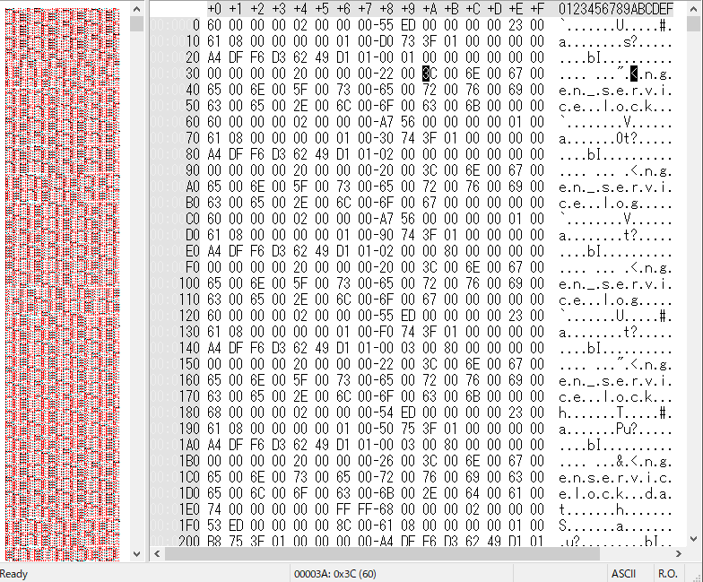

※ 移行前の元ブログ記事 : [SECCON 2018 Online CTF Forensics問題 Write-up - #include <sys_socket.h>](https://socketo.hatenablog.jp/entry/2018/10/28/154122)

## はじめに

SECCON2018のオンライン大会のForensics問題のWrite-up

フォレンジック問題はやるかと腰を上げてやるだけやった

UnzipとHistory

### Unzip

#### 問題文

``` sh
$ Unzip flag.zip.
```

#### Write-up

ファイル名:`unzip.zip_26c0cb5b40e9f78641ae44229cda45529418183f`のZIPファイルが落ちてくる．

``` sh
$ file unzip.zip_26c0cb5b40e9f78641ae44229cda45529418183f
unzip.zip_26c0cb5b40e9f78641ae44229cda45529418183f: Zip archive data, at least v1.0 to extract
```

普通にzipファイルなのでunzipする

``` sh
$ unzip -d unzip unzip.zip_26c0cb5b40e9f78641ae44229cda45529418183f
Archive:  unzip.zip_26c0cb5b40e9f78641ae44229cda45529418183f
extracting: unzip/flag.zip
inflating: unzip/makefile.sh
```

unzipするとflag.zipとmakefile.shが出てくる
flag.zipは暗号化されたZIPファイル

``` sh
$ ls -la
.rw-r--r--@ 225 socketo 27 10  0:10 flag.zip
.rwx---r-x@  99 socketo 27 10  0:10 makefile.sh
```

makefile.shの中身を見ると，zipパスワードに`perl -e "print time()"`で出力されたunixtimeが設定されていることがわかる

``` sh
echo 'SECCON{'`cat key`'}' > flag.txt
zip -e --password=`perl -e "print time()"` flag.zip flag.txt
```

このzipファイルが作成された時の時間を調べる為にexiftoolで調べる

``` sh
$ exiftool flag.zip
ExifTool Version Number         : 11.01
File Name                       : flag.zip
Directory                       : .
File Size                       : 225 bytes
File Modification Date/Time     : 2018:10:27 00:10:41+09:00
File Access Date/Time           : 2018:10:27 00:47:28+09:00
File Inode Change Date/Time     : 2018:10:27 23:09:08+09:00
File Permissions                : rw-r--r--
File Type                       : ZIP
File Type Extension             : zip
MIME Type                       : application/zip
Zip Required Version            : 20
Zip Bit Flag                    : 0x0009
Zip Compression                 : Deflated
Zip Modify Date                 : 2018:10:27 00:10:42
Zip CRC                         : 0x571b1069
Zip Compressed Size             : 43
Zip Uncompressed Size           : 32
Zip File Name                   : flag.txt
```

このzipファイルのmodify dateが`2018:10:27 00:10:41+09:00`だというのが分かる

dateコマンドでunixtimeに変換する

``` sh
$ date -j -f "%Y-%m-%d %H:%M:%S" "2018-10-27 00:10:41" "+%s"
1540566641
```

unzipする

``` sh
$ unzip -P 1540566641 flag.zip
Archive:  flag.zip
inflating: flag.txt
```

``` sh
$ cat flag.txt
SECCON{We1c0me_2_SECCONCTF2o18}
```

FLAG:`SECCON{We1c0me_2_SECCONCTF2o18}`

## History

### 問題文

``` text
History Check changed filename.

file:J.zip_4c7050d70c9077b8c94ce0d76effcb8676bed3ba
```

### Write-up

ファイル名`J.zip_4c7050d70c9077b8c94ce0d76effcb8676bed3ba`のzipファイルが落ちてくるので，unzipすると`J`というファイルが展開される

fileコマンドで見てもdataとしか出ない

``` text
$ file J
J: data
```

BZで開いてhexで見てみると$USNジャーナルの$Jっぽい

<span itemscope="" itemtype="http://schema.org/Photograph"></span>

$USNジャーナルについては日本語だと，JSAC2018の@4n6istさんの"USNジャーナル解析の追求"がとても詳しく書いてあるので参考．

USNジャーナル解析の追求
https://www.jpcert.or.jp/present/2018/JSAC2018_03_yamazaki.pdf

そもそもファイルの名前も`J`なので$Usnjrnl$Jファイルとして解析する

JSAC2018で@4n6istさんが発表していたUSNAnalyticsを使う

USN Analytics _ Forensicist : https://www.kazamiya.net/usn_analytics

``` text
HIstory >usn_analytics.exe -o outdir -u J
4093104 bytes (J)
Search USNRECORD.........Done
0 corrupt records skipped
43313 records found
Check records....................Done
Path construction...................Done
4880 records after packing
Write records.........Done
Check executed trace...Done
Check opened trace...Done
Check suspicious trace...Done
CPU Time: 14.684000
Processed Time: 14(s)
```

出力された`usn_analytics_records-20160107T154818.csv`を見る，問題文にあるようにファイルのRENAMEだけを出力すると，それっぽいファイルがあるのでそのファイルのFIle IDで絞り込むと以下のような感じになる

``` text
"24920792"   "3" "2018/09/29 07:50:47.256606"    "0.000000"  "SEC.txt"   "CREATE|EXTEND|CLOSE"   "ARCHIVE"   "60666" "48"    ""
"24922120"  "3" "2018/09/29 07:51:24.557945"    "0.000000"  "SEC.txt -> CON{.txt"    "RENAME"    "ARCHIVE"   "60666" "48"    ""
"24928696"  "3" "2018/09/29 07:52:22.779984"    "0.000000"  "CON{.txt -> F0r.txt"    "RENAME"    "ARCHIVE"   "60666" "48"    ""
"24936008"  "3" "2018/09/29 07:52:53.691992"    "0.000000"  "F0r.txt -> ensic.txt"   "RENAME"    "ARCHIVE"   "60666" "48"    ""
"24936544"  "3" "2018/09/29 07:53:08.622815"    "0.000000"  "ensic.txt -> s.txt" "RENAME"    "ARCHIVE"   "60666" "48"    ""
"24943752"  "3" "2018/09/29 07:54:24.492611"    "0.000000"  "s.txt -> _usnjrnl.txt"  "RENAME"    "ARCHIVE"   "60666" "48"    ""
"24944768"  "3" "2018/09/29 07:54:38.376635"    "0.000000"  "_usnjrnl.txt -> 2018}.txt"  "RENAME"    "ARCHIVE"   "60666" "48"    ""
```

RENAMEされたファイルの名前から".txt"を抜いて繋げるとFLAGになる

FLAG:`SECCON{F0rensics_usnjrnl2018}`