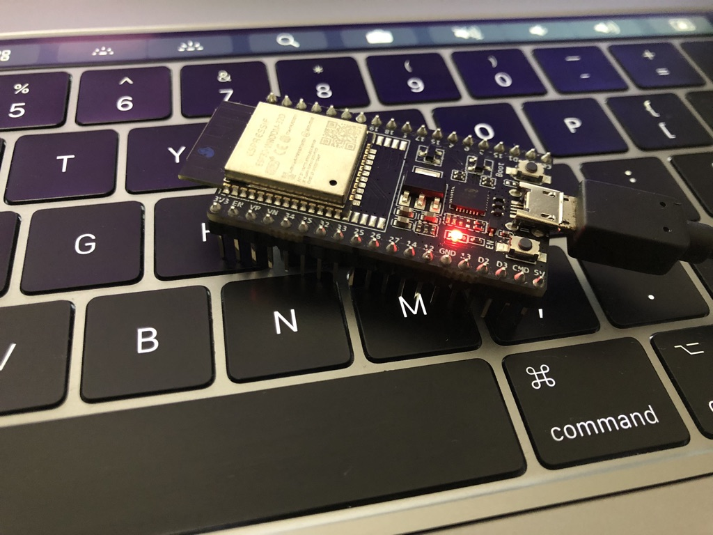
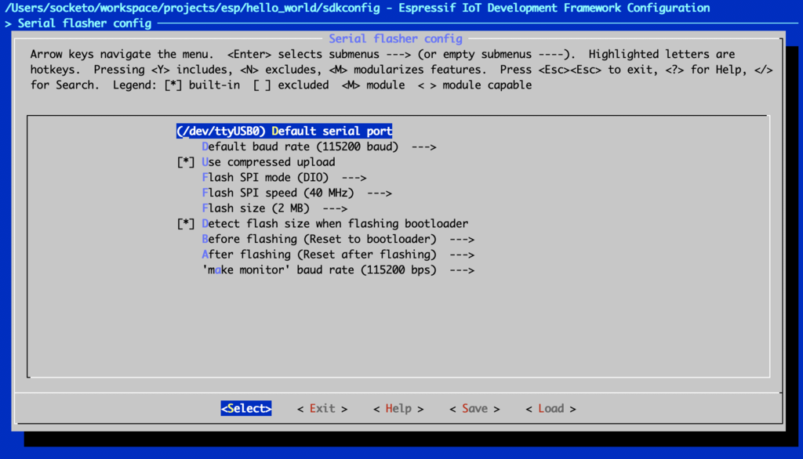
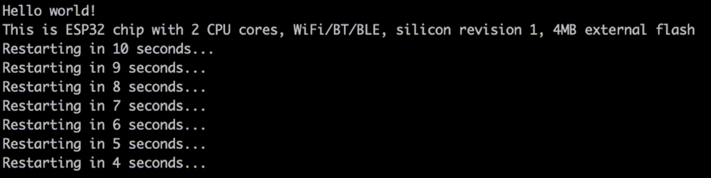
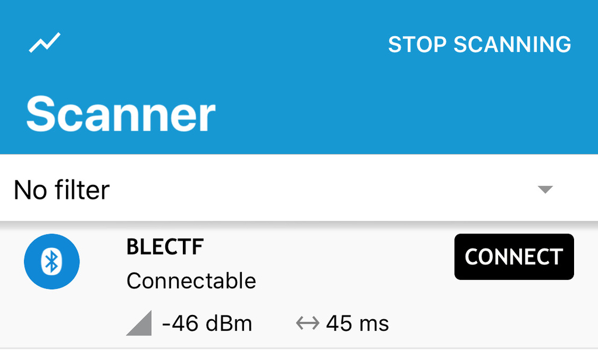

※ 移行前の元ブログ記事 : [BLE CTF WriteUp - #include <sys_socket.h>](https://socketo.hatenablog.jp/entry/2019/02/21/203347)

はじめに
====

昨年2018年のDEF CON 26 WIRELESS VILLAGEで発表された[@hackgnar](https://twitter.com/hackgnar)氏のBLE CTFをやってみるという話。

hackgnar - Learning Bluetooth Hackery with BLE CTF

[http://www.hackgnar.com/2018/06/learning-bluetooth-hackery-with-ble-ctf.html](http://www.hackgnar.com/2018/06/learning-bluetooth-hackery-with-ble-ctf.html)




ble_ctf_ A Bluetooth low energy capture the flag :  [https://github.com/hackgnar/ble_ctf](https://github.com/hackgnar/ble_ctf)

READMEに書かれているように、このCTFを実施するには、手元のコンピュータだけでなくESP32-DevkitとBluetoothドングルが必要になる。

私の今回の環境は以下

ESP32-DevkitC V4
エレコムのよく分からんBluetooth USBアダプタ

ESP32ビルド環境
macOS Mojave version 10.14.3

端末(ThinkPad X220)
Kali Linux



***

環境構築
====

ESP32-DevKitC V4を使う。aliexpressとかだと$7前後で購入出来る。安い。

国内だと秋月やマルツなどで売ってる。

ＥＳＰ３２－ＤｅｖＫｉｔＣ　ＥＳＰ－ＷＲＯＯＭ－３２開発ボード [http://akizukidenshi.com/catalog/g/gM-11819/](http://akizukidenshi.com/catalog/g/gM-11819/)

Wi-Fi+BLE無線モジュールESP-WROOM-32搭載開発ボード【ESP32-DEVKITC】 [https://www.marutsu.co.jp/pc/i/952928/](https://www.marutsu.co.jp/pc/i/952928/)

ESP32の環境構築 [ESP-IDF]
----------------------

ESP32のビルド環境を整える(macOS Mojave version 10.14.3)

Arudino IDEでも開発環境として使えるようだが、今回はBLE CTFのREADMEにESP-IDFのBluetoothのサンプルプログラムと同様にと書いてあった為、EPS32の公式開発フレームワークであるESP-IDFを使用する。

Espressif IoT Development Framework : [https://github.com/espressif/esp-idf](https://github.com/espressif/esp-idf)

ESP-IDFの設定はGitHubのREADMEにも書いてあるこちらを参考。

[Getting Started Guide for the latest (master branch) ESP-IDF version](https://docs.espressif.com/projects/esp-idf/en/latest/get-started/)

toolchainを設定していく。

``` text
$ git clone --recursive https://github.com/espressif/esp-idf.git
```

「--recursive」でサブモジュールもcloneする。

環境変数`$IDF_PATH`を利用してESP-IDFへアクセスするので環境変数を設定する。

``` text
export IDF_PATH=$HOME/workspace/esp-idf/
```

必要なPythonパッケージをpipでインストールする。

``` text
$ pip install -r esp-idf/requirements.txt
```

とりあえずサンプルプログラムのHello Worldをやる

``` text
$ cp -r esp-idf/example/get-started/hello_world ~/esp
$ cd ~/esp/hello_wolrd

$ make menuconfig
```


「Serial flasher config」を選択。



「(/dev/ttyUSB0) Default serial port」の部分を、macOSの環境なので「/dev/cu.SLAB_USBtoUART」に変更して 他は特に変更せずにSaveしてexit exit


``` text
DEFCONFIG
#
# configuration written to /Users/socketo/workspace/projects/esp/hello_world/sdkconfig
#
MENUCONFIG


*** End of the configuration.
*** Execute 'make' to start the build or try 'make help'.

GENCONFIG
Project is not inside a git repository, will not use 'git describe' to determine PROJECT_VER.
App "hello-world" version: 1
```

大丈夫そうなのでmake

``` text
$ make
```

特にエラーなどなければflashする

``` text
$ make flash
```

monitorで確認する

``` text
$ make monitor
```



とりあえずSampleの動かし方はなんとなく分かった。

BLE CTFをビルドする
-------------

Hello Worldと同様に今回のBLE CTFもビルドする。

``` text
$ git clone https://github.com/hackgnar/ble_ctf
$ cd ble_ctf
$ make menuconfig
```

「Serial flasher config」を選択、「(/dev/ttyUSB0) Default serial port」の部分を、macOSの環境なので「/dev/cu.SLAB_USBtoUART」に変更して他は特に変更せずにSaveしてexit exit

特に問題がなければmake

``` text
$ make
```

特にエラーなどの問題がなければflash

``` text
$ make flash
```

稼働しているかをnRF Connect(アプリ)で確認する。

nRF Connect on the App Store : [https://itunes.apple.com/us/app/nrf-connect/id1054362403](https://itunes.apple.com/us/app/nrf-connect/id1054362403)



とりあえず稼働しているようなので、前置きが長くなったがこれでようやくCTFの問題に取り組む。

BLE CTF
=======

BLE CTFのスコアはgatttoolか[Bleah](https://github.com/evilsocket/bleah)で確認することが出来る。

``` text
gatttool

$ gatttool -b 24:0a:c4:23:d3:16 --char-read -a 0x002a|awk -F':' '{print $2}'|tr -d ' '|xxd -r -p;printf '\n'

Score: 0/20
```

``` text
Bleah

$ bleah -b "24:0a:c4:23:d3:16" -e

```


FLAGのSubmitもgatttoolかBleahで可能。

FLAGの形式は20文字で切ったMD5ハッシュ(MTU制限の為20文字にした様子)になっており、ハンドル44(0x002c)でgattサーバへ送信する形式になってる。

FLAGは全部で20個。

FLAG1 This flag is a gift and can only be obtained from reading the hint!
-------------------------------------------------------------------------

[https://github.com/hackgnar/ble_ctf/blob/master/docs/hints/flag1.md](https://github.com/hackgnar/ble_ctf/blob/master/docs/hints/flag1.md)

BLE handleにwriteする為の練習問題。

gatttoolで現在のスコアを確認

``` text
$ gatttool -b 24:0a:c4:23:d3:16 --char-read -a 0x002a|awk -F':' '{print $2}'|tr -d ' '|xxd -r -p;printf '\n'

Score: 0/20
```

gatttoolでFLAGをsubmitする。(gatttoolの場合は`xxd -ps`でhexにする必要がある)

``` text
$ gatttool -b 24:0a:c4:23:d3:16 --char-write-req -a 0x002c -n $(echo -n "12345678901234567890"|xxd -ps)
```

書き込みが成功した様子

``` text
Characteristic value was written successfully
```

スコアを確認すると、1/20となっており得点が入った。

``` text
gatttool -b 24:0a:c4:23:d3:16 --char-read -a 0x002a|awk -F':' '{print $2}'|tr -d ' '|xxd -r -p;printf '\n'
```

こんな感じでFLAGをsubmitしていく。

以降、gatttoolではなくbleahでsubmitしていく

``` text
$ bleah -b "24:0a:c4:23:d3:16" -n 0x002c -d "[FLAG]"
```

Flag 0x002e Learn how to read handles
-------------------------------------


はじめにbleahでスコアを確認した時(`$ bleah -b "24:0a:c4:23:d3:16" -e`)にhandle「0x002e」にDataの部分にFLAGが書いてあった。


一応gatttoolで確かめる。

``` text
$ gatttool -b 24:0a:c4:23:d3:16 --char-read -a 0x002e|awk -F':' '{print $2}'|tr -d ' '|xxd -r -p;printf '\n'
```

FLAG:`d205303e099ceff44835`


Flag 0x0030 Read handle puzzle fun
----------------------------------

handle 0x0030を見ると以下のASCIIが読める。

MD5 of Device Name

このデバイスの名前のMD5ハッシュ値がFLAGのようで、nRF ConnectでもBleahでも見たように、このデバイスの名前は「BLECTF」なのでMD5ハッシュ値にした後に先頭20文字を切り出す。

``` text
$ echo -n "BLECTF" | md5sum | cut -c-20
```

FLAG:`5cd56d74049ae40f442e`

Flag 0x0016 Learn about discoverable device attributes
------------------------------------------------------

deviceのattributesについて。handle「0x0016」をのData部分を確認。

``` text
$ gatttool -b 24:0a:c4:23:d3:16 --char-read -a 0x0016 | awk -F':' '{print $2}'|tr -d ' '|xxd -r -p;printf '\n'
```

先頭20文字を切り出す。

FLAG:`2b00042f7481c7b056c4`

Flag 0x0032 Learn about reading and writing to handles
------------------------------------------------------

handle「0x0032」のData部分を読むと、「Write anything here」となっており何かしら書き込む必要があるらしい。


適当にhandle「0x0032」へbleahで書き込みをする。

``` text
$ bleah -b "24:0a:c4:23:d3:16" -n 0x0032 -d "hogehoge"
```

すると、Data部分が書き換わりFLAGが出てくる。


FLAG:`3873c0270763568cf7aa`

Flag 0x0034 Learn about reading and writing ascii to handles
------------------------------------------------------------

handle「0x0034」のData部分を読むと以下の文字列が出てくる。

「Write the ascii value "yo" here」

”yo”と書き込めとのことなので、bleahで「yo」と書き込む。

``` text
$ bleah -b "24:0a:c4:23:d3:16" -n 0x0034 -d "yo"
```

すると、一つ前の問題と同じでData部分が書き換わりFLAGが出てくる。

FLAG:`c55c6314b3db0a6128af`

Flag 0x0036 Learn about reading and writing hex to handles
----------------------------------------------------------

handle「0x0036」を読むと以下の文字列が出てくる。

「Write the hex value 0x07 here」

hexで「0x07」を書き込む。bleahは--data部分をそのままhexに書くとhexで書き込むことになる。

``` text
$ bleah -b "24:0a:c4:23:d3:16"  -n 0x0036 -d 0x07
```

FLAG:`1179080b29f8da16ad66`

Flag 0x0038 Learn about reading and writing to handles differently
------------------------------------------------------------------

handle「0x0038」を読むと以下の文字列が出てくる。

「Write 0xC9 to handle 58」

handle58(0x3a)へ0xC9を書き込む。

``` text
$ bleah -b "24:0a:c4:23:d3:16"  -n 0x003a -d 0xc9
```

FLAG:`f8b136d937fad6a2be9f`

大分同じような問題で飽きてきた。

Flag 0x003c Learn about write fuzzing
-------------------------------------

 handle「0x003c」を読むと以下の文字列が出てくる。

「Brute force my value 00 to ff」

00〜ffまでBrute Forceしろとのこと。

許してと言いながら雑にgatttoolでhandle「0x003c」へ00〜ffの書き込みを繰り返す。

``` text
#!/bin/bash

for i in `seq 0 255`;
do
printf "%02x" $i
gatttool -b 24:0a:c4:23:d3:16 --char-write-req -a 0x003c -n `printf "%02x" $i`
done
```

FLAG:`933c1fcfa8ed52d2ec05`

Flag 0x003e Learn about read and write speeds
---------------------------------------------

 handle「0x003e」を読むと以下の文字列が出てくる。

「Read me 1000 times」

またも許してと言いながらgatttoolでhandle「0x003e」を1000回読む

``` text
#!/bin/bash

for i in `seq 0 999`;
do
echo -n $i
gatttool -b 24:0a:c4:23:d3:16 --char-read -a 0x003e
done
```

FLAG:`6ffcd214ffebdc0d069e`

Flag 0x0040 Learn about single response notifications
-----------------------------------------------------

 handle「0x0040」を読むと以下の文字列が出てくる。

「Listen to me for a single notification」

Notificationを受け取る為に分かりやすくgatttoolのインタラクティブモードにする。

``` text
＄gatttool -i hci0 -b 24:0a:c4:23:d3:16 -I
[24:0a:c4:23:d3:16][LE]> connect
Attempting to connect to 24:0a:c4:23:d3:16
Connection successful

「ENABLE_NOTIFICATION_value=0x0100」にすると良いらしいので、handleに「0x0100」を書き込む。

[24:0a:c4:23:d3:16][LE]> char-write-req 0x0040 0x0100
Characteristic value was written successfully
Notification handle = 0x0040 value: 35 65 63 33 37 37 32 62 63 64 30 30 63 66 30 36 64 38 65 62
```

FLAGのフォーマットにする。

``` text
$ echo "35 65 63 33 37 37 32 62 63 64 30 30 63 66 30 36 64 38 65 62" | tr -d ' ' | xxd -r -p;
```

FLAG:`5ec3772bcd00cf06d8eb`

Flag 0x0042 Learn about single response indicate
------------------------------------------------

handle「0x0044」を読むと以下の文字列が出てくる。

「Listen to handle 0x0044 for a single indication」

Notificationとの違いはIndicateはクライアントからの応答も要求することらしい。

[http://yegang.hatenablog.com/entry/2014/08/09/195246](http://yegang.hatenablog.com/entry/2014/08/09/195246)

「0x0200」を書き込む。

``` text
[24:0a:c4:23:d3:16][LE]> char-write-req 0x0044 0x0200
Characteristic value was written successfully
Indication   handle = 0x0044 value: 63 37 62 38 36 64 64 31 32 31 38 34 38 63 37 37 63 31 31 33
```

FLAGのフォーマットにする。

``` text
$ echo "63 37 62 38 36 64 64 31 32 31 38 34 38 63 37 37 63 31 31 33" | tr -d ' ' | xxd -r -p;
```

FLAG:`c7b86dd121848c77c113`

Flag 0x0046 Learn about multi response notifications
----------------------------------------------------

handle「0x0046」を読むと以下の文字列が出てくる。

「Listen to me for multi notifications」

複数のNotificationを受け取る。

相変わらずgatttoolのインタラクティブモードでやる。

handle「0x0046」に「0x0100」を書き込むとNotificationがどんどん降ってくる。


最初Notificationだけが違って、それ以降は同じものの様子。

最初のNotificationをASCIIにする。

``` text
$ echo "55 20 6e 6f 20 77 61 6e 74 20 74 68 69 73 20 6d 73 67 00 00" | tr -d ' ' | xxd -r -p
```

「U no want this msg」となり、それ以降がFLAGの様子なのでFLAGのフォーマットにする。

``` text
$ echo "63 39 34 35 37 64 65 35 66 64 38 63 61 66 65 33 34 39 66 64" | tr -d ' ' | xxd -r -p
```

FLAG:`c9457de5fd8cafe349fd`

Flag 0x0048 Learn about multi response indicate
-----------------------------------------------

handle「0x0048」を読むと以下の文字列が出てくる。

「Listen to handle 0x004a for multi indications」

Flag「0x0046」と同じgatttoolのインタラクティブモードでやる。 Flag「0x0042」と同じように「0x0200」を書き込む。


一番最初は同じくダミーなので、それ以降のvalueをFLAGのフォーマットにする。

``` text
$ echo "62 36 66 33 61 34 37 66 32 30 37 64 33 38 65 31 36 66 66 61" | tr -d ' ' | xxd -r -p
```

FLAG:`b6f3a47f207d38e16ffa`

Flag 0x004c Learn about BT client device attributes
---------------------------------------------------

handle「0x004c」を読むと以下の文字列が出てくる。

「Connect with BT MAC address 11:22:33:44:55:66」

BluetoothのMAC Addressを「11:22:33:44:55:66」にして接続をする。

参考 : Bluetoothアダプタのデバイスアドレスを変更する。 - freefielder.jp

[https://freefielder.jp/blog/2015/10/changing-bluetooth-address.html](https://freefielder.jp/blog/2015/10/changing-bluetooth-address.html)

``` text
bccmd psset -s 0 bdaddr 0x44 0x00 0x66 0x55 0x33 0x00 0x22 0x11
```

hciconfigでBDのアドレスが変更されたことを確認。

``` text
hci0:    Type: Primary  Bus: USB
BD Address: 11:22:33:44:55:66  ACL MTU: 310:10  SCO MTU: 64:8
DOWN
RX bytes:574 acl:0 sco:0 events:30 errors:0
TX bytes:368 acl:0 sco:0 commands:30 errors:0
```

BLECTFへ接続するとFLAGが降ってくる。

FLAG:`aca16920583e42bdcf5f`

Flag 0x004e Learn about message sizes MTU
-----------------------------------------

handle「0x004e」を読むと以下の文字列が出てくる。

「Set your connection MTU to 444」

MTUを「444」に変更する。

gatttoolのインタラクティブモードにして、helpを見ると「mtu」を変更出来る項目がある。

``` text
[24:0a:c4:23:d3:16][LE]> help
help                                           Show this help
exit                                           Exit interactive mode
quit                                           Exit interactive mode
connect         [address [address type]]       Connect to a remote device
disconnect                                     Disconnect from a remote device
primary         [UUID]                         Primary Service Discovery
included        [start hnd [end hnd]]          Find Included Services
characteristics [start hnd [end hnd [UUID]]]   Characteristics Discovery
char-desc       [start hnd] [end hnd]          Characteristics Descriptor Discovery
char-read-hnd   <handle>                       Characteristics Value/Descriptor Read by handle
char-read-uuid  <UUID> [start hnd] [end hnd]   Characteristics Value/Descriptor Read by UUID
char-write-req  <handle> <new value>           Characteristic Value Write (Write Request)
char-write-cmd  <handle> <new value>           Characteristic Value Write (No response)
sec-level       [low | medium | high]          Set security level. Default: low
mtu             <value>                        Exchange MTU for GATT/ATT
```

mtuを444に変更してhandle「0x004e」を読む。

``` text
[24:0a:c4:23:d3:16][LE]> mtu 444
MTU was exchanged successfully: 444
[24:0a:c4:23:d3:16][LE]> char-read-hnd 0x004e
Characteristic value/descriptor: 62 31 65 34 30 39 65 35 61 34 65 61 66 39 66 65 35 31 35 38
```

FLAGのフォーマットにする。

``` text
$ echo "62 31 65 34 30 39 65 35 61 34 65 61 66 39 66 65 35 31 35 38" | tr -d ' ' | xxd -r -p
```

FLAG:`b1e409e5a4eaf9fe5158`

Flag 0x0050 Learn about write responses
---------------------------------------

handle「0x0050」を読むと以下の文字列が出てくる。

「Write+resp 'hello'」

普通にhandle「0x0050」に書き込みをして読み直したら、FLAGが出てきた。

想定としては書き込んだらレスポンスで返ってくる？

``` text
$ bleah -b "24:0a:c4:23:d3:16" -n 0x0050 -d "hello"
```

FLAG:`d41d8cd98f00b204e980`

Flag 0x0052 Hidden notify property
----------------------------------

handle「0x0052」を読むと以下の文字列が出てくる。

「No notifications here! really?」

確かにBleahで見てもNotificationが無い。


gatttoolのインタラクティブモードでNotificationをONにする「0x0100」を書き込む。

``` text
[24:0a:c4:23:d3:16][LE]> char-write-req 0x0052 0x0100
Characteristic value was written successfully
Notification handle = 0x0052 value: 66 63 39 32 30 63 36 38 62 36 30 30 36 31 36 39 34 37 37 62
```

FLAGのフォーマットにする。

``` text
$ echo "66 63 39 32 30 63 36 38 62 36 30 30 36 31 36 39 34 37 37 62" | tr -d ' ' | xxd -r -p
```

FLAG:`fc920c68b6006169477b`

Flag 0x0054 Use multiple handle properties
------------------------------------------

handle「0x0054」を読むと以下の文字列が出てくる。

「So many properties!」

BleahでPropatiesを見ると「NOTIFY BROADCAST READ WRITE EXTENDED PROPERTIES」と様々ある。

よく分からないのでHintを見る

Check out all of the handle properties on 0x0054! Poke around with all of them and find pieces to your flag.

Propatiesをチェックして、FLAGの断片を見つけてとのこと。

適当に書き込む。

``` text
[24:0a:c4:23:d3:16][LE]> char-write-req 0x0054 0xFFFF
Characteristic value was written successfully
Notification handle = 0x0054 value: 30 37 65 34 61 30 63 63 34 38
```

``` text
$ echo "30 37 65 34 61 30 63 63 34 38" | tr -d ' ' | xxd -r -p
```

10文字`07e4a0cc48`が出てきた。

書き込んだ後にhandle「0x0054」をreadすると10文字`fbb966958f`が出てくる。

`07e4a0cc48fbb966958f`か`fbb966958f07e4a0cc48`を書き込んで得点できれば多分合っているだろうという感じで書き込む。

当たりは後半の方だった。

FLAG:`fbb966958f07e4a0cc48`

Flag 0x0056 OSINT the author!
-----------------------------

handle「0x0054」を読むと以下の文字列が出てくる。

「MD5 of author's twitter handle」

この作者のTwitterのハンドルのMD5ハッシュ値を答えろとのこと。

冒頭でも書いた通り、この作者は[@hackgnar](https://twitter.com/hackgnar)氏なので、この文字列をMD5ハッシュ値を20文字にする。

``` text
$ echo -n '@hackgnar' | md5sum | cut -c-20
```

FLAG:`d953bfb9846acc2e15ee`

おわり
---


ESP32-DevkitCを買ったまま腐らしていたので、使い道として適当に使えたのは良かった。

gatttoolとBleahの使い方とかを学ぶには良い感じだった、多分BLE通信をするデバイスとかをESP32などで開発するとより理解が追いつく気がしたのでこれを機にちょっとやっていきたい。

ArduinoIDEなどでもサクッと書けるようなので遊んでいきたい気持ち。