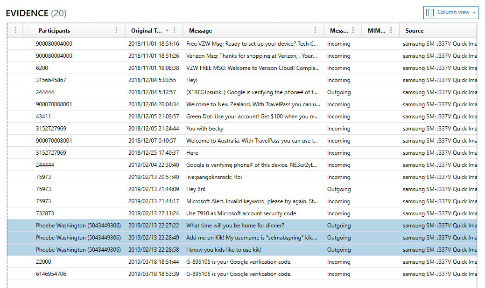
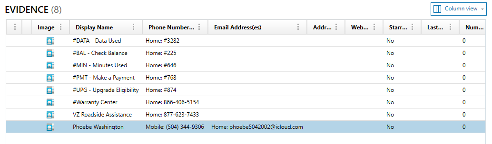
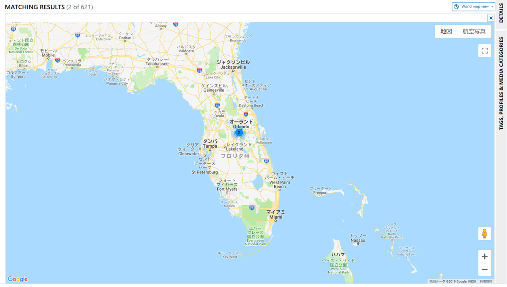
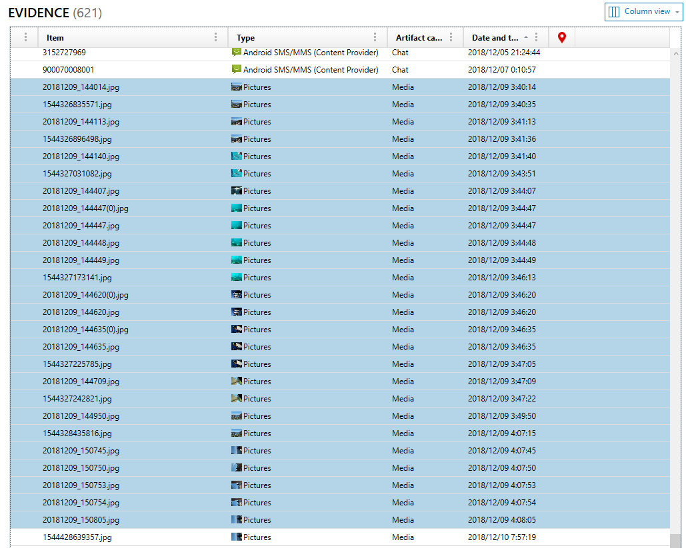
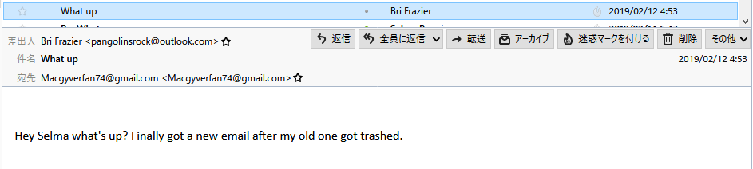
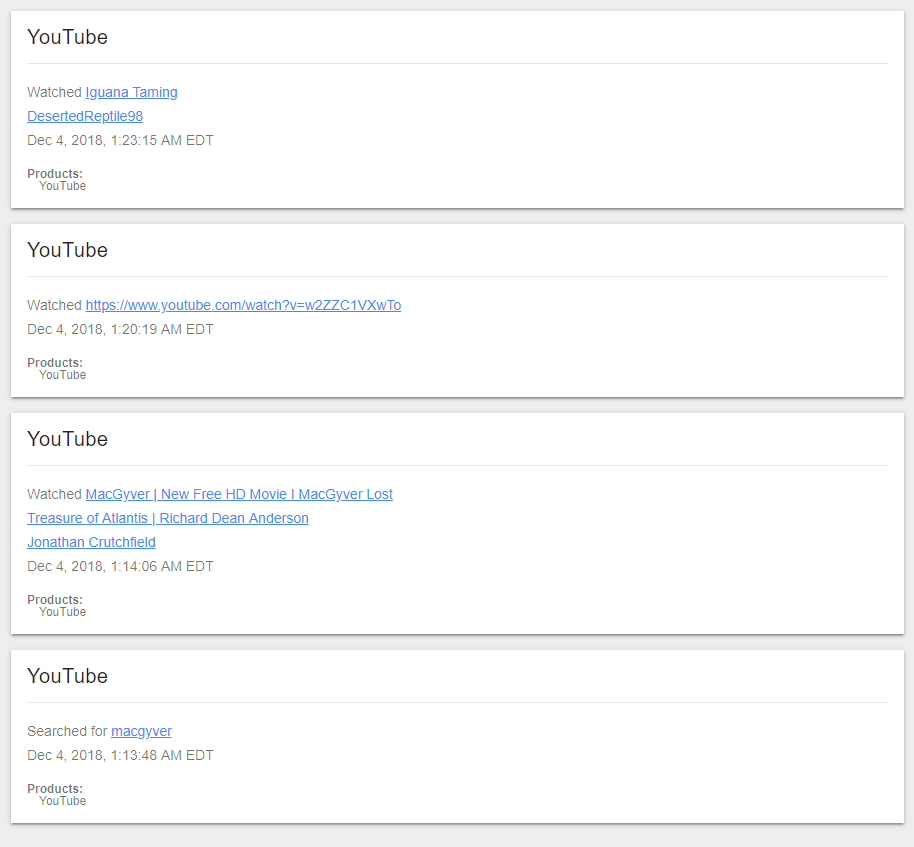

※ 移行前の元ブログ記事 : [Magnet User Summit CTF 2019 WriteUp [Mobile] - #include <sys_socket.h>](https://socketo.hatenablog.jp/entry/2019/04/11/222659)

## Magnet User Summit 2019

Magnet Forensicsというフォレンジック製品などをやっている企業のサミットが2019/04/02～2019/04/03に行われていました。

https://magnetusersummit.com/

Twitterで「#mus2019」で検索すると現地の様子がなんとなく分かりそう。発表スライドとかもあったりする。

https://twitter.com/search?q=%23mus2019

今回も、以前のDFIR CTFのようにMagnet User Summit CTF 2019として開催されていたものが、公開されていたのでやっていきの記事です。
AXIOMの使い方を学ぶ的な問題。

Hacking Exposed Computer Forensics Blog _Daily Blog #657_ MUS2019 DFIR CTF open to the public : https://www.hecfblog.com/2019/04/daily-blog-657-mus2019-dfir-ctf-open-to.html

Magnet AXIOMという有償のフォレンジックツールが2019/05/04までのトライアルのキーがついて使用することができてすごい。
せっかくなので使ってみる感じで、頑張ってAXIOMだけでとりあえずやっていきます。

https://www.magnetforensics.com/products/magnet-axiom/

「Mobile」カテゴリはモバイルフォレンジック的な感じの問題で、Android端末のデータを取得したケースが与えられてそれについて質問していくという感じです。

やっていきましょう。


AXIOMのインストール
------------

AXIOMは一応日本語対応はしていますが、設定する際に「日本語」ではなく、「English」にする方が良いです。
(CSVなどのファイルに出力する際、カラムが結構厳しい日本語とかになってしまうので)

インストールしたら、ライセンスが聞かれるので、ファイル名「AXIOM 30-day Trial Key Install by May 4.txt」にキーが書いてあるのでそれをライセンスキー入力する。

Mobile
======

ケースファイル「AXIOM - Mar 28 2019 114941 Mobile/Case.mfdb」

Image Type 2pt
--------------

問題文

``` text
What type of mobile image do you have?

- Full/Physical
- Quick/Logical
- File System
- Medium /Chip Off
```

このモバイルイメージがどのようなタイプか？という質問。

AXIOMのケースディレクトリ内のケースの情報のファイル「Case Information.xml」を見る。

``` text
samsung SM-J337V Quick Image.zip [ROOT]\

Files and Folders (User-Selected)
```

Nameが「samsung SM-J337V Quick Image.zip [ROOT]\」となっているので恐らく「Quick」で取得したものと推測。

FLAG : `Quick/Logical`

IMSI 2pt
--------

問題文

``` text
What is the IMSI for the SIM Card?
```

このSIMカードのIMSIを答える問題。

IMSIは「International Mobile Subscriber Identity」の略称で、携帯電話のSIM内に格納されている一意な識別番号。

https://ja.wikipedia.org/wiki/International_Mobile_Subscriber_Identity

Artifactsの中でから「OPERATING　SYSTEM」>「Android Device Information」から見る。


<span itemscope="" itemtype="http://schema.org/Photograph"></span>

FLAG : `311480460682294`

Basic Info 2pt
--------------

問題文

``` text
What is the phone number for the device in the format 2125551212?
```

「2125551212」のフォーマットで携帯電話の番号を答える問題。

これもデバイスの情報から「Device Phone Number」を見る。


<span itemscope="" itemtype="http://schema.org/Photograph"></span>

FLAG : `3153165956`

Google Search 2pt
---------------------------------------------------------

問題文

``` text
Which Google search was made on the phone on Dec 4, 2018?

- iguana potty training
- penguin
- best tacos in orlando
- Mega
```

AIOM Caseと同ディレクトリリにある「Images」下に「takeout-20190326T151444Z-001.zip」というZIPファイルがあり、これはAXIOM ProcesserのCloud取得で取得したものと考えられる。

https://www.howtogeek.com/216189/how-to-create-and-download-an-archive-of-all-your-google-data/

展開し、中のファイル「index.html」を見ると、このTakeoutが「macgyverfan74@gmail.com」のバックアップアーカイブであることが分かる。


<span itemscope="" itemtype="http://schema.org/Photograph"></span>

AXIOMはGoogleアカウントのActivityも取得してくるので、検索の履歴なども取得されているので、その項目を見る。

「Takeout\My Activity\Search\MyActivity.html」

この検索履歴から、2018/12/04の日の検索を見る。


<span itemscope="" itemtype="http://schema.org/Photograph"></span>

FLAG : `iguana potty training`

User Name 5pt
-------------

問題文

``` text
What is mobile device owner's username on Kik?
```

このモバイルデバイスの所有者のKikのユーザネームは何か？

「kik」がなんのことを指すのか分からなかったので、とりあえずArtifacts内で「kik」と検索。


<span itemscope="" itemtype="http://schema.org/Photograph"></span>

ChatとMediaが計5件ヒットする。

チャットを見ると、Kikでの私のユーザネームは「selmabspring」と言ってURLを送っているのが分かる。


<span itemscope="" itemtype="http://schema.org/Photograph"></span>

Kikはチャットアプリのようで、Google Play Storeにもあった。

https://play.google.com/store/apps/details?id=kik.android

FLAG : `selmabspring`

Travel 5pt
----------

問題文

``` text
What country was the mobile phone in on December 7th?
```

12/7にこのモバイル端末はどの国にいたか？という問題。

AXIOMのArtifactsではなく「Timeline」機能を使う。


<span itemscope="" itemtype="http://schema.org/Photograph"></span>

Timeline機能を使うと、日時順に何が起きたかをパッとみることができて便利。

今回では、12/7に「900070008001」からSMSを受け取っていることが分かる。

``` text
Welcome to Australia. With TravelPass you can use talk, text and data from your domestic allowance. You'll pay $10/day only on days you use your mobile abroad. Reply YES to this message and we'll add TravelPass to your line. Without TravelPass, calls will cost $1.79/min, text $0.5 to send and $0.05 to receive and data $2.05/MB. If you need help call +1.908.559.4899.Enjoy your trip.
```

オーストラリアにいた様子が分かる。

FLAG : `Australia`

Pictures 5pt
------------

問題文

``` text
What is the file name of the largest picture taken with the phone camera?
```

このモバイル端末のカメラで撮影した最大サイズの写真のファイル名は何か。

「File System」から見る。
ディレクトリ構造が、Androidと同じように見えるため、Androidが写真を撮った際に保存されるディレクトリを見る。

「sdcard\sdcard\DCIM\Camera」

ここでSize(bytes)を降順にソートする。


<span itemscope="" itemtype="http://schema.org/Photograph"></span>

FLAG : `20181209_144014.jpg`

Email Address 5pt
-----------------

問題文

``` text
What is the home email address for the user that is texted on Feb 13, 2019?
```

2019/02/13に送信したユーザの自宅のメールアドレスは何か？

「Artifacts」から「Chat」>「Android SMS/MMS(Content Provider)」で、SMS・MMSのみのリストを見る。


<span itemscope="" itemtype="http://schema.org/Photograph"></span>

この中で番号に名前が定義(番号登録)されているのが「Phoebe Washington (5043449306)」のみで、該当の2019/02/13にSMSを送信をしていることが分かる。

次に、左のカラムの中の「MOBILE」>「Android Contacts」の中を見る。


<span itemscope="" itemtype="http://schema.org/Photograph"></span>

「Phoebe Washington (5043449306)」のEmail Addressが「Home: `phoebe5042002@icloud.com`」だと分かる。

FLAG : `phoebe5042002@icloud.com`

Invite 5pt
----------

問題文

``` text
What email address sent the Mega invite?
```

Megaへの招待を送信したメールアドレスは何か。

Mobileの方ではメールはないので、Takeoutの方を見る。
Takeoutの下の「Mail」ディレクトリを見ると、「All mail Including Spam and Trash.mbox」というmboxファイルがあることが確認できる。

mbox形式なので、Thunderbirdの「ImportExportTools」でインポートをする。

https://addons.thunderbird.net/ja/thunderbird/addon/importexporttools/

インポートをすると、Megaの招待メールが発見できる。


<span itemscope="" itemtype="http://schema.org/Photograph"></span>

FLAG : `wdoobner@putinsangels.com`

Kik User Photo 5pt
------------------

問題文

``` text
Which imagery is part of the user's kik avatar?

- taco
- iguana
- angel
- penguin
```

「User Name」の問題でこの人は「Kikでの私のユーザネームは「selmabspring」です」と一緒にURLを送っている。

http://kik.me/selmabspring?i2=p


<span itemscope="" itemtype="http://schema.org/Photograph"></span>

ペンギンっぽい。

FLAG : `penguin`

Domestic Travel 10pt
--------------------

問題文

``` text
What state was the phone in on December 25th, 2018?
```

2018/12/25にこのモバイル端末のどの州にあったか？

Artifactで日時でソートすると、該当の2018/12/25に一つだけ位置情報がついた写真があるのを見つけることができる。


<span itemscope="" itemtype="http://schema.org/Photograph"></span>

ピンをクリックすると、「World map view」モードになり、世界地図にこの位置情報付きの写真がピンされる。


<span itemscope="" itemtype="http://schema.org/Photograph"></span>

パッと見るとフロリダ州にいたことが分かる。

FLAG : `Florida`

Theme Park 5pt
--------------

「Domestic Travel」を解くと現れる問題。（ボーナス？）

本文

``` text
What theme park was the mobile device in on Dec 25, 2018?
- Disney World
- Universal Studios
- Sea World
- Bush Gardens
```

2018/12/25にどこのテーマパークにモバイル端末があったか？

上のマップをアップしていく。

<span itemscope="" itemtype="http://schema.org/Photograph"></span>

ユニバーサルスタジオ的なところの位置情報だと分かる。

FLAG : `Universal Studios`

App Download Methods 10pt
-------------------------

``` text
Which of the following apps was NOT downloaded from Google Play?

- Facebook
- YouTube
- Skype
- Kik
```


次のうち、どれがGoogle Playからダウンロードされていないか？

Takeoutの「Google Play Store」下にGoogle Play Store関係のファイルがあるので確認する。

「Installs.json」にはインストールされたアプリの情報が入っており、Facebook, YouTube, Skype, Kikがすべてあって一体……となっていたが、「firstInstallationTime」の項目を見ると、YouTubeだけ2018年で一つだけ古いことが分かる。他は2019/02/13になっている。

Facebook

``` json
{
"install": {
"doc": {
"documentType": "Android Apps",
"title": "Facebook"
},
"firstInstallationTime": "2019-02-13T21:55:13.578Z",
"deviceAttribute": {
"model": "SM-J337V",
"carrier": "Verizon Wireless",
"manufacturer": "samsung",
"deviceDisplayName": "samsung SM-J337V"
},
"lastUpdateTime": "2019-02-13T21:57:01.973Z"
}
},
```

YouTube

``` json
{
"install": {
"doc": {
"documentType": "Android Apps",
"title": "YouTube"
},
"firstInstallationTime": "2018-12-04T05:13:33.705Z",
"deviceAttribute": {
"model": "SM-J337V",
"carrier": "Verizon Wireless",
"manufacturer": "samsung",
"deviceDisplayName": "samsung SM-J337V"
},
"lastUpdateTime": "2019-03-18T18:55:21.504Z"
}
},
```

Skype

``` json
{
"install": {
"doc": {
"documentType": "Android Apps",
"title": "Skype - free IM \u0026 video calls"
},
"firstInstallationTime": "2019-02-13T21:52:26.253Z",
"deviceAttribute": {
"model": "SM-J337V",
"carrier": "Verizon Wireless",
"manufacturer": "samsung",
"deviceDisplayName": "samsung SM-J337V"
},
"lastUpdateTime": "2019-02-13T21:52:26.253Z"
}
},
```

Kik

``` json
{
"install": {
"doc": {
"documentType": "Android Apps",
"title": "Kik"
},
"firstInstallationTime": "2019-02-13T21:54:13.635Z",
"deviceAttribute": {
"model": "SM-J337V",
"carrier": "Verizon Wireless",
"manufacturer": "samsung",
"deviceDisplayName": "samsung SM-J337V"
},
"lastUpdateTime": "2019-02-13T21:54:13.635Z"
}
},
```

確かにAndroidだとGoogle関係のアプリはプリインストールされている、YouTubeもその一つに入っているはず。

デバイスの情報を調べる。

「installs.json」と同じディレクトリにある「Debices.json」を見る。

``` json
[{
"device": {
"mostRecentData": {
"carrierName": "Verizon Wireless",
"playStoreClientVersion": 81394000,
"manufacturer": "samsung",
"modelName": "SM-J337V",
"deviceName": "j3topeltevzw",
"productName": "j3topeltevzw",
"retailBrand": "Verizon",
"totalMemoryBytes": "1814548480",
"nativePlatform": ["armeabi-v7a", "armeabi"],
"deviceIpCountry": "US",
"userLocale": "en_US",
"buildFingerprint": "Verizon/j3topeltevzw/j3topeltevzw:8.0.0/R16NW/J337VVRU2ARI3:user/release-keys",
"androidSdkVersion": "26"
},
"dataAtTimeOfUserPlayActivity": {
"carrierName": "Verizon Wireless",
"manufacturer": "samsung",
"modelName": "SM-J337V",
"deviceName": "j3topeltevzw",
"productName": "j3topeltevzw",
"retailBrand": "Verizon",
"nativePlatform": ["armeabi-v7a", "armeabi"],
"deviceIpCountry": "US",
"userLocale": "en_US",
"androidSdkVersion": "26"
},
"deviceRegistrationTime": "2018-12-04T05:13:00.807Z",
"userAddedOnDeviceTime": "2018-12-04T05:13:00.807Z",
"lastTimeDeviceActive": "2019-03-22T10:59:25.395423Z"
}
}]
```

「deviceRegistrationTime」が「2018-12-04T05:13:00.807Z」となっているので、YouTubeアプリはGoogle Play Storeからでなく、プリインストールされたアプリだと推測ができる。

FLAG : `YouTube`

Timezone 10pt
-------------

``` text
What time zone was the phone in on Dec 9th?

Please frame your answer in relationship to UTC in the format: UTC+0 or UTC-1 or UTC+1
```

12/09の時のこのモバイル端末のタイムゾーンは何時か？


<span itemscope="" itemtype="http://schema.org/Photograph"></span>

タイムライン的に見ると、問題「Travel」で見たSMSが2018/12/7にオーストラリアへようこそ！的な文章になっている。

祈りをこめて、オーストラリアに滞在してくれているだろうというのと、Artifactsでは2019/12/09は写真が撮影されており、写真を見るとバケーション的な旅行を感じる写真が多い。


<span itemscope="" itemtype="http://schema.org/Photograph"></span>

オーストラリアにいてほしい。

オーストラリアのUTCでの表記はUTC+10らしい。

https://www.google.com/search?q=%E3%82%AA%E3%83%BC%E3%82%B9%E3%83%88%E3%83%A9%E3%83%AA%E3%82%A2+utc

だが、「UTC+10」にしたらIncorrectで唸っていた。

あとで気づいたが、この問題の12月の時期はサマータイムというものに入っているらしくてUTC+10に+1する必要があるらしい。
(日本だと馴染みがなさ過ぎて全くその発想が出なかった)
2018-19年のオーストラリアのサマータイム（DAY LIGHT SAVING) : https://www.ats.co.jp/summer_time.php

ということでUTC+11になる。

FLAG : `UTC+11`

Contacts 10pt
-------------

問題文

``` text
What is the last name of the user whose email is pangolinsrock@outlook.com?
```

`pangolinsrock@outlook.com`のメールアドレスの人物のラストネームは何か。

問題「Invite」でインポートしたメールを見る。


<span itemscope="" itemtype="http://schema.org/Photograph"></span>

「pangolinsrock@outlook.com」のメールアドレスで検索するとヒットするので、そのメールを見ると、「Bri Frazier」さんから来ていることが分かる。

FLAG : `Frazier`

Content Distributor 10pt
------------------------

問題文

``` text
What account posted the video that the mobile device visited on 4 Dec 2018 at 06:23 am UTC?
```

2018/12/04 UTC 06:23に見た動画を投稿したアカウントは何か？という問題。

Takeoutから。
「My Activity\YouTube\MyActivity.html」を見る。


<span itemscope="" itemtype="http://schema.org/Photograph"></span>

EDT表記なので、UTCにすると2018/12/04 06:23な一番上の「Iguana Taming」を見ていたことが分かる。

この動画を見ると、投稿者のアカウント名は「DesertedReptile98」

FLAG : `DesertedReptile98`

HOLY COW BATMAN! 2pt
------------------------------------------------------------

「Content Distributor」を解いたら現れた。

問題文

``` text
Congratulations! While searching the mobile device you found a bitlocker password! Here it is:

- protectedbyjubjub
```

突然bitlockerのパスワード「protectedbyjubjub」を貰った。

FLAG : `protectedbyjubjub`

Analysis 15pt
-------------

問題文

``` text
What country was the mobile device owner in when reading a document that was "IN MEMORY OF MOE"?
```

「IN MEMORY OF MOE」というドキュメントを読んだ時にどの国に居たか？

「IN MEMORY OF MOE」って何となり、とりあえずAXIOMのCase内で文字列検索、Takeout下で全文検索をしたが特にヒット無し。

Takeoutの「MyActivity」ディレクトリを見る。
「Search\MyActivity.html」を見ると、Google検索していたものと訪れたWebページが分かる。
一つづつ見ていくと、「Resource for Iguana Care and Adoption」というイグアナのページが出てくる。


<span itemscope="" itemtype="http://schema.org/Photograph"></span>

ページ下部を見ていくと、該当の「IN MEMORY OF MOE」の文字列を発見。


<span itemscope="" itemtype="http://schema.org/Photograph"></span>

このページに訪れたのは「Dec 4, 2018, 1:25:05 AM EDT」なので、Timelineで2019/12/04あたりを見る。


<span itemscope="" itemtype="http://schema.org/Photograph"></span>

2019/12/04に受信したSMSが見つかる。

``` text
Welcome to New Zealand. With TravelPass you can use talk, text and data from your domestic allowance. You'll pay $10/day only on days you use your mobile abroad. Reply YES to this message and we'll add TravelPass to your line. Without TravelPass, calls will cost $1.79/min, text $0.5 to send and $0.05 to receive and data $2.05/MB. If you need help call +1.908.559.4899.Enjoy your trip.
```

New Zealandにウェルカムされており、ニュージーランドにいることが推測できる。

FLAG : `New Zealand`

感想
==

AXIOMの使い方イントロダクションみたいな感じだった。AXIOMつよい。