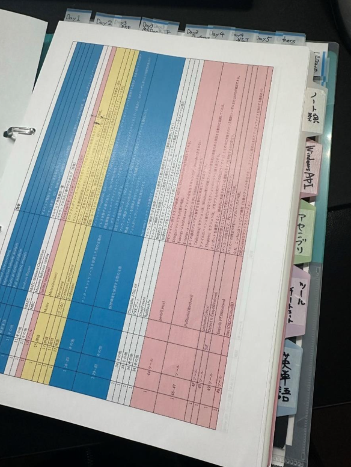
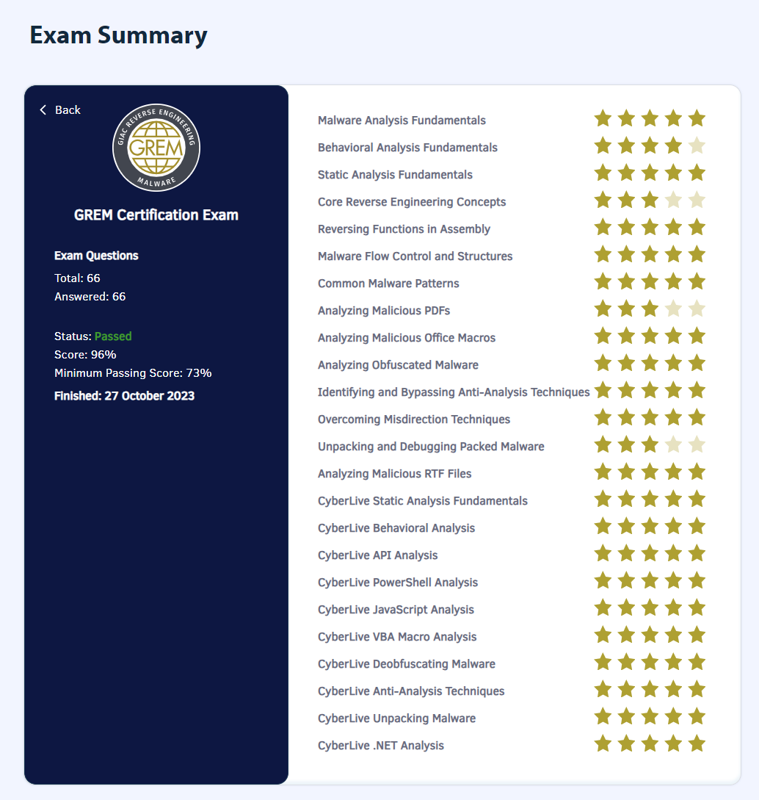

## TL;DR

[GREM(GIAC Reverse Engineering Malware)](https://www.giac.org/certifications/reverse-engineering-malware-grem/) に96%のスコアで合格した。高得点だったため、GIAC Advisory Board(諮問委員会)とSANSインストラクター育成プログラムへの招待も受けた。





## GREMとは

GIAC Reverse Engineering Malwareの略称で、SANS Instituteが提供するマルウェア解析の国際的な認定試験。SANS FOR610「Reverse-Engineering Malware: Malware Analysis Tools and Techniques」のトレーニングコースに対応した認定試験になっている。

Paul Jerimy MediaのSecurity Certification Roadmapでは、Expertの部類に属している。

[Security Certification Roadmap - Paul Jerimy Media](https://pauljerimy.com/security-certification-roadmap/)

### 出題範囲

SANS FOR610コースの5日間のトレーニング内容がすべて対象になる。公式サイトに記載されている出題カテゴリは以下の通り。

- Analyzing Malicious Office Macros / PDFs / RTF Files
- Analyzing Obfuscated Malware
- Behavioral / Static Analysis Fundamentals
- Common Malware Patterns
- Core Reverse Engineering Concepts
- Examining .NET Malware
- Identifying and Bypassing Anti-Analysis Techniques
- Malware Analysis Fundamentals
- Malware Flow Control and Structures
- Overcoming Misdirection Techniques
- Reversing Functions in Assembly
- Unpacking and Debugging Packed Malware

## 試験概要

自分が受験した2023年10月時点での概要は以下の通り。開催のタイミングによって試験時間や合格点等が変わる模様なので、受験前に公式を確認してほしい。

| カテゴリ | 内容 |
|------|------|
| 試験時間 | 180分 |
| 問題数 | 66問（うち11問がCyberLive問題） |
| 出題形式 | CBT（選択式） + CyberLive（実技） |
| 合格ライン | 73% |
| その他 | オープンブック形式で紙の資料の持ち込み可。スキップ機能あり（10問まで）。スキップした問題はあとで回答可能。 |

### CyberLiveとは

CyberLiveはVMを使用した実技問題で、GREMの場合は対象のマルウェアをVM上で解析して設問に答える形式になる。SANSトレーナー曰く、CyberLive問題は配点の割合が高いとのこと。



## 実施した勉強方法

SANS公式が推奨する以下の手順で実施した。

1. トレーニングのテキストをすべて読む（インデックス化）
2. 模擬試験1回目を受ける
3. 模擬試験で弱かった範囲を復習
4. 模擬試験2回目を受ける

### テキストの読み込みとインデックス化

SANSのテキストはスライドの下に内容が丁寧に記載されている。トレーニング中はスライド中心の説明になるため、スライド下の内容を自分でしっかり読んで把握しておく必要がある。

FOR610は5日間のトレーニングで、ワークブックを除いたテキストの総ページ数は**741ページ**にも及ぶ。テキストはすべて英語なので、英語が得意でない場合はGoogle翻訳片手に翻訳しながら読み進めることになる。当初2週間くらいで読み切れると思っていたが、夏休みや業務を挟んで結局約3ヶ月かかった（受験期限は残り1ヶ月だった）。

**付箋によるインデックス作成**

GIAC試験はオープンブック形式なので、テキストを持ち込んで参照できる。重要な概念などに付箋を貼り、情報へスムーズにアクセスできるようにすることが合否に直結する。5冊分すべてのテキストに付箋を貼り、以下のように色で概念を分類した。

- **赤** : ツール
- **青** : 概念
- **黄** : 用語

さらに大きな付箋でそのページが何について書かれているかを日本語でメモし、素早く内容を把握できるようにした。

付箋インデックス化と並行して、どのページに何があるかを一目で把握できる**インデックスシート**も作成した。ページ番号・分類・キーワード・概要をまとめた表形式のもので、テキストを開かずにアクセス先を特定できるようにした。

また、テキストを読んでいてすぐに訳せなかった英単語をブック番号・ページ番号・訳とともにリスト化しておいた。本番試験で英和辞典を引く時間が省けるため、かなり有効だった。

> **Tips: 付箋はプラスチック製のPost-itを使う**
>
> 普通の紙の付箋は折れてしまってインデックスとして機能しなくなる。3MのPost-it「Job is Clear」シリーズのようなプラスチック（フィルム）製のものは頑丈で長持ちするのでおすすめ。

**アセンブリへの向き合い方**

マルウェア解析に必要な最低限のアセンブリ知識で挑んだ。JMP命令等はリファレンスを参照しながらコードフローが追えるようになることを目標にした。トレーニング中に紹介されたx86 JMPクイックリファレンスが役立った。

[Intel x86 JUMP quick reference - unixwiz.net](http://unixwiz.net/techtips/x86-jumps.html)

フローが分からないところは手書きアセンブリで整理し、自分でC言語で書いてビルドしてディスアセンブルして頭で確認するという作業を繰り返した（書いている時はかなり錯乱状態だった）。

### 模擬試験（1回目）

テキストを一通り読み終えた後、本番と同じ環境を想定して模擬試験を実施した。インデックス化したテキスト、カンニングペーパー（インデックスシート・英単語リスト）、英和辞典を手元に置いて180分の時間配分も把握するように取り組んだ。

**1回目の結果：79%**

合格ライン（73%）は超えていたが、全く正解できていないセクションがあって心配だった。40分ほど余った状態で終わったので、時間配分を調整して丁寧に解いていく余地があると感じた。

### 模擬試験で弱かった範囲の復習

1回目で点数が取れなかった分野をテキストで復習し、テキストだけでは理解が浅かった部分は以下の書籍の該当セクションで補完した。

- [初めてのマルウェア解析](https://www.amazon.co.jp/dp/4873119294/)
- [Practical Malware Analysis](https://www.amazon.co.jp/Practical-Malware-Analysis-Hands-Dissecting/dp/1593272901)

また、マルウェア解析者のYouTubeチャンネル（[hasherezade](https://www.youtube.com/c/hasherezade)）の動画も参考にした。

### 模擬試験（2回目）

1回目の反省を活かし、時間をかけて丁寧に解いた。スキップ機能を活用して難しい問題を後に回し、最後にじっくり考えて解いた。

**2回目の結果：86%**

苦手だった分野のスコアが伸びた。CyberLive問題で1問間違えたり、Officeマクロ問題に若干不安が残ったが、傾向が掴めたので本番試験を申し込んだ。

### カンニングペーパーの準備

本番に持っていくものはすべて印刷してノートにまとめた。

- インデックスシート（テキスト横断）
- WindowsAPIパターン早見表（APIカテゴリ・機能・パラメータをまとめた表）
- 各テキスト毎にまとめたドキュメント
- 各ツールのパラメータ一覧
- Ghidraチートシート
- [マルウェア解析チートシート（Lenny Zeltser氏）](https://www.sans.org/blog/4-cheat-sheets-for-malware-analysis/)

> **注意：試験会場の机は狭い**
>
> ピアソンVueの試験会場は机が狭いので、持ち込み資料が多すぎると邪魔になる。本当に使うものに絞っておく方がいい。

## CyberLive対策

CyberLiveはトレーニング中に実施した演習と同じ形式の問題が出題される。対策として効果的だったのは、**講義中にやった演習を繰り返し実施すること**。演習でツールの使い方とWindows APIのパラメータ情報をまとめながら手を動かした（`strings`コマンドのオプション、`speakeasy`の使い方、`capa`の出力の読み方など）。

> **キーボードレイアウトに注意**
>
> ピアソンVueの試験会場のキーボードはUS配列になっている（ほとんどのテストセンターがそう）。日本語配列で普段使っている場合は記号の位置などに差異があるため、CyberLiveのVM操作時に戸惑う可能性がある。模擬試験や演習でUS配列に慣れておくか、あらかじめ配置を把握しておくといい。

## 認定試験本番

受験場所は**ピアソンVue 西新宿テストセンター**を予約した。リモート受験（ProctorU）は英語でのやり取りが発生することや監視ソフトのインストール等が必要で手間がかかるため、オンサイトで受験した方が楽だと思う。

持ち物は以下の通り。

- 身分証明書2点（直筆署名付き：パスポート、顔写真入り：運転免許証 など）
- インデックス化した5冊のテキスト
- 英和辞典
- カンニングペーパーをまとめたノート

**時間配分**

CyberLive問題に十分な時間をかけたかったので、CBT（選択式）パートをなるべく早く終わらせる方針にした。問題文の英語の解釈がすぐにできない場合やパッと分からない問題はスキップ機能で後に回し、確認も含めて早めにCBTを終わらせた。2回の模擬試験でCyberLiveの時間感覚をある程度把握していたので、余裕をもってすべて解答できた。

**本番結果：96%**

CyberLive問題をすべて正解できたことが大きかった。

## まとめと感想

4年ぶりのGIAC受験（前回はGCFA）ということもあり、かなり緊張していたが、96%という高スコアで合格できた。

スコアが90%を超えたため、GIAC Advisory Board（招待制フォーラム）への招待を受けた。GIACの改善活動に関わるものらしく、NDAに署名して参加しデジタルバッジを取得した。





受験期限ぎりぎりに受験するのは精神衛生上よくないのでやめた方がいい（自分は残り1ヶ月というタイミングで申し込んだ）。

テキストを丁寧に読み込み、他のマルウェア解析に関する書籍も読んで手を動かしたおかげで、ずっと入門し続けていたマルウェア解析にようやく入門できた気がしている。これからもなんとかやっていきたい。
