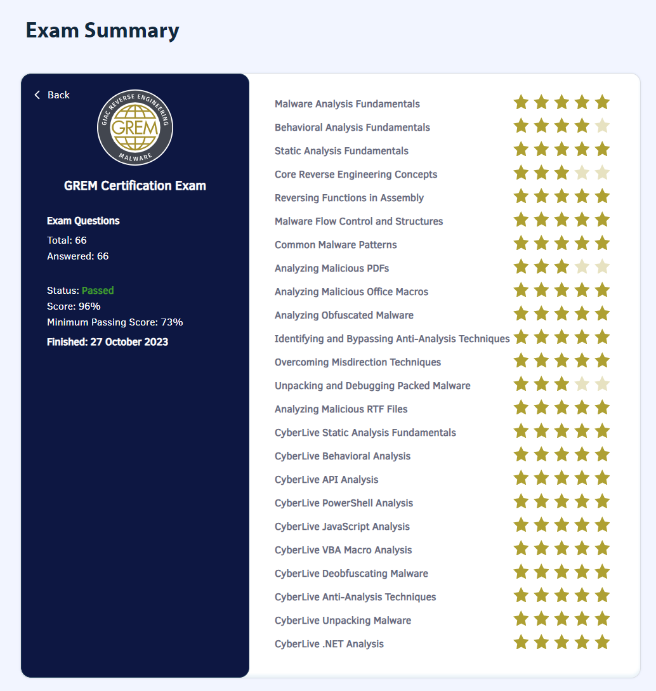

## TL;DR

[GREM(GIAC Reverse Engineering Malware)](https://www.giac.org/certifications/reverse-engineering-malware-grem/) に96%のスコアで合格した。





## GREMとは

GIAC Reverse Engineering Malwareの略称で、SANS Instituteが提供するマルウェア解析の国際的な認定試験になる。

Paul Jerimy MediaのSecurity Certification Roadmapでは、Expertの部類に属していることになっている。

[Security Certification Roadmap - Paul Jerimy Media](https://pauljerimy.com/security-certification-roadmap/)

## 実施した勉強方法

オンラインでのトレーニングを5日間+1日CTF(Malware Analysis Tournament)を受講。最終日のCTFでは3位でCoinは獲得できず（2位までがCoin獲得だった）

[FOR610: Reverse Engineering Malware Training | Malware Tools & Techniques | SANS Institute](https://www.sans.org/cyber-security-courses/reverse-engineering-malware-malware-analysis-tools-techniques/)

基本的には、他の受験記の方々と同じようにトレーニング後はひたすらテキストを読み込んで付箋でインデックスを作成しながら演習を繰り返し実施した。テキストはすべて英語で書かれていて読むのにとても時間がかかり、当初の予定では2週間くらいではすべて読み切れるだろうと思っていたが他業務など様々あり1ヶ月くらいかかってしまった。

一通りテキストの内容読み込みと演習を終えた状態で1度目の模擬試験を実施。1回目の模擬試験のスコアは79%で、合格ラインは一応超えていた(73%以上が合格ライン）が、あまりにも出来ていない分野があって少し心配気味だった。

1回目の模擬試験で点数が取れなかった分野をテキストで復習し、テキストだけでなく他のマルウェア解析に関する書籍([Practical Malware Analysis](https://www.amazon.co.jp/Practical-Malware-Analysis-Hands-Dissecting/dp/1593272901)、[初めてのマルウェア解析](https://www.amazon.co.jp/dp/4873119294/))を読んで知識を補完した後に2回目の模擬試験を実施した。2回目の模擬試験のスコアは86%で、1回目で点数が取れなかった苦手分野のスコアが伸びたので多分大丈夫だろうと思い本番試験を申し込んだ。

## 認定試験について

自分が実施した時(2023年10月)のGREMは以下のような概要で実施された。過去GREMを受けた方々の受験記を見ていると受験時期によって問題数や合格ラインが違うらしい。

- 試験時間 : 180分
- 問題数 : 66問
- 出題形式 : 
    - Computer Based Testing(CBT)
    - 選択問題式
    - CyberLiveにおける実技問題あり
- 合格ライン : 73%
- その他 : オープンブック形式で紙の資料の持ち込み可

CyberLiveの実技試験は、以下のGIAC Certifications公式のYouTube動画にあるようにVMを起動させて設問に答える形式になる。



### 認定試験本番

オープンブック形式で紙の資料の持ち込みが可能なので、トレーニング時のテキストと英和辞典、自分用に作成したノートのまとめとSANS FOR610の講師である[Lenny Zeltser氏のマルウェア解析に関するチートシート](https://www.sans.org/blog/4-cheat-sheets-for-malware-analysis/)や、[Ghidraのチートシート](https://ghidra-sre.org/CheatSheet.html)など持ち込めるものはすべて持ち込んだ状態で本番に挑んだ。

GIAC試験は問題をスキップする機能があるので、問題文の英語の解釈がすぐに出来ない場合やパッと分からない問題はスキップしていって最後にじっくり調べながら解答した。2回の模擬試験のおかげでCyberLiveの時間配分などある程度分かっていたので時間に余裕をもってすべて解答できた。

結果は96%で無事合格した。

## まとめと感想

4年ぶりのGIAC受験ということもあり、とても緊張していたがひとまず合格できてよかった。

4年前のGCFAはギリギリのスコアで合格したので知らなかったのだが、スコアが90%超えて合格するとGIAC Advisory Boardへの招待がされるとのこと。GIAC Advisory Boardは招待制のフォーラムで、GIAC自体の改善に関わる活動を行うらしくNDAに署名し参加してデジタルバッジを貰った。





今回のGREM受験に際してテキストを読み込んだり、他のマルウェア解析に関する書籍等も読んだり手を動かしたおかげで、ずっと入門し続けていたマルウェア解析にようやく入門できた気がしている。これからもなんとかやっていきたい。