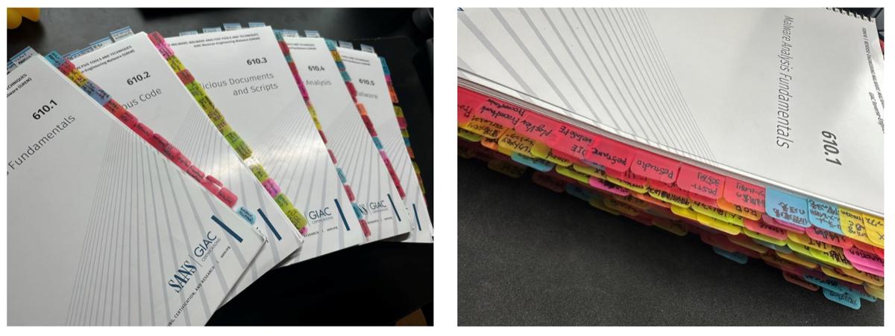
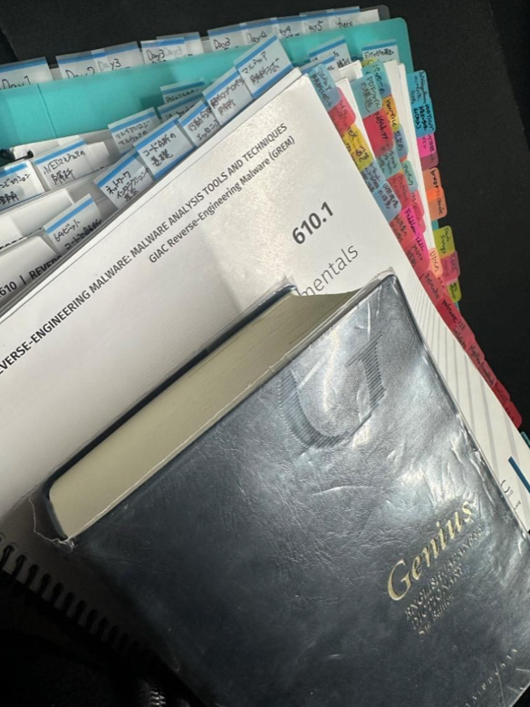

> **Note:** This article is an AI-assisted English translation of the [original Japanese post](/posts/2023/11/02/). The content and experiences described are my own.

**Japanese version is here → [GREM合格記 - 96%スコアで合格したGIAC Reverse Engineering Malware試験の全記録](/posts/2023/11/02/)**

---

## TL;DR

I passed [GREM (GIAC Reverse Engineering Malware)](https://www.giac.org/certifications/reverse-engineering-malware-grem/) with a score of 96%. Due to the high score, I also received invitations to the GIAC Advisory Board and the SANS Instructor Development Program.





## What is GREM?

GREM stands for GIAC Reverse Engineering Malware. It is an internationally recognized certification offered by SANS Institute, corresponding to the SANS FOR610 course "Reverse-Engineering Malware: Malware Analysis Tools and Techniques."

On Paul Jerimy Media's Security Certification Roadmap, it is categorized under the Expert tier.

[Security Certification Roadmap - Paul Jerimy Media](https://pauljerimy.com/security-certification-roadmap/)

### Exam Domains

The exam covers the full content of the 5-day SANS FOR610 training. The official exam domains are as follows:

- Analyzing Malicious Office Macros / PDFs / RTF Files
- Analyzing Obfuscated Malware
- Behavioral / Static Analysis Fundamentals
- Common Malware Patterns
- Core Reverse Engineering Concepts
- Examining .NET Malware
- Identifying and Bypassing Anti-Analysis Techniques
- Malware Analysis Fundamentals
- Malware Flow Control and Structures
- Overcoming Misdirection Techniques
- Reversing Functions in Assembly
- Unpacking and Debugging Packed Malware

## Exam Overview

The following details are based on my exam taken in October 2023. The time limit and passing score may vary depending on when you take the exam, so always check the official site before registering.

| Category | Details |
|------|------|
| Time limit | 180 minutes |
| Number of questions | 66 (11 of which are CyberLive questions) |
| Format | CBT (multiple choice) + CyberLive (practical) |
| Passing score | 73% |
| Other | Open-book format — printed materials allowed. Skip feature available (up to 10 questions). Skipped questions can be answered later. |

### What is CyberLive?

CyberLive is a hands-on practical section where you analyze actual malware samples in a VM and answer questions about them. According to the SANS trainer, CyberLive questions carry a higher weight in scoring.



## Study Method

I followed the official SANS-recommended study process:

1. Read all training textbooks (with indexing)
2. Take Practice Test 1
3. Review weak areas from Practice Test 1
4. Take Practice Test 2

### Reading and Indexing the Textbooks

The SANS textbooks include detailed notes below each slide. During training, instruction is primarily slide-based, so it is important to thoroughly read the content below the slides on your own.

FOR610 spans 5 days of training. Excluding workbooks, the total page count across all textbooks is **741 pages**. All content is in English, so if you are not a confident English reader, you will need to work through the material with the help of a translation tool. I had originally expected to finish reading in about two weeks, but with summer vacation and work obligations, it ended up taking about 3 months (with only 1 month left before the exam deadline).

**Building the Index with Sticky Notes**

Since GIAC exams are open-book, you can bring your textbooks and reference them during the exam. Marking important concepts with sticky notes so you can access information quickly is directly tied to your exam performance. I indexed all 5 volumes using color-coded sticky notes:

- **Red**: Tools
- **Blue**: Concepts
- **Yellow**: Terminology

I also added larger sticky notes with Japanese summaries of what each page was about, so I could grasp the content at a glance.

In parallel with the sticky note indexing, I created an **index sheet** — a spreadsheet-style table mapping page numbers, categories, keywords, and descriptions across all textbooks. This allowed me to locate information without even opening the books.

I also kept a running list of English words that I could not immediately translate while reading, along with the book number, page number, and Japanese meaning. This saved a significant amount of time during the actual exam when I would have otherwise needed to look things up in a dictionary.

> **Tip: Use plastic (film-based) Post-it flags, not paper ones**
>
> Paper sticky notes bend and fold over time, making them useless as index tabs. The 3M Post-it "Job is Clear" series uses a plastic film material that is durable and long-lasting — highly recommended.

**Approach to Assembly Language**

I focused on acquiring the minimum assembly knowledge needed for malware analysis rather than trying to master it comprehensively. My goal was to be able to follow code flow using references for instructions like JMP. The x86 JMP quick reference introduced during training was very helpful.

[Intel x86 JUMP quick reference - unixwiz.net](http://unixwiz.net/techtips/x86-jumps.html)

For sections where I could not follow the flow, I worked through the assembly by hand. I also repeatedly wrote small programs in C, compiled them, and disassembled the output (I was pretty confused during this process, to be honest).

### Practice Test 1

After finishing the textbooks, I took the first practice test under simulated exam conditions — indexed textbooks, cheat sheets (index sheet and vocabulary list), and an English-Japanese dictionary at hand. I also used it to get a feel for time management within the 180-minute limit.

**Result: 79%**

I passed the 73% threshold, but there were entire sections where I got almost nothing right, which was concerning. I finished with about 40 minutes to spare, so I knew I had room to slow down and be more careful.

### Reviewing Weak Areas

I went back to the textbook sections where I had scored poorly, and supplemented my understanding with the following books for areas where the textbook alone was not enough:

- [初めてのマルウェア解析 (Malware Analysis for Beginners)](https://www.amazon.co.jp/dp/4873119294/)
- [Practical Malware Analysis](https://www.amazon.co.jp/Practical-Malware-Analysis-Hands-Dissecting/dp/1593272901)

I also studied by watching malware analysis videos on YouTube, particularly the [hasherezade](https://www.youtube.com/c/hasherezade) channel.

### Practice Test 2

I applied the lessons from the first attempt — taking more time and being more deliberate. I used the skip feature to defer difficult questions and came back to them at the end.

**Result: 86%**

My weak areas had improved. I still missed one CyberLive question and struggled a bit with the Office Macro section, but I felt confident enough to schedule the real exam.

### Preparing the Cheat Sheets

I printed everything I wanted to bring and organized it in a dedicated notebook:

- Index sheet (cross-referencing all textbooks)
- Windows API pattern quick reference (API categories, functions, parameters)
- Per-textbook summary documents
- Tool parameter reference sheets
- Ghidra cheat sheet
- [Malware Analysis Cheat Sheets by Lenny Zeltser](https://www.sans.org/blog/4-cheat-sheets-for-malware-analysis/)

> **Warning: Desk space at the test center is limited**
>
> The desks at Pearson VUE test centers are small. Bringing too many materials will get in your way. Prioritize and only bring what you will actually use.

## CyberLive Preparation

CyberLive questions follow the same format as the hands-on labs in the training course. The most effective preparation was **repeatedly working through the lab exercises from the training**. While doing so, I documented tool usage and Windows API parameter information (e.g., options for the `strings` command, how to use `speakeasy`, reading `capa` output).

> **Watch out for keyboard layout**
>
> The keyboards at Pearson VUE test centers use a US layout (this is the case at most test centers). If you normally use a Japanese keyboard layout, you may be thrown off by symbol placement during CyberLive VM tasks. Practice with a US layout beforehand, or at least familiarize yourself with the differences.

## Exam Day

I booked a slot at the **Pearson VUE Nishi-Shinjuku test center**. Remote proctoring (ProctorU) requires communicating in English and installing monitoring software, which adds a lot of friction — I recommend taking it on-site if possible.

What I brought:

- Two forms of ID (one with signature: passport; one with photo: driver's license or My Number card, etc.)
- All 5 indexed textbooks
- English-Japanese dictionary
- Cheat sheet binder

**Time Management**

My strategy was to get through the CBT (multiple choice) section as quickly as possible to leave ample time for CyberLive. I used the skip feature to defer anything I couldn't answer immediately, then circled back through everything including double-checking. Having practiced with the mock exams, I had a solid feel for CyberLive timing and was able to complete everything comfortably.

**Result: 96%**

Getting all the CyberLive questions right made a big difference.

## Conclusion

It had been 4 years since my last GIAC exam (GCFA), so I was quite nervous — but I am glad I managed to pass with a high score.

Because my score exceeded 90%, I received an invitation to the GIAC Advisory Board, an invite-only forum. It apparently involves contributing to improvements to GIAC itself. I signed the NDA, joined, and received a digital badge.





I would not recommend waiting until close to your exam deadline — it is not good for your mental health (I booked with only 1 month remaining).

All the time I spent reading through the textbooks and supplementary books, doing hands-on practice, and building reference materials finally made malware analysis feel accessible to me after years of feeling like a permanent beginner. I hope to keep building on this going forward.
