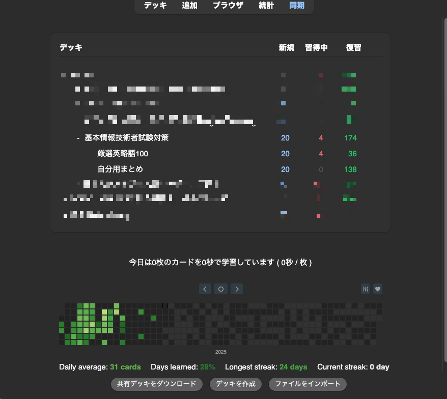
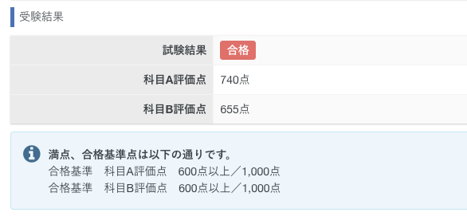

## はじめに
10年ぶりくらいに基本情報技術者試験を受けて合格した。

約10年前に受験した際は、春秋の年2回開催だったが今回はCBT形式でいつでも受験が可能だったため気軽に受けることができた。

## モチベーション

今年2025年は自分のコンプレックスを解消していこう！というスローガンを掲げて、過去に辞めてしまった習慣や不合格だった試験などをやり直している。

多分大学生の2014年頃に基本情報を受験して普通に数点足らずに落ちてからずっとIPAの試験から遠ざかっていた。

そんな中YouTubeを見ていたら、以下の基本情報をRTAして合格する動画を発見した。


<iframe width="560" height="315" src="https://www.youtube.com/embed/8Frg8QTJJ5o?si=bv8F4eQQaSmb1jeD" title="YouTube video player" frameborder="0" allow="accelerometer; autoplay; clipboard-write; encrypted-media; gyroscope; picture-in-picture; web-share" referrerpolicy="strict-origin-when-cross-origin" allowfullscreen></iframe>


こういった参考にならない勉強方法めちゃくちゃ好きで真似はしないけどもモチベーションになる。

## 勉強方法

至って普通の勉強方法で、[イメージ＆クレバー方式でよくわかる かやのき先生の基本情報技術者教室](https://amzn.asia/d/0W3nqmS) を買って一通り読んだのち、過去問をひたすらに実施した。

過去問は[基本情報試験ドットコム](https://www.fe-siken.com/)の最近のものを選択して、間違えた問題をAnkiに登録して周回した。

## まとめと感想

A試験、B試験とも時間に結構余裕がある状態で終えて合格。

合格できて良かった。

今年の秋は応用情報技術者試験(AP)を受験したい。
